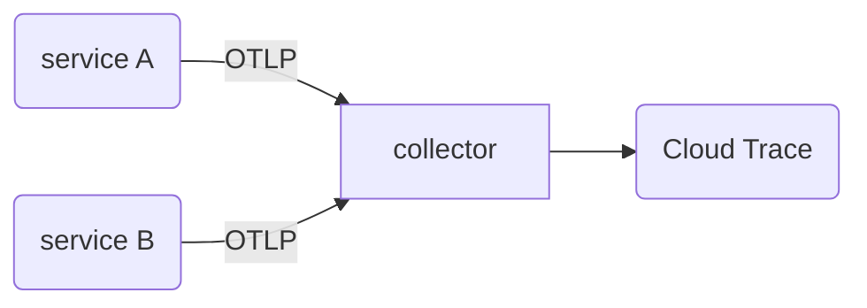
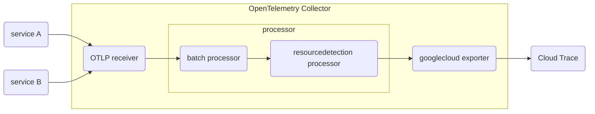

こんにちは！Google Cloudでオブザーバビリティを担当しているものです！この記事は[Google Cloud Japan Advent Calender 2022](https://zenn.dev/google_cloud_jp/articles/12bd83cd5b3370)の15日目の記事です。（あと空いてたので[OpenTelemetry Advent Calender](https://qiita.com/advent-calendar/2022/opentelemetry)の8日目の記事とします。）

## TL;DR

OpenTelemetry Collectorを使えば、GKEなどの複数のサービスで共通なリソース情報をテレメトリーにまとめて追加できて、めちゃくちゃ便利なんで、ぜひ使ってみてください！

:::message
バージョン情報

* OpenTelemetry Collector Contrib: v0.66.0
* OpenTelemetry for Go for Trace: v1.11
:::

## OpenTelemetry Collectorとは

「そもそも[OpenTelemetry Collector](https://opentelemetry.io/docs/collector/)なんて知らないよ！」っていう方もいらっしゃると思います。というか、「[OpenTelemetry](https://opentelemetry.io/)自体知らないよ！」という方もいらっしゃるかもしれません。そういう方については手前味噌ですが、こちらをご参照ください。

@[card](https://ymotongpoo.hatenablog.com/entry/2020/06/01/164221)

OpenTelemetry Collectorはログ、メトリクス、トレースといったテレメトリーを収集、送信するためのエージェントで、これを使うことで複雑なテレメトリーパイプラインを構成することが可能となっています。

## アプリケーションを計装する際の課題点

OpenTelemetryを使いたくなる状況というのは、アプリケーションに対して計装をし、テレメトリーデータを生成して、モニタリングバックエンドに送信したいときなわけですが、その際に課題となってくるのは計装に必要なコード量です。

たとえば次はトレースを生成する際に書いたサンプルコードの一部ですが、非常に多くの属性が宣言されています。

```go
    ...
	res, err := resource.New(
		context.Background(),
		resource.WithAttributes(
			semconv.ServiceNameKey.String("service-a"),
			semconv.ServiceVersionKey.String("1.0.0"),
			semconv.DeploymentEnvironmentKey.String("production"),
			semconv.TelemetrySDKNameKey.String("opentelemetry"),
			semconv.TelemetrySDKLanguageKey.String("go"),
			semconv.TelemetrySDKVersionKey.String("0.13.0"),
		),
	)
    ...
```

このアプリケーション固有の属性に関してはまだ個別に計装するほかないですが、これ以外にも例えばGoogle Cloudのリージョン情報や、この例にも書いてあるような実行環境のバージョン情報、あるいはKubernetesの稼働中のクラスタ名などを埋め込みたいとった場合には、関連する全サービスで書く必要があるため、計装のコードが膨れ上がってしまいます。

また、同じコードを別の環境にデプロイする場合などには、環境変数などから値を差し込む必要がでてくるため、計装上では環境変数の参照しかしていなくても、サービスのデプロイ用の設定ファイルが大きくなってしまいます。

こうした需要を解決するためにはいくつかの方法が考えられます。

1. アプリケーション側で実行環境などを自動で検知して属性に差し込む
2. エージェントやプロキシーなどに対して送信し、送信先で属性を差し込む

1に関しては、いくつか自動計装用のライブラリがあるので、それをインポートさえすればある程度カバーできるのですが、一方でアプリケーションの依存ライブラリが増えますし、すべてのアプリケーションに依存ライブラリを追加しなければなりません。

2に関しては、アプリケーション側のコードを編集すること無いため便利ではあるのですが、一方でテレメトリーのメタデータの編集のための追加の層が必要になってきます。

一長一短ではありますが、OpenTelemetryを使った計装の場合、Collectorを使う構成が推奨されていることもあり、この記事では2番めの方法を紹介したいと思います。

## OpenTelemetry Collectorのprocessor

OpenTelemetry Collectorは大きく分けて3つのコンポーネントで構成されていて、この3つのコンポーネントがそれぞれプラグイン形式を採用しています。

* receiver: テレメトリーデータを取得し、OpenTelemetry Collector内部の標準形式（以下「標準形式」）に変換する部分
* processor: 標準形式内のデータを編集する部分
* exporter: 標準形式から各バックエンド向けのデータ形式に変換し、送信する部分

たとえばPrometheus(OpenMetrics)形式で計装されているアプリケーションがあった場合には、[Prometheus receiver](https://github.com/open-telemetry/opentelemetry-collector-contrib/blob/main/receiver/prometheusreceiver/README.md)を使えば、標準形式へ変換ができ、さらにそれ以外のOpenTelemetryのエコシステムを活用できる、ということになります。

今回はテレメトリー内に環境情報からメタデータを追加したいということなので、それ用のprocessorを追加します。

## Resource Detection Processor

@[card](https://github.com/open-telemetry/opentelemetry-collector-contrib/tree/main/processor/resourcedetectionprocessor)

このResource Detection Processorというprocessorは、Google Cloudを始めとするクラウドプラットフォームサービスにおけるサービスのリソース情報や、動作させている環境のOS関連情報などを自動で検知し、必要なものをテレメトリーに埋め込んでくれる、というものです。

これはOpenTelemetryが扱うすべての種類のテレメトリーに対して実施してくれるので、たとえばトレースとメトリクスをOpenTelemetry Collector経由で送信している場合には、これを使うだけで両方にリソース情報を追加してくれます。便利ですね！！！

## サンプルプロジェクト

説明のためにサンプルプロジェクトを用意しました。（TODO: PRがマージされたらURLを置き換える）

@[card](https://github.com/ymotongpoo/devrel-demos/tree/otel-gke-add-labels/devops/otel-col-gke-add-labels)



サービスAとサービスBがそれぞれトレースをCollectorに向かって送信していて、Collector内部でGKEやGoogle Cloud関連のメタデータをトレースに埋め込んでいます。

Collector用の設定ファイルは次のとおりです。（デモではこの設定ファイルはKubernetesのConfigMapになっています。）

```yaml
receivers:
    otlp:
        protocols:
            grpc:
processors:
    batch: {}
    resourcedetection:
        detectors: [gke, gce]
        override: false
exporters:
    logging:
    googlecloud:
    retry_on_failure:
        enabled: true
    log:
        default_log_name: opentelemetry.io/collector-exported-log
service:
    pipelines:
    traces:
        receivers: [otlp]
        processors: [batch, resourcedetection]
        exporters: [logging, googlecloud]
```

この設定はどうなっているかというと次のようなパイプラインになっています。



このデモを実際に動作させてみるとどうなるか見てましょう。


右側のペインにあるメタデータを確認してみましょう。


ここに載っている次の属性はすべて自動で追加されたものになっています！！

* cloud.account.id: <プロジェクトID>
* cloud.platform: gcp_kubernetes_engine
* cloud.provider: gcp
* cloud.region: asia-east1
* g.co/r/k8s_cluster/cluster_name: otel-sample
* g.co/r/k8s_cluster/location: asia-east1
* k8s.cluster.name: otel-sample

実際にCollectorに `resourcedetection` を追加する前は次のようになっていました。


## まとめ

OpenTelemetry Collectorのprocessorによって属性を追加する方法について書きました。OpenTelemetryは活発に開発が続けられています。いまも新たな機能が日々追加されています。2023年はいよいよログも本格的に扱えるようになることが期待されています。ぜひ皆様のプロジェクトでも使ってみてください。

もしGoogle Cloud上に限らず、OpenTelemetryを使っていて疑問に思ったことがあったら私（[@ymotongpoo](https://twitter.com/ymotongpoo)）までご連絡ください。お答えできるかもしれません。

## 補足

今回のデモではOpenTelemetry Collector Releasesからリリースされているものから `opeltelemetry-collector-contrib` のイメージを使用しました。

@[card](https://github.com/open-telemetry/opentelemetry-collector-releases)

@[card](https://hub.docker.com/r/otel/opentelemetry-collector-contrib)

このイメージは、[opentelemetry-collector-contrib](https://github.com/open-telemetry/opentelemetry-collector-contrib) レポジトリの中にあるすべてのプラグインを全部盛り込んだごった煮のCollectorなので、テストする場合には便利ですが、実用する場合にはサイズが大きくなりすぎてしまいます。

本番環境で使用する場合にはぜひ[OpenTelemetry Collector Builder (`ocb`)](https://github.com/open-telemetry/opentelemetry-collector/tree/main/cmd/builder)を使って、必要なプラグインだけを同梱した専用Collectorを作成して使用してください。

Cloud Buildを使って作成するサンプルに関しては下記のブログポストおよびサンプルレポジトリを参照してください。

@[card](https://opentelemetry.io/blog/2022/collector-builder-sample/)

@[card](https://github.com/GoogleCloudPlatform/opentelemetry-collector-builder-sample)
