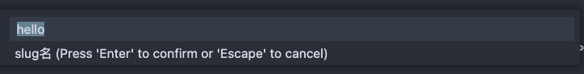
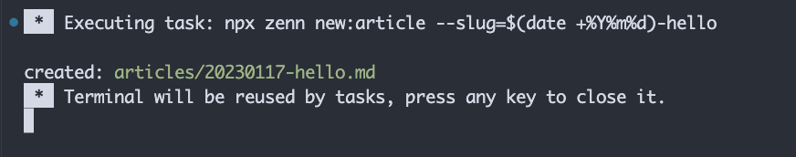

## はじめに

zenn.devの記事をGitHubで管理しているわけだけれども、画像の貼り付けや、いちいち `npx zenn new:article` などとコマンドを打つのが面倒なので、全部Visual Studio Codeでできるように設定をしてみた。

## 設定変更

設定をした箇所は以下の通り

* 画像の貼り付けの自動化
* Zenn CLIをショートカットで起動

### 画像の貼り付けの自動化

本文にスクリーンショットを貼りたいときなどに、いちいちスクリーンショットを取って、画像を `/images` ディレクトリに置いて、Markdownの画像貼り付けの記法でパスを指定して...という手順が本当に煩わしかったので、画像の貼り付けをすると `/images` ディレクトリに自動で保存され本文にマークアップされるようにした。

@[card](https://marketplace.visualstudio.com/items?itemName=mushan.vscode-paste-image)

この "Paste Image" という拡張を追加して、次のようにワークスペース設定を変更した。

```json
{
    "pasteImage.defaultName": "YYYYMMDDHHmmss",
    "pasteImage.path": "${projectRoot}/images",
    "pasteImage.showFilePathConfirmInputBox": true
}
```

ユーザー設定にしてもいいんだけども、パスとかはプロジェクトごとに違うのでひとまずワークスペース設定にしておいた。また画像ファイル名のデフォルトは日付日時によるものだけど、自分で設定したいときもあるかもしれないので、プロンプトで名前を指定する設定も入れた。

### Zenn CLIをショートカットで起動

Zenn CLIはターミナルで起動してもたいして時間はかからないんだけれども、ぱっとすぐに記事を書きたいときにショートカットで記事を作れたほうが便利かと思ったので設定してみた。

まず、プロジェクトに `tasks.json` を設定したいので、コマンドパレットを起動して "Task: Configure Task" でプロンプトを起動。初回なら "Create tasks.json file from template" から "Other" を選択。すでに `tasks.json` を作ってるなら、適当に過去に設定したタスクを選択するとファイルが開く。

開いたら次のように `tasks.json` を設定した。

```json
{
    "version": "2.0.0",
    "tasks": [
        {
            "label": "newArticle",
            "type": "shell",
            "command": "npx zenn new:article --slug=$(date +%Y%m%d)-${input:slug}"
        }
    ],
    "inputs": [
        {
            "id": "slug",
            "description": "slug名",
            "default": "hello",
            "type": "promptString",
        }
    ]
}
```

自分はslug名を `日付-キーワード` としているので、日付部分はshellの `date` コマンドから、キーワード部分はプロンプトで入力するように設定した。この辺りは好みなので、使える変数を参照しながら設定するとよい。（Windowsでも動くようにしたいので、なんとかここを統一したいが名案がない）

@[card](https://code.visualstudio.com/docs/editor/variables-reference)

そのあとこのタスクをショートカットで起動できるようにキーバインディングを設定する。

@[card](https://code.visualstudio.com/docs/getstarted/keybindings)

コマンドパレットから "Preferences: Open Keyboard Shortcuts (JSON)" を選択して設定ファイルを開き、次のように編集する。

```json
[
    {
        "key": "ctrl+shift+meta+a",
        "command": "workbench.action.tasks.runTask",
        "args": "newArticle",
    }
]
```

`"args"` のフィールド値は上の `tasks.json` で設定した、タスクのラベル名。またマルチプラットフォームで動くように、キーバインドでは `meta` キーと設定した。

## 実際に使ってみた

適当に `Ctrl+Shift+Meta+a` を押してみると次のようにプロンプトが開いた。デフォルト値は "hello" にしてある。



このファイル名でそのまま設定すると設定したnpxのコマンドが無事実行されてファイルが作成された。


