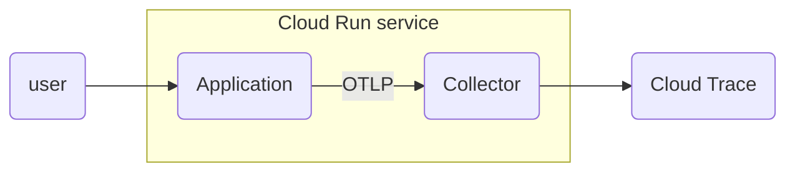

:::message
バージョン情報

* OpenTelemetry Collector Contrib: v0.70.0
:::

こんにちは！Google Cloudでオブザーバビリティを担当しているものです！Cloud Runでマルチコンテナーサポートがパブリックプレビューになりましたね！これはCloud Runでサイドカーを走らせられるということです！というわけで今日は1ユースケースとしてOpenTelemetry CollectorをCloud Runのサイドカーとして走らせてみようと思います。

**TODO: devsiteのドキュメントのリンクをカードで貼る**

## TL;DR

Cloud Runのマルチコンテナーサポートを使うと、アプリケーション側はOTLPの実装だけして、OpenTelemetry Collectorをサイドカーとして走らせて、テレメトリーをCloud Opsに送るということが可能になります。

## 構成

Kubernetesで使っているようなポッド内のサイドカーの構成をCloud Runでもできますよ、というだけなので、それをわかってる人にはそれだけの話です。

次の図でCloud Runの中で `Application` と `Collector` の2つのコンテナが動いていると思ってください。



## コンテナの準備

まずアプリケーションとコレクターのコンテナをそれぞれ準備しましょう。

### アプリケーション

今回のアプリケーションは以前デモで作った再帰的に分散トレース用のスパンを生成して、それをOTLP over gRPCで `localhost:4317` に送信するアプリです。

@[card](https://github.com/GoogleCloudPlatform/devrel-demos/tree/main/devops/otel-col-gke-add-labels/src/service)

これはそのまま使います。

### OpenTelemetry Collector

そして、今回の肝はOpenTelemetry Collector（以下、コレクター）をサイドカーとして走らせるところです。アプリケーションの側は `localhost:4317` に対してスパンをOTLP over gRPCで送信してくるので、コレクター側はそれを受け取って、Cloud Traceに送信してあげる必要があります。まずそのための設定ファイルを書きます。

```yaml:config.yaml
receivers:
  otlp:
    protocols:
      grpc:

processors:
  batch:

exporters:
  googlecloud:
    retry_on_failure:
      enabled: false

service:
  pipelines:
    traces:
      receivers: [otlp]
      processors: [batch]
      exporters: [googlecloud]
```

`4317` ポートは `otlp` レシーバーでのデフォルトポートなので、そのまま設定しておきます。また念の為 `batch` プロセッサーを用意し、最後にCloud Traceにトレース情報を送信するため [`googlecloud` エクスポーター](https://github.com/open-telemetry/opentelemetry-collector-contrib/blob/main/exporter/googlecloudexporter/README.md)を設定しておきます。このエクスポーターは `trace` と `metric` と `log` のそれぞれの設定があり、それぞれCloud Trace、Cloud Monitoring、Cloud Loggingへのテレメトリーの送信に関連する設定を行います。

今回はトレース情報しか送信しないので、パイプラインの設定はトレースのみ（ `traces` ）だけ行いました。

この設定ファイルを使うわけですが、各プラグイン（ `otlp` 、 `batch` 、 `googlecloud` ）が同梱されているコレクターを使わなければいけません。本番環境などであれば、必要なプラグインだけが入ったCollectorを自前ビルドして作成するところですが、今回はデモ環境ということで `opentelemetry-collector-contrib` のプラグイン全部入りごった煮コレクターを使います。

```docker:Dockerfile
FROM ghcr.io/open-telemetry/opentelemetry-collector-releases/opentelemetry-collector-contrib:0.70.0-amd64
COPY config.yaml /etc/otel/config.yaml
EXPOSE 4317
CMD ["--config", "/etc/otel/config.yaml"]
```

行儀がいい方法ではボリュームをマウントして設定ファイルを読ませるようにしたりしますが、面倒なので入れちゃいます。

## Cloud Run YAMLの設定

アプリケーションとコレクターのコンテナをビルドして、Cloud Runがアクセスできるコンテナレジストリーに入れたら、いよいよこの2つのコンテナをサイドカーパターンでCloud RunにデプロイするためのYAMLを用意します。これは公式ドキュメントにサンプルがあるのでそれを参考にしていきます。

**TODO: devsiteのCloud Runのマルチコンテナサポートのページのリンク**

Cloud Run YAML自体のリファレンスはこちらです。

@[card](https://cloud.google.com/run/docs/reference/yaml/v1)

今回はCloud Run用のインスタンスを起動しっぱなしにするためのオプションを追加で指定しています。（[CPU always allocated](https://cloud.google.com/blog/ja/products/serverless/cloud-run-gets-always-on-cpu-allocation?hl=ja)についての記事も参照してください）

```yaml:multicontainers.yaml
apiVersion: serving.knative.dev/v1
kind: Service
metadata:
  annotations:
    run.googleapis.com/launch-stage: ALPHA
  name: otel-sidecar-challenge
spec:
  template:
    metadata:
      annotations:
        autoscaling.knative.dev/minScale: "1"
        run.googleapis.com/cpu-throttling: "false"
        run.googleapis.com/execution-environment: gen2
    spec:
      containers:
        - image: ${REPO}/recursive:latest
        - image: ${REPO}/otelsidecar:latest
          ports:
            - containerPort: 4317
          resources:
            limits:
              cpu: 1000m
              memory: 512Mi
```

ここで `${REPO}` は適当にArtifact RegistryやContainer Registryのレジストリ名に読み替えてください。（例: `asia-east1-docker.pkg.dev/sample-project/test-registry`）
