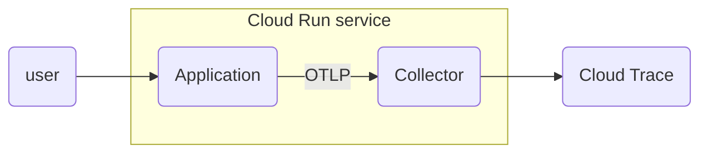

:::message
バージョン情報

* OpenTelemetry Collector Contrib: v0.77.0
:::

こんにちは！Google Cloudでオブザーバビリティを担当しているものです！[Cloud Runでマルチコンテナーサポートがパブリックプレビューになりましたね](https://cloud.google.com/run/docs/deploying?hl=en#sidecars)！これはCloud Runでサイドカーを走らせられるということです！というわけで今日は1ユースケースとしてOpenTelemetry CollectorをCloud Runのサイドカーとして走らせてみようと思います。

@[card](https://cloud.google.com/run/docs/deploying?hl=en#sidecars)

## TL;DR

Cloud Runのマルチコンテナーサポートを使うと、アプリケーション側はOTLP送信の実装だけして、OpenTelemetry Collectorをサイドカーとして走らせて、テレメトリーをCloud Opsや外部のオブザーバビリティツールに送ることが可能になります。

## 構成

Kubernetesで使っているようなポッド内のサイドカーの構成をCloud Runでもできますよ、というだけなので、それをわかってる人にはそれだけの話です。

次の図でCloud Runの中で `Application` と `Collector` の2つのコンテナが動いていると思ってください。



## コンテナの準備

まずアプリケーションとコレクターのコンテナをそれぞれ準備しましょう。

### アプリケーション

今回のデモアプリケーションは、再帰的に分散トレース用のスパンを生成して、それをOTLP over gRPCで `localhost:4317` に送信するアプリです。

@[card](https://github.com/GoogleCloudPlatform/devrel-demos/tree/main/devops/otel-col-cloud-run-multicontainer)

OpenTelemetryの初期化部分はこうなっています。（少しだけ簡単のために改変）

```go:main.go
    // OTLP exporter config for Collector (using default config)
    exporter, err := otlptracegrpc.New(
        context.Background(),
        otlptracegrpc.WithEndpoint("localhost:4317"),
        otlptracegrpc.WithInsecure(),
    )
    ...
    tp := sdktrace.NewTracerProvider(
        sdktrace.WithSampler(sdktrace.AlwaysSample()),
        sdktrace.WithBatcher(exporter),
        sdktrace.WithResource(res),
    )
    otel.SetTracerProvider(tp)
    otel.SetTextMapPropagator(propagation.TraceContext{})
```

注目してほしいのは `otlptracegrpc.WithEndpoint()` で、これが `localhost:4317` に向いています。これでサイドカーのOpenTelemetry Collector（以下、コレクター）に送る設定になっています。

### OpenTelemetry Collector

そして、今回の肝はコレクターをサイドカーとして走らせるところです。アプリケーションの側は `localhost:4317` に対してスパンをOTLP over gRPCで送信してくるので、コレクター側はそれを受け取って、Cloud Traceに送信してあげる必要があります。まずそのための設定ファイルを書きます。

```yaml:config.yaml
receivers:
  otlp:
    protocols:
      grpc:

processors:
  batch:

exporters:
  googlecloud:
    retry_on_failure:
      enabled: false

service:
  pipelines:
    traces:
      receivers: [otlp]
      processors: [batch]
      exporters: [googlecloud]
```

`4317` ポートは `otlp` レシーバーでのデフォルトポートなので、そのまま設定しておきます。また念の為 `batch` プロセッサーを用意し、最後にCloud Traceにトレース情報を送信するため [`googlecloud` エクスポーター](https://github.com/open-telemetry/opentelemetry-collector-contrib/blob/main/exporter/googlecloudexporter/README.md)を設定しておきます。このエクスポーターは `trace` と `metric` と `log` のそれぞれの設定があり、それぞれCloud Trace、Cloud Monitoring、Cloud Loggingへのテレメトリーの送信に関連する設定を行います。

今回はトレース情報しか送信しないので、パイプラインの設定はトレースのみ（ `traces` ）だけ行いました。

この設定ファイルを使うわけですが、各プラグイン（ `otlp` 、 `batch` 、 `googlecloud` ）が同梱されているコレクターを使わなければいけません。本番環境などであれば、必要なプラグインだけが入ったCollectorを自前ビルドして作成するところですが、今回はデモ環境ということで `opentelemetry-collector-contrib` のプラグイン全部入りごった煮コレクターを使います。

```docker:Dockerfile
FROM ghcr.io/open-telemetry/opentelemetry-collector-releases/opentelemetry-collector-contrib:0.77.0-amd64
COPY config.yaml /etc/otel/config.yaml
EXPOSE 4317
CMD ["--config", "/etc/otel/config.yaml"]
```

行儀がいい方法では[Secret Managerから読み込んだり](https://cloud.google.com/run/docs/migrate/from-kubernetes?#config-maps)しますが、今回は簡単のために同梱してしまいます。

## Cloud Run YAMLの設定

アプリケーションとコレクターのコンテナをビルドして、Cloud Runがアクセスできるコンテナレジストリーに入れたら、いよいよこの2つのコンテナをサイドカーパターンでCloud RunにデプロイするためのYAMLを用意します。これは公式ドキュメントにサンプルがあるのでそれを参考にしていきます。

@[card](https://cloud.google.com/run/docs/deploying#multicontainer-yaml)

Cloud Run YAML自体のリファレンスはこちらです。

@[card](https://cloud.google.com/run/docs/reference/yaml/v1)

今回はCloud Run用のインスタンスを起動しっぱなしにするためのオプションを追加で指定しています。（これをオンにしないとコレクターがすぐにシャットダウンされてしまうので指定しています。[CPU always allocated](https://cloud.google.com/blog/ja/products/serverless/cloud-run-gets-always-on-cpu-allocation?hl=ja)についての記事も参照してください。）

```yaml:multicontainers.yaml
apiVersion: serving.knative.dev/v1
kind: Service
metadata:
  annotations:
    run.googleapis.com/launch-stage: BETA
  name: otel-sidecar-challenge
spec:
  template:
    metadata:
      annotations:
        autoscaling.knative.dev/minScale: "1"
        run.googleapis.com/cpu-throttling: "false"
        run.googleapis.com/execution-environment: gen2
    spec:
      containers:
        - image: ${REGISTRY}/otelsidecar:latest
          resources:
            limits:
              cpu: 1000m
              memory: 512Mi
        - image: ${REGISTRY}/recursive:latest
          ports:
            - containerPort: 8080
```

ここで `${REGISTRY}` は適当にArtifact RegistryやContainer Registryのレジストリ名に読み替えてください。（例: `asia-east1-docker.pkg.dev/sample-project/test-registry`）

Cloud Runでのコンテナの起動順は特に無いわけですが、もしコレクター起動前にリクエストが来たときのエラーが気になる場合は、[コンテナの依存関係をYAMLファイルに設定](https://cloud.google.com/run/docs/configuring/containers#container-ordering)してあげたほうが良いでしょう。

## デプロイしてトレースを確認

もうあとはデプロイするだけです。（サンプルではここまでの手順をすべてCloud Buildですべて行うように[設定して](https://github.com/GoogleCloudPlatform/devrel-demos/blob/main/devops/otel-col-cloud-run-multicontainer/cloudbuild.yaml)います。）

```console
gcloud run services replace multicontainers.yaml --region asia-east1
```

これでエンドポイントにアクセスしてみると、無事にトレースが取れているのが確認できます。


トレースを確認してみると、Cloud Runが生成したルートスパンから取得できていることが分かります。


## 他のオブザーバビリティツールに流してみる

コレクターを使うところの良いところは、コレクター側の設定を変えるだけで、テレメトリーデータの処理や送信先が変更できることです。

せっかくなので、今回は[Sentry](https://sentry.io)にもトレースデータを送ってみようと思います。先ほどのコレクター用設定ファイルを次のように変更して、Sentryをトレースの送信先としてパイプラインに追加します。

```yaml:config.yaml
...
exporters:
  googlecloud:
    retry_on_failure:
      enabled: false
  sentry:
    dsn: https://key@host/path/123456...
    environment: prod
    insecure_skip_verify: true

service:
  pipelines:
    traces:
      receivers: [otlp]
      processors: [batch]
      exporters: [googlecloud, sentry]

```

再度サービスをデプロイすると、次のようにスパン一覧に表示されるようになりました！


これをよく見ると、Cloud Run自体が生成した `/root` のスパンが取得されていません。


トレースIDで絞り込んでも、やはり `/root` のスパンは取得できていないようでした。このあたりはどの分散トレースバックエンドでは処理できるのか、他には確認できていないので、他に試した方がいればぜひ結果を共有してもらいたいです。

## おわりに

OpenTelemery CollectorをサイドカーとしてCloud Run内で走らせることができました。コレクターをCloud Runで走らせるのは構成として少し大きいように感じるかもしれませんが、この構成が選択肢にあることでOpenTelemetryを使う幅が広がってくると思います。

今回確認できなかったCloud Runが生成するルートスパンの扱いについて、もし他のオブザーバビリティツールで確認できた例があればぜひ教えて下さい。
