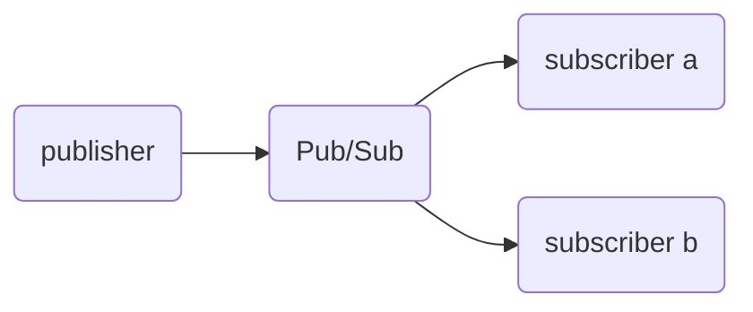

:::message
バージョン情報

* OpenTelemetry for Go: 1.16.0
* OpenTelemetry exporter for Cloud Trace: 1.15.0
:::

こんにちは！Google Cloudでオブザーバビリティを担当しているものです！今日は同僚から「Pub/Sub経由での処理の分散トレースを取得したいんだが」と質問されたので、サンプルを作ったついでに記事を書きました！

## TL;DR

Pub/Subのメッセージの中にトレース情報を埋め込ん（Injectする）で、各サブスクライバーはメッセージの取得の際に取り出す（Extractする）ことになります。

## デモの構成

今回はGKEのクラスターにpublisherとsubscriberのpodを展開します。
このデモでは1:NのPub/Sub構成でトレースが取得できることを見せるために、publisherが1つ、subscriberが2つの構成になっています。

@[card](https://github.com/GoogleCloudPlatform/devrel-demos/tree/main/devops/otel-pubsub-trace)



## 一般的なトレース情報の伝搬手順

通常のOpenTelemetryを用いたトレース情報の伝搬では[W3C Trace Context](https://www.w3.org/TR/trace-context/)や[b3 single header](https://github.com/openzipkin/b3-propagation/blob/master/RATIONALE.md#b3-single-header-format)などの形式で、HTTPヘッダーを使って伝搬する方法を取っています。

@[card](https://opentelemetry.io/docs/instrumentation/go/manual/#propagators-and-context)

もちろん、自前で上記のようなヘッダーの設定と解析を行うこともできますが、通常はそのためのヘルパーライブラリーも用意されているので、それを用いることを前提としています。たとえばWebサーバーなどの計装ライブラリーをなどを見てみると、その実態がわかります。

@[card](https://opentelemetry.io/docs/instrumentation/go/libraries/)

@[card](https://pkg.go.dev/go.opentelemetry.io/contrib/instrumentation/net/http/otelhttp@v0.42.0#NewHandler)

`otelhttp.NewHandler` は通常の `net/http.Handler` をラップして、計装された状態にしてくれるヘルパー関数ですが、これの中身を見てみると、 [`propagation.TextMapPropagator#Extract`](https://pkg.go.dev/go.opentelemetry.io/otel@v1.16.0/propagation#TextMapPropagator) を [`propagation.HeaderCarrier`](https://pkg.go.dev/go.opentelemetry.io/otel@v1.16.0/propagation#HeaderCarrier) に対して呼んでいる事がわかります。

@[card](https://github.com/open-telemetry/opentelemetry-go-contrib/blob/instrumentation/net/http/otelhttp/v0.42.0/instrumentation/net/http/otelhttp/handler.go#L131)

逆に、HTTPリクエストを送信する場合のヘルパー関数の方を見てみると、こちらは逆に `propagation.TextMapPropagator#Inject` を `propagation.HeaderCarrier` に対して呼んでいます。

@[card](https://github.com/open-telemetry/opentelemetry-go-contrib/blob/instrumentation/net/http/otelhttp/v0.42.0/instrumentation/net/http/otelhttp/transport.go#L114)

つまり重要な点は「 `propagation.TextMapPropagator#Inject/Extract` を適切な `Carrier` に対して行う」ということになります[^tmp]。

[^tmp]: そもそも `propagation.TextMapPropagator` とはなにか、という説明をしていませんが、ここでは名前の通り文字列のキーと値でトレース情報を伝搬するもの、ぐらいの認識で大丈夫です。

## Pub/Sub経由でトレース情報を伝搬する

さて、これを踏まえた上で、HTTPヘッダーでなく、Pub/Subを使ってトレース情報を伝搬するためにはどうしたら良いのでしょうか。Pub/Subを使う場合には同期的に直接HTTPヘッダーを使ってトレース情報を伝搬できないので、上で説明したヘルパー関数のように `propagation.HeaderCarrier` を使うわけにはいきません。

しかしよく見ると `propagation.MapCarrier` という構造体もあります。これは `map[string]string` の定義型になっています。つまり、 `map[string]string` 型のデータをやり取りしていれば、そこにトレース情報の伝搬を任せられるということになります。

ここでPub/Subのメッセージの型を見てみましょう。（ `pubsub.Message` はinternalパッケージ内の `Message` の型エイリアスになっています。）

@[card](https://pkg.go.dev/cloud.google.com/go/internal/pubsub#Message)

```go
type Message struct {
    ...(中略)...
    // Attributes represents the key-value pairs the current message is
    // labelled with.
    Attributes map[string]string
    ...(中略)...
}
```

この `Message.Attributes` はPub/Subメッセージの属性を伝搬するために使われるフィールドです。これはPub/Subのメッセージで渡したいデータと同時にやり取りされるものでもあるため、通信の非同期性の問題も解決していて、まさに用途にピッタリです！ということでPub/Subのpublishとsubscribeの処理の各々で、前後に `Message.Attributes` に対して `Inject` と `Extract` の処理をしてあげれば良さそうです。

### publisher側

publisher側ではトレース情報を `Inject` を使って埋め込みます。

```go
msg := pubsub.Message{Data: m}
...(中略)...
if msg.Attributes == nil {
    msg.Attributes = make(map[string]string)
}
otel.GetTextMapPropagator().Inject(ctx, propagation.MapCarrier(msg.Attributes))
```

これだけです。 `msg.Attributes` が `TextMapPropagator` のInject先の `Carrier` として認識されるように設定すれば、あとはライブラリがよしなに設定してくれます。

### subscriber側

subscriber側では逆に渡されてきたメッセージからトレース情報を取り出します。

```go
if msg.Attributes != nil {
    propagator := otel.GetTextMapPropagator()
    ctx = propagator.Extract(ctx, propagation.MapCarrier(msg.Attributes))
}
```

Injectの場合とまったく変わりません。 `msg.Attributes` がExtract元の `Carrier` として認識されるように設定するだけです。

## 動作させる

### Pub/Subメッセージ内での伝搬の様子

実際に動作させるとどういう情報が伝搬されるのでしょうか。subscriber側で渡されてきたPub/SubメッセージのAttributesに入ったデータを見てみると次のようになっています。

```text
map[traceparent:00-ac8ad3335d81832c6ece808c55e72dbd-995a17d75376b619-01]
```

これはpublisher側で次のようにW3C Trace Contextの形式で送るという設定をしているので、このようなキーと値になるのも納得ですね。

```go
otel.SetTextMapPropagator(propagation.TraceContext{})
```

### Cloud Traceでのウォーターフォールチャート

実際にこのトレースをCloud Traceのウォーターフォールで見てみると次のようになりました。


`publisher-service` のスパンの子として、並列して `subscriber-service-a` と `subscriber-service-b` のスパンが両方生成されていることがわかります。

また別のメッセージを生成してみると、次のようにPub/Subを経由している間のレイテンシーが大きい場合には空白として表現されているのがわかります。


## おわりに

OpenTelemetryを使ってPub/Sub経由でトレース情報を伝播する方法について解説しました。ぜひPub/Subを使った非同期な処理に対してもOpenTelemetryを使ってトレース情報を取得してみてください。
