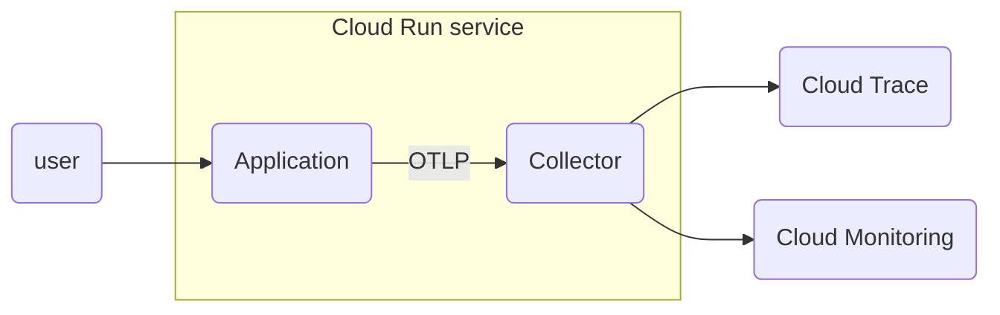

:::message

バージョン情報

* OpenTelemetry for Go: v1.24.0以上

:::

## はじめに

こんにちは！Google Cloudでオブザーバビリティを担当しているものです！ここ1ヶ月ほどでOpenTelemetry for Goに[エグザンプラー](https://opentelemetry.io/docs/specs/otel/metrics/data-model/#exemplars)に関するパッチが2件入り、先日の1.23.0と1.24.0のリリースでその両方が取り込まれました。

@[card](https://github.com/open-telemetry/opentelemetry-go/pull/4871)
@[card](https://github.com/open-telemetry/opentelemetry-go/pull/4900)

まだ試験的な機能ではありますが、早速エグザンプラーを試してみましょう。

## TL;DR

トレースエグザンプラーの取得をOpenTelemetryで行うデモを用意しました。Google Cloudのアカウントがあれば割と簡単に試せるはずです。ローカルやKubernetesでも動かす場合も手元での修正はそんなに難しくないと思います。

詳細はREADMEを読んでみてください。

@[card](https://github.com/GoogleCloudPlatform/devrel-demos/tree/main/devops/otel-trace-exemplar)

## エグザンプラーとは

そもそもエグザンプラー（Exemplar）とは何かについて紹介すると、集約されたメトリクス（ヒストグラム、合計値、平均値、最小値、最小値など）をアノテートする何らかの標本のことをいいます。オブザーバビリティの文脈では、特徴的な標本としてトレースやエラーログなどが使われます。特にメトリクスとトレースの連携が一番多いので、トレースエグザンプラーのことを代表的にエグザンプラーと呼ぶことが多いです。

Google CloudではCloud Monitoringでチャートの中に関連するトレースの情報を表示する機能があります。逆井さんがGoogle Managed Service for Prometheus (GMP)を使ってそれを試してくれた記事がありますので、興味があればそちらもご覧ください。

@[card](https://zenn.dev/k6s4i53rx/articles/2023-advent-calendar-google-cloud)

公式ではGMPからGrafanaを使ってエグザンプラーを表示する例も紹介しています。

@[card](https://cloud.google.com/stackdriver/docs/managed-prometheus/exemplars)

そして、今回はGMPを使わずにOpenTelemetry for GoのSDKとエクスポーターに入ったエグザンプラーの機能を試してみたいと思います。

## デモの構成

今回はCloud Runでサイドカー構成でアプリケーションとOpenTelemetry Collector（以下、コレクター）をデプロイし、アプリケーションからはトレースとメトリクスのそれぞれをOTLPでコレクターに送信し、コレクターからは [`googlecloud`](https://github.com/open-telemetry/opentelemetry-collector-contrib/blob/main/exporter/googlecloudexporter/README.md) エクスポーターを使ってそれらのシグナルをCloud TraceとCloud Monitoringそれぞれに送信します。



## 計装

計装は特に変わったことをする必要はありません。`v1.24.0` 以上のバージョンのOpenTelemetry for Goのライブラリを使ってトレースとメトリクスの計装を普通に行うだけです。するとメトリクスにトレースエグザンプラーが自動で挿入されます。今回のデモでは [`otelhttp`](https://pkg.go.dev/go.opentelemetry.io/contrib/instrumentation/net/http/otelhttp@v0.49.0)を使っていて、メトリクスに関しては `http.server.duration`、`http.server.response.size`、`http.server.request.size` というGoのHTTPサーバーに関するメトリクスがいくつか自動で生成されている[^otelhttp]ので、メトリクスプロバイダーの設定だけしてあげれば試せます。

[^otelhttp]: <https://github.com/open-telemetry/opentelemetry-go-contrib/blob/v1.24.0/instrumentation/net/http/otelhttp/common.go#L32-L37>

## 設定

計装側で何もしなくていいなら、どこでエグザンプラーを有効にするかというと、環境変数で設定します。詳細はドキュメント[^exemplarfilter]にありますが、エグザンプラーには次の環境変数を設定します。

[^exemplarfilter]: Go SDKでは試験的機能なので[xパッケージ](https://github.com/open-telemetry/opentelemetry-go/blob/v1.24.0/sdk/metric/internal/x/README.md)に入っていますが、このフラグ自体は[仕様](https://github.com/open-telemetry/opentelemetry-specification/blob/v1.30.0/specification/metrics/sdk.md#exemplarfilter)で決められています。

* `OTEL_GO_X_EXEMPLAR`: エグザンプラーの機能の有効化フラグ（`true`と`false`）
* `OTEL_METRICS_EXEMPLAR_FILTER`: どの頻度でエグザンプラーを取るか（`always_on`、`always_off`、`trace_based`）

今回のデモではとにかく確実にエグザンプラーを取りたいのでフィルターは `always_on` にしておきます。

というわけでCloud Run向けの設定は次のようになっています。

```yaml
apiVersion: serving.knative.dev/v1
kind: Service
metadata:
  name: otel-exemplar-test
spec:
  template:
    metadata:
      annotations:
        autoscaling.knative.dev/minScale: "1"
        run.googleapis.com/cpu-throttling: "false"
        run.googleapis.com/execution-environment: gen2
    spec:
      containers:
        - image: ${YOUR_CONTAINER_REGISTRY_NAME}/recursive:latest
          env:
            - name: OTEL_GO_X_EXEMPLAR
              value: "true"
            - name: OTEL_METRICS_EXEMPLAR_FILTER
              value: "always_on"
          ports:
            - containerPort: 8080
        - image: ${YOUR_CONTAINER_REGISTRY_NAME}/otelsidecar:latest
          resources:
            limits:
              cpu: 250m
              memory: 256Mi
```

## 試してみる

早速デプロイして、継続的にリクエストしてメトリクスとトレースを生成し続けてみます。Cloud Monitoringではメトリクス型が `DISTRIBUTION` のものだけエグザンプラーに対応しているので、ここでは `http.server.duration` を見てあげてください。
次のようにヒストグラムを可視化したヒートマップ内にトレースの標本を表す点が表示されるようになりました[^mr]。

[^mr]: メトリクスを探すときは `workload.googleapis.com/http.server.duration` で検索すると、 Generic Task のモニタードリソース内に見つかります。


この点をダブルクリックすると右からトレースのウォータフォールチャートがスライドして見れました。


またヒストグラム以外のデータ型でも、`debug` エクスポーターの出力から、エグザンプラーが入っていることが確認できました。

```
...
Metric #1
Descriptor:
     -> Name: http.server.response.size
     -> Description: Measures the size of HTTP response messages.
     -> Unit: By
     -> DataType: Sum
     -> IsMonotonic: true
     -> AggregationTemporality: Cumulative
NumberDataPoints #0
Data point attributes:
     -> http.method: Str(GET)
     -> http.scheme: Str(http)
     -> http.status_code: Int(200)
     -> net.host.name: Str(otel-exemplar-test-loiwv2t7ea-de.a.run.app)
     -> net.protocol.name: Str(http)
     -> net.protocol.version: Str(1.1)
StartTimestamp: 2024-03-06 07:58:33.620925484 +0000 UTC
Timestamp: 2024-03-06 10:40:33.623290564 +0000 UTC
Value: 1730
Exemplars:
Exemplar #0
     -> Trace ID: 8d5ff01f329c3abb14c7bcbbb58ca0d3
     -> Span ID: f7c89ac676ec2466
     -> Timestamp: 2024-03-06 10:39:36.041341031 +0000 UTC
     -> Value: 12
Exemplar #1
     -> Trace ID: 0393f641112d95f13b83cf12e2c02e1a
     -> Span ID: a0aeb8f610c9255c
     -> Timestamp: 2024-03-06 10:39:46.951561363 +0000 UTC
     -> Value: 11
Exemplar #2
     -> Trace ID: f12b20c64a4542514042eac8cc47785a
     -> Span ID: 4313072398b98a63
     -> Timestamp: 2024-03-06 10:39:57.848970157 +0000 UTC
     -> Value: 11
Exemplar #3
     -> Trace ID: fb2d801a798fe8682d50f3602aa8c212
     -> Span ID: 46c1e1c94a94928d
     -> Timestamp: 2024-03-06 10:40:08.226691328 +0000 UTC
     -> Value: 11
...
```

## おわりに

オブザーバビリティにおいて重要な点としてテレメトリーシグナル同士の相関（correlation）があります。Cloud MonitoringやPrometheus以外のモニタリングSaaSでもエグザンプラーはサポートされていると思いますので、ぜひ試してみてください。

## 補足1 2024.03.08

この記事を書いている最中に `googlecloud` エクスポーターのバグで `int64` のメトリクスにエグザンプラーがちゃんとアノテートされない問題を発見してしまったのですが、報告して無事に解決したので、次の `googlecloud` エクスポーターのリリースで修正が入ると思います。

@[card](https://github.com/GoogleCloudPlatform/opentelemetry-operations-go/pull/810)

## 補足2 2024.04.02

これらの修正が入ったバージョン（v0.46.0）のエクスポーターがcontribレポジトリーの方でも取り込まれました。

@[card](https://github.com/open-telemetry/opentelemetry-collector-contrib/tree/main/exporter/googlecloudexporter)
