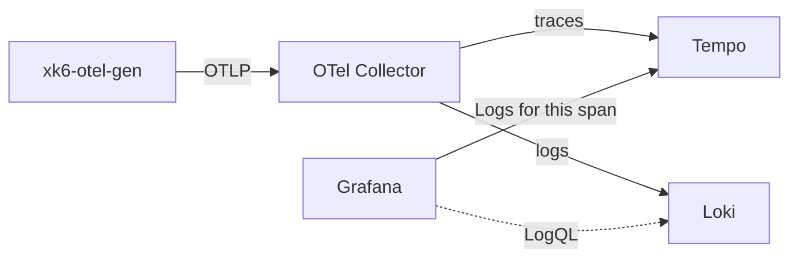

## はじめに

こんにちは、Grafana Labsでデベロッパーアドボケイトをしているものです。

先日、テレメトリー生成器の `xk6-otel-gen` を紹介しました。

@[card](https://github.com/ymotongpoo/xk6-otel-gen)

このツールは合成したトレース・メトリクス・ログを **すべて同じトレースコンテキストで関連付けて** OTLPで送信します。
つまりログのレコードには対応するスパンの `trace_id` と `span_id` がちゃんと入っています。
せっかく相関させたので、Grafana + Tempo + Loki の構成で「このスパンに対応するログ」をワンクリックで引きたい——というのが今回の話の出発点です。

ところが、トレースのスパン詳細から **Logs for this span** を押すと、目的の1スパンに対応するログだけでなく **そのサービスの当該時間帯のログが全部** 出てきてしまいました。
これ、OTLPネイティブにLokiを使っているとかなり踏みやすい罠だったので、原因と直し方を残しておきます。

## 何が起きるか

スパン詳細の **Logs for this span** は、内部的にLokiへ次のようなクエリを発行します。

本来欲しいクエリ（理想）はこうです。

```logql
{service_name="frontend"} | trace_id = "3ad285c53fd79bb74d5d5ddebdf67a54"
```

ところが実際に発行されていたのはこちらでした。

```logql
{service_name="frontend"}
```

`trace_id` のフィルタが消えて、ストリームセレクタと時間範囲だけになっています。
結果として、そのスパン1件に対応するログではなく、`frontend` サービスがその時間帯に吐いたログが丸ごと返ってきます。
相関させた意味がありません。

## 原因：trace_id は「ストリームラベル」ではなく「structured metadata」

ポイントはOTLP → Lokiのインジェスト仕様にあります。
OTLPで送られてきたログのフィールドは、Loki側で次のように **固定的に** 振り分けられます。

| OTLPのフィールド | Lokiでの扱い |
|---|---|
| Resource attributes（例: `service.name`） | ストリームラベル（`service_name`） |
| LogRecord の `trace_id` / `span_id` | structured metadata |
| その他のログ属性 | structured metadata |



`service.name` のようなリソース属性は `{service_name="..."}` というストリームラベルになりますが、
`trace_id` は設計上 **structured metadata** に入ります。`{}` の中（ストリームセレクタ）では使えません。

一方、Grafanaの **Logs for this span**（Tempoデータソースの `tracesToLogsV2` 設定）は、
デフォルトでは設定した **タグからストリームセレクタを組み立てるだけ** で、structured metadata の `trace_id` を絞り込むクエリにはなりません。
そのため `{service_name="..."}` までしか作れず、冒頭の「全部出てくる」状態になります。

### trace_id をストリームラベルに昇格させてはいけない

「じゃあ `trace_id` をストリームラベルにすればいいのでは？」と考えたくなりますが、これはやってはいけません。
トレースIDはトレースごとにユニーク、つまり **カーディナリティが事実上無限** です。
ラベルにするとトレースの数だけストリームが生成され、Lokiのインデックスとクエリ性能が深刻に劣化します。
Lokiのラベル設計としては典型的なアンチパターンです。

:::message
高カーディナリティな値（trace_id、span_id、user_id、リクエストIDなど）はラベルにせず、structured metadata かログ本文に置く、というのがLokiの基本方針です。
:::

## 解決策：Tempoの「Trace to logs」をカスタムクエリにする

正しい直し方は、`trace_id` を **structured metadata のフィルタとして** クエリに含めるよう、Tempoデータソースの **Trace to logs** を設定することです。
`| trace_id = "..."` はストリームセレクタの外側のフィルタなので、structured metadata に対して効きます。

### Grafana CloudのUIから設定する場合

1. **Connections → Data sources** で対象のトレース用データソース（例: `grafanacloud-<stack>-traces`）を開く
2. **Trace to logs** セクションを開く
3. **Data source** にログ用データソース（例: `grafanacloud-<stack>-logs`）を指定
4. **Custom query** を有効化して次を設定する

```logql
{service_name="${__tags["service.name"]}"} | trace_id = "${__trace.traceId}"
```

5. 保存

これで **Logs for this span** が `| trace_id = "..."` 付きのクエリを発行するようになり、目的の1スパンに対応するログだけが返ってきます。

### プロビジョニング（YAML）で設定する場合

ローカルのLGTMスタックなど、データソースをコードで管理している場合は `datasources.yaml` の `tracesToLogsV2` を次のようにします。

```yaml
datasources:
  - name: Tempo
    uid: tempo
    type: tempo
    jsonData:
      tracesToLogsV2:
        datasourceUid: loki
        spanStartTimeShift: -5m
        spanEndTimeShift: 5m
        filterByTraceID: false
        customQuery: true
        query: '{service_name="${__tags["service.name"]}"} | trace_id = "${__trace.traceId}"'
        tags:
          - service.name
```

ポイントは次の3点です。

- `customQuery: true` にして `query` に自前のLogQLを書く
- `filterByTraceID` は `false`（カスタムクエリ側で `trace_id` を絞るので二重指定を避ける）
- `${__tags["service.name"]}` はスパンのタグ、`${__trace.traceId}` はトレースIDに展開される

`xk6-otel-gen` のサンプル（`examples/minimal/k8s/` と `examples/astroshop/k8s/`）には、この修正を入れたデータソース定義を同梱してあります。
マネージドなGrafana Cloud向けの手順は `examples/saas-endpoints.md` にもまとめてあります。

@[card](https://github.com/ymotongpoo/xk6-otel-gen/blob/main/examples/saas-endpoints.md)

## おわりに

トレースとログを相関させること自体はSDK側で正しくできていても、
バックエンドのインデックス設計（Lokiならどれがラベルでどれがstructured metadataか）と、
フロントエンド（Grafanaのデータソース設定）が噛み合っていないと、相関は活きません。

特にOTLPネイティブにLokiへ送る構成だと、`trace_id` がstructured metadataに入るのは仕様どおりの挙動なので、
「相関させたはずなのにLogs for this spanが全部のログを返す」という症状はけっこう普遍的に踏むはずです。
同じところでハマった方の助けになれば幸いです。
