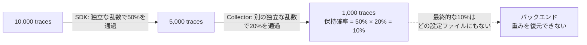
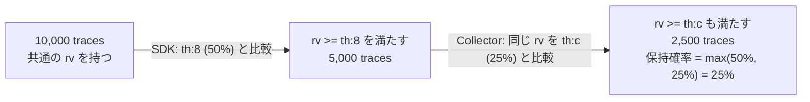

SRE NEXT 2026では「サンプリングは統計学である」というタイトルで、サンプリング率を決めるときには許容誤差から標本数を逆算する必要がある、という話をしました。

@[speakerdeck](a9ec7f8ce1b94371b64c35878693494e)

このとき、トレースの一貫したサンプリングを支える仕組みとして**Consistent Probability Sampling**に触れましたが、時間の都合でその中身までは踏み込みませんでした。この記事では、その部分を掘り下げて紹介します。

## TraceIdRatioBasedの限界

分散トレースのサンプリング率を下げたいとき、OpenTelemetryでまず候補に挙がるのは `TraceIdRatioBased` サンプラーです。トレースIDから決定論的に判定するため、同じトレースIDに対しては必ず同じ結果を返します。であれば、複数のサービスがそれぞれこのサンプラーを設定しても、ひとつのトレースが途中で欠けることはないはずです。

ところが、Tracing仕様の1.0には、このサンプラーはルートスパンで設定する場合にのみ安全である、という趣旨の注意書きがありました[^ratio-warning]。判定に使うアルゴリズムが言語実装間で揃うことは保証されておらず、サービスごとに異なるサンプリング率を選んだときの振る舞いも定義されていなかったからです。つまり、分散システムの各所で独立に確率的サンプリングを行うことは、仕様1.0の時点ではできませんでした。

この未解決だった問題に答えるのが、**Consistent Probability Sampling**（以下CPS）です。Tracing仕様1.0の公開から4年以上を経て、2025年に一連の関連仕様とOTEPが出揃い、実装が使える段階に到達しました[^milestones]。この記事では、CPSが何を解決するのか、そしてどういう仕組みで解決するのかを説明します。

[^ratio-warning]: 該当箇所は [Trace SDK仕様の「Compatibility warnings for `TraceIdRatioBased` sampler」節](https://github.com/open-telemetry/opentelemetry-specification/blob/main/specification/trace/sdk.md#compatibility-warnings-for-traceidratiobased-sampler)です。「異なる言語実装がアルゴリズムの互換性を持たない可能性があるため、このサンプラーアルゴリズムはルートスパンにのみ使うことを推奨する」と書かれています。

[^milestones]: 経緯は公式ブログの [Sampling updates: a special interest group reaches milestones](https://opentelemetry.io/blog/2025/sampling-milestones/) にまとまっています。

## 多段サンプリングが壊すもの

そもそも、なぜ各所で独立にサンプリングしたくなるのでしょうか。

現実のシステムでは、コンポーネントごとにトラフィック量が桁で違うからです。たとえば、フロントエンドは全量（100%）、その背後のキャッシュは1/1000、ストレージは1/10でサンプリングしたい、という状況を考えます。リクエスト数の少ないフロントエンドは全部残したいし、桁違いに呼ばれるキャッシュは強く間引きたい。この要求自体は自然なものです。

このとき、各サービスが無関係な乱数で判定すると、2つのことが壊れます。

ひとつは、トレースそのものです。サービスAでは保持、サービスBでは破棄、サービスCでは保持、というように判定がばらけると、トレースが断片化します。根本原因調査で見たい因果関係が途中で切れ、トレースとしての価値が落ちます。断片化を防ぐには、「1/1000のサンプラーが残すと決めたトレースは、1/10のサンプラーも必ず残す」という関係、つまり低い確率で残る集合が高い確率で残る集合の部分集合になっていることが必要です。

もうひとつは、集計です。サンプリングされたデータから母集団の量を推定するには、残った1件が元の何件を代表するのかという重み（adjusted count）が必要です。サンプリング率 `r` で残ったスパンの重みは `1/r` で、各標本をこの重みで合計すれば母集団の合計を偏りなく推定できます[^ht]。ところが、SDKで50%に間引き、Collectorでさらに20%に間引くと、最終的な保持確率は掛け算で10%になります。各段が独立に間引く構成では、この最終値はどの段の設定ファイルにも書かれていません。全段の設定を知らない限り、バックエンドは重みを復元できないことになります。



[^ht]: この推定手法は、統計学ではHorvitz–Thompson推定量として知られています。

`ParentBased` サンプラーで親の判定を子に継承すれば、断片化は防げます。しかしその場合、判定はルートで一度きりです。キャッシュだけ強く間引きたい、Collectorで追加に絞りたい、という段ごとの調整はできません。

整理すると、必要なのは次の2つです。段ごとに異なる確率を選んでもトレースを**正しく残す**こと。そして、最終的な保持確率を後段に伝えて**正しく数える**こと。CPSはこの両方を、ひとつの仕組みで実現します。

## 同じ乱数を閾値と比較

CPSの仕組みは、2つの56ビット値に集約されます。

- **ランダム値 `rv`**：トレースごとに一度だけ決まる乱数。原則としてトレースIDの下位7バイト（56ビット）をそのまま使い、以後どの段でも変わりません
- **閾値 `th`**：56ビット空間上の棄却閾値。`rv >= th` を満たすトレースだけを保持します

保持確率 $p$ と閾値の関係は次の式です。

$$
th = (1 - p) \times 2^{56}
$$

$th = 0$ なら全トレースが条件を満たすので100%保持、$th$ が大きいほど棄却域が広がり、保持確率は下がります。

重要なのは、どの段のサンプラーも乱数を引き直さない点です。全員が同じ `rv` を見て、それぞれ自分の閾値と比較するだけです。すると、閾値のきつい（大きい）サンプラーが残したトレースは、閾値の緩いサンプラーの条件を自動的に満たします。先ほど必要だと述べた部分集合の関係が、判定方式そのものから導かれるわけです。

このとき、複数段を通過したトレースの最終的な保持確率はどうなるでしょうか。

独立な乱数で間引く方式なら、50%の次に25%を通すと保持確率は12.5%でした。CPSでは違います。判定条件は「`rv` が両方の閾値以上」であり、これは「`rv` が大きいほうの閾値以上」と同じです。つまり閾値は掛け算ではなくmaxで合成され、50%（`th:8`）の後に25%（`th:c`）を通した最終保持確率は25%です。



この性質が、集計の問題を一気に単純にします。最終確率がもっともきつい閾値だけで決まるので、バックエンドは各段の履歴を掛け合わせる必要がありません。スパンに記録された最後の $th$ を読めば、次の式で重みを復元できます。

$$
\text{adjusted\_count} = \frac{2^{56}}{2^{56} - th}
$$

各段は互いの設定を知らないままでよい、という点も見逃せません。SDKは自分が使った閾値をデータに書き残す。Collectorは流れてきた閾値を読み、必要なら引き上げて書き直す。前段までの保持確率は、設定の共有ではなくデータと一緒に流れてきます。

## tracestateでの表現

では、この `th` と `rv` はどこに書かれるのでしょうか。

W3C Trace Contextの `tracestate` ヘッダーです。OpenTelemetryは `ot` というキーの下に、コロン区切りのサブキーとして値を載せます[^tracestate]。

```text
tracestate: ot=th:c;rv:6e6d1a75832a2f
```

[^tracestate]: 形式の詳細は [TraceState Handling](https://opentelemetry.io/docs/specs/otel/trace/tracestate-handling/) 仕様で定義されています。`ot` エントリ全体で256文字以内という制約もここにあります。

`th` は1〜14桁の小文字16進数で、末尾の0は省略できます。14桁に0埋めして56ビット整数として読むので、`th:8` は `0x80000000000000`、つまり上位半分が棄却されて保持確率50%です。同様に `th:c` は25%、`th:0` は100%を表します。2のべき乗の確率なら1〜2文字で書ける、コンパクトな表現です。

なぜ10進の確率ではなく16進の閾値なのか、と思うかもしれません。`rv` がトレースIDの16進表記の部分文字列そのままだからです。両方を16進で揃えておけば、変換なしに文字列として大小比較でき、しかも `th` から保持確率を丸め誤差なく可逆に復元できます。判定の単純さと確率の可逆性を優先した設計です。

一方の `rv` は、実は多くの場合 `tracestate` に現れません。トレースIDの下位56ビットがランダムであると信頼できるなら、それをそのまま `rv` として使えばよいからです。問題は、W3C Trace ContextがトレースIDに要求するのが一意性だけで、ランダム性ではないことです。タイムスタンプを埋め込むIDや、64ビットIDを0埋めしたIDも現実に存在します。そこでW3C Trace Context Level 2では、traceparentのフラグで「下位7バイトはランダムである」と宣言できるようになりました（[Random Trace ID Flag](https://github.com/w3c/trace-context/blob/main/spec/20-http_request_header_format.md#random-trace-id-flag)）。このフラグが立っていないなど、ランダム性を保証できない場合に限り、ルート側で乱数を生成し、明示的な `rv` として `tracestate` に載せて伝搬させます。つまり明示的な `rv` は、ランダムなトレースIDを持たないエコシステムとの互換性のためのフォールバックです。

## 仕様とエコシステムの現状

CPSは、4本のOTEPを経て仕様化されました。サンプリング情報の伝搬（[OTEP 0168](https://github.com/open-telemetry/opentelemetry-specification/blob/main/oteps/trace/0168-sampling-propagation.md)）、サンプリング確率の定義（[OTEP 0170](https://github.com/open-telemetry/opentelemetry-specification/blob/main/oteps/trace/0170-sampling-probability.md)）、`tracestate` への閾値の記録（[OTEP 0235](https://github.com/open-telemetry/opentelemetry-specification/blob/main/oteps/trace/0235-sampling-threshold-in-trace-state.md)）、複合サンプラー（[OTEP 0250](https://github.com/open-telemetry/opentelemetry-specification/blob/main/oteps/trace/0250-Composite_Samplers.md)）です。これらが [Trace Probability Sampling](https://opentelemetry.io/docs/specs/otel/trace/tracestate-probability-sampling/) などの仕様に結実し、前提となるトレースIDのランダム性はW3C Trace Context Level 2が引き受けました。

Collector側の実装も進んでいます。collector-contribの `probabilisticsampler` プロセッサーはOTEP 0235に準拠し、流れてきた `th` を読んで書き直す動作をします。最終確率を設定値に揃えるequalizingモードと、入ってきた確率に設定値を掛けた確率になるよう閾値を再計算するproportionalモードがあり、CPS非対応の前段から来たデータに対しては、ハッシュ値から `rv` 相当の値を合成して既存の判定を壊さないよう配慮されています。

## 導入するときの注意点

CPSはパイプライン全体で採用して初めて機能します。途中のどこかに、閾値を無視して独立な乱数で間引く段があると、部分集合の関係も最終 `th` の正しさも崩れます。SDK、Collector、バックエンドのどこでサンプリングしているかを棚卸ししたうえで導入すべきです。

もうひとつ、重みが効く場面は限定的です。`adjusted_count` が必要なのは、保存済みトレースに対して「この障害パターンは結局何件発生したのか」のような量的な質問をするときだけで、個別のトレースを1本ずつ読んで調査する分には重みは要りません。また、エラー率やレイテンシー分布のようなSLIは、そもそもサンプリングの前段でspanmetricsコネクターなどを使い全量スパンから生成しておくほうが確実です。CPSの重み復元は、事前にメトリクスへ焼き込めなかった想定外の量的な問いに答えるための備え、と位置づけるのがよいでしょう。

## まとめ

冒頭の注意書きに戻ります。`TraceIdRatioBased` がルート以外で安全でなかったのは、各段が共有できる乱数と、判定を比較できる共通の物差しがなかったからでした。CPSはトレースID由来の56ビット乱数 `rv` を全段で共有し、棄却閾値 `th` を `tracestate` で申し送ることで、この2つを揃えます。その結果、段ごとに異なる確率を選んでもトレースは断片化せず、最終的な `th` ひとつから各トレースの重みを復元できます。

サンプリングは、データを捨てると同時に、残ったデータの意味を変えます。残った1件は母集団の何件分かを代表する1件であり、その代表性を後段に伝えるメタデータがなければ、正しく数えることはできません。CPSは、そのメタデータの標準的な運び方です。

残る課題は、バックエンドやクエリ側がこの `th` をどこまで活用してくれるかです。仕様と伝搬の道具立ては揃いました。保存されたトレースを重み付きで集計する体験が当たり前になるかどうかは、これからの各実装にかかっています。
