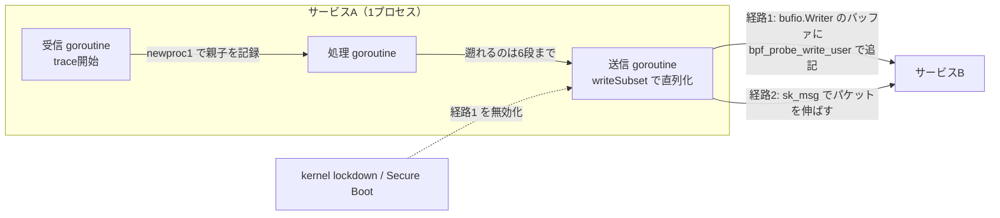
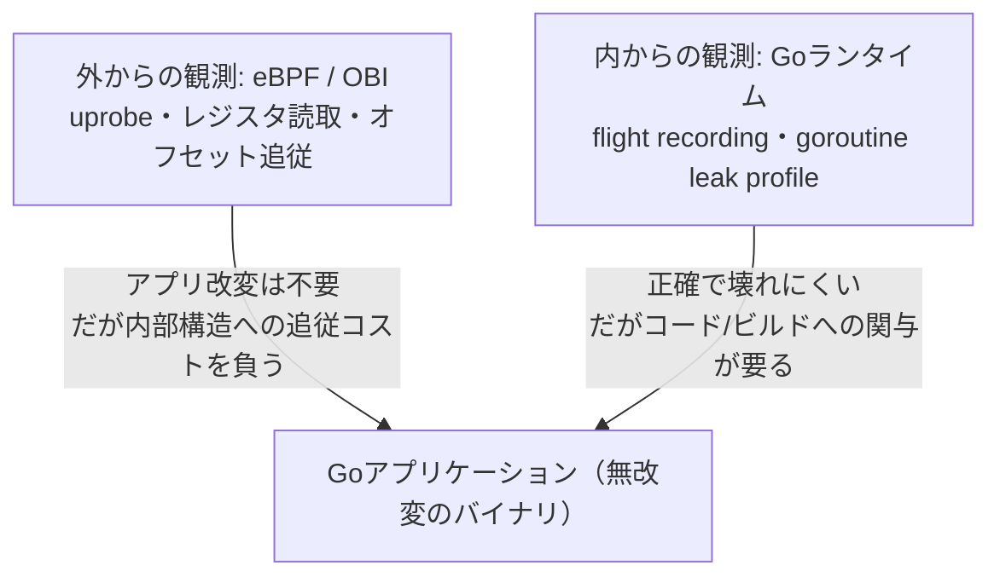

## はじめに

eBPFを使うと、アプリケーションのソースコードを一切変更せずに、HTTPやgRPCの分散トレースを取得できます。いわゆる**ゼロコード計装**（zero-code instrumentation）です。再ビルドも再デプロイも不要で、言語を問わず動きます。製品の説明ではしばしばそう語られます。

しかし、その仕組みの中身は言語ごとにまったく違います。eBPFで関数レベルまで踏み込んで計装されているのは、実のところGoだけです。他の言語では、通信のバイト列をプロトコルとして解釈する汎用の経路が主になります。Goに対してだけ深く踏み込めるのは、静的にリンクされたバイナリに関数のアドレスが固定で並んでいるからです。そして踏み込んだ先で、他の言語では出てこない難所に次々とぶつかります。

難所の正体は、**Goを高速かつ書きやすい言語にしている設計そのもの**です。一般的なeBPF計装の定石は、スタックがOSに管理されて動かないこと、呼び出し規約がプラットフォームの標準に従うことを前提にしています。CやJavaのスレッドはこの前提を満たします。一方Goは、goroutineのスタックを実行中に動かし、独自の呼び出し規約を持ち、スケジューリングもメモリ管理もランタイムが自前で抱えています。定石の前提が、ここでまとめて成り立たなくなります。

題材にするのは、Grafana BeylaがOpenTelemetryプロジェクトに寄贈されて生まれた**OpenTelemetry eBPF Instrumentation**（OBI）です。4つの難所それぞれに、Goの手元の環境で実行して確かめられるコードを添えました。そのうえで、同じことをOBIが実際にどう書いているかを見ます。本記事に載せた実行結果はすべて go1.26.0 linux/amd64 での実測値で、OBIのコードはリリース v0.11.0 時点のものです。

## 前提知識

本記事を読むうえで必要な前提は次の3点だけです。細部は登場のたびに補います。

- CPUは命令を順番に実行し、各命令はアドレスを持つ。
- 関数呼び出しでは「呼び出し元のどこに戻るか」を示す戻りアドレスがどこかに保存される。
- GoのgoroutineはOSスレッドそのものではなく、Goランタイムが管理する実行単位である。多数のgoroutineが少数のOSスレッド上で切り替えられながら動く。

eBPFの知識は前提としません。必要なぶんは次の節で説明します。

---

## eBPFとは何か

### カーネルの中で動く小さなプログラム

eBPFは、ユーザーが書いた小さなプログラムをLinuxカーネルの中にロードして、特定のイベントが起きたときに実行させる仕組みです。イベントとは、システムコールが呼ばれた、パケットが届いた、ある命令アドレスに到達した、といったものを指します。カーネルを再ビルドしたり、カーネルモジュールを書いたりする必要はありません。

カーネル空間で任意のコードを走らせるのですから、そのままでは危険です。そこでロード時に**検証器**（verifier）がプログラム全体を静的に解析し、通らなければロード自体が失敗します。検証器が保証するのは、プログラムが必ず停止すること、未初期化のメモリやポインタを読まないこと、許可されたメモリ以外に触らないことです。振る舞いはコンパイラの型検査に近いものです。Goのコンパイラが型の合わない代入をコンパイルエラーにするように、検証器は安全性を証明できないプログラムをロードエラーにします。走らせてから落ちるのではなく、載せる前に断られます。

この検証を成立させるために、eBPFプログラムにはいくつもの制約が課されます。命令数に上限があり、ループは回数の上界がコンパイル時に決まる形でしか書けません。「リストを終端まで辿る」ような、素直でありながら停止性を証明しにくいコードは書けません。この制約は4つ目の難所で具体的な形をとって現れます。

### イベントをまたいで状態を持つマップ

カーネル側で動くeBPFプログラムは、イベントごとに呼ばれてすぐ終わります。関数のローカル変数に相当するものは、次のイベントには残りません。イベントをまたいで状態を持つには、**マップ**（map）と呼ばれるカーネル管理のキーバリューストアを使います。役割はGoの `map` と似ています。違うのは、実体がカーネル側にあり、eBPFプログラムからもユーザー空間のプロセスからも読み書きできる点です。

「関数の入口で開始時刻を記録し、出口でそれを取り出して所要時間を計算する」という計装の基本パターンは、このマップの上で成り立っています。4つ目の難所で登場する `ongoing_goroutines` も、goroutineの親子関係を保持するマップです。

### uprobeとuretprobe

eBPFでユーザー空間のプログラムにフックを仕掛ける主な仕組みは2つあります。

- **uprobe**：ユーザー空間バイナリの「特定の命令アドレス」に置くプローブ。関数の先頭アドレスに置くことが多いため「入口のフック」と呼ばれがちだが、仕組み上は入口専用ではなく、バイナリ中の任意の命令アドレスに置ける。
- **uretprobe**：関数から「戻るタイミング」を捕捉するための特別な仕組み。

一般的な計装では、関数の入口にuprobe、出口にuretprobeを置き、「入口で開始時刻を記録、出口で所要時間を計算」というパターンを取ります。多くの言語ではこれで素直に動きます。Goでは、この素直な形が最初の一歩から使えません。

### ローダーはGoで書かれている

eBPFプログラム自体は制限されたCで書き、専用のコンパイラでバイトコードに落とします。しかし、そのバイトコードをカーネルにロードし、プローブを実際のアドレスに結びつけ、マップを読み出す側は、普通のユーザー空間のプログラムです。そしてこのローダー側は、多くの場合Goで書かれています。デファクトのライブラリが [`github.com/cilium/ebpf`](https://github.com/cilium/ebpf) で、OBIもこれを使っています。

uprobeを1つ仕掛けるコードを見ておきます。

```go
// コンパイル済みeBPFプログラム objs は事前にロード済みとする
exe, err := link.OpenExecutable("/proc/12345/exe")
if err != nil {
	return err
}

// シンボル名を指定して関数の先頭に置く
up, err := exe.Uprobe("main.handleRequest", objs.OnEntry, nil)
if err != nil {
	return err
}
defer up.Close()
```

第1引数にシンボル名を渡すと、そのシンボルの先頭アドレスにプローブが置かれます。シンボル名の代わりに、アドレスを直接指定する形もあります。

```go
up, err := exe.Uprobe("", objs.OnReturn, &link.UprobeOptions{
	Address: 0x49e050, // 関数先頭からのオフセット
})
```

シンボル名を空文字列にして `Address` を渡すこの形が、1つ目の難所の回避策そのものになります。なお、ここに挙げた2つのコードは動かすのにroot権限とLinuxが要るので、読むだけでかまいません。手元で実行して確かめるのは、これ以降に出てくるGoのサンプルのほうです。

### OBIとは何か

OBIは、もともとGrafanaが開発していたeBPFベースの自動計装ツール**Beyla**を前身とします。2025年5月にOpenTelemetryプロジェクトへの寄贈が発表され、同年10月30日に最初のリリース `v0.1.0` が出ました。2026年3月のKubeCon EUでbetaに到達し、その後もおよそ月1回のペースでリリースが続いています。本記事執筆時点の最新は2026年8月17日の `v0.11.0` で、`1.0` GAを目標にしています。

参照するソースは、リポジトリ [`open-telemetry/opentelemetry-ebpf-instrumentation`](https://github.com/open-telemetry/opentelemetry-ebpf-instrumentation) です。カーネル側のCコードが `bpf/` 配下、Goで書かれたローダーと解析処理が `pkg/` 配下にあります。Goを扱う部分は主に `bpf/gotracer/` と `pkg/internal/goexec/` です。

OBIの計装は、`SUPPORT_MATRIX.md` にあるとおり2つのカテゴリに分かれます。一つはネットワークレベルのプロトコル計装で、こちらは言語に依存しません。ソケットを流れるバイト列を、HTTP/1.1、HTTP/2、gRPC、MySQL、PostgreSQL、Redis、Kafkaなどとして解釈します。もう一つがランタイムやライブラリのレベルの計装で、こちらは対象の環境ごとに個別の実装が要ります。そしてライブラリレベルの関数計装を持つのはGoだけです。`net/http` は1.17以降、`google.golang.org/grpc` は1.40以降、`database/sql` は1.17以降、というようにサポート範囲がバージョン単位で決まっています。本記事が扱う4つの難所は、すべてこの後者の経路で起きるものです。

---

## 1つ目の難所：`uretprobe` が使えない

### 症状

関数の入口と出口にプローブを置くだけなら、Goでも同じようにできそうに見えます。ところが、Goのバイナリに対してuretprobeを使うと、最悪の場合、計装対象のGoプログラムが次のエラーでクラッシュします。

```
fatal error: unknown caller pc
```

観測していただけのはずが、観測対象を道連れに落ちます。計装はあくまで観測が目的であり、これは許されない挙動です。なぜ観測しただけで対象が落ちるのでしょうか。原因はuretprobeの実装にあります。

### uretprobeの仕組み

通常の関数呼び出しでは、CPUは「この関数を抜けたら呼び出し元のどの命令に戻るか」という戻りアドレスを保存します。amd64では典型的に、この戻りアドレスはスタック上に積まれ、関数末尾の `RET` 命令がそれを取り出してジャンプします。

uretprobeは、関数に入った瞬間に、スタック上の戻りアドレスを自身の「トランポリン」のアドレスに書き換えます。こうすると関数がreturnする際、本来の呼び出し元ではなく一度カーネルのフックに制御が戻り、そこで処理を行ってから本物の戻りアドレスへジャンプし直します。

つまりuretprobeは「スタック上の戻りアドレスは、書き換えた後も同じ場所に留まり続ける」という前提に立っています。

```
図1: uretprobe による戻りアドレスの書き換え

  通常の呼び出し                    uretprobe 設定後（関数entry時）
  ┌───────────────────┐            ┌───────────────────┐
  │ ローカル変数 ...   │            │ ローカル変数 ...   │
  ├───────────────────┤            ├───────────────────┤
  │ 戻りアドレス       │            │ 戻りアドレス       │
  │   0x401050 ───────┼─┐          │   0xTRAMPOLINE ───┼─┐  ← カーネルが書換え
  └───────────────────┘ │          └───────────────────┘ │
            RET でここへ─┘                      RET でここへ─┘
            （呼び出し元）                       （カーネルのフック）
                                       フック処理後、本物の 0x401050 へジャンプし直す

  前提: 「戻りアドレスを置いたスタック上の場所」は、その後も動かない
```

### Goの可動スタックとの衝突

この前提が、Goでは成り立ちません。goroutineのスタックは可変長です。初期サイズは数KB程度と小さく、不足すると、より大きな領域を新たに確保してスタックの内容を丸ごとコピーし、移動します（スタックの伸長と収縮）。

スタックを移動する際、Goランタイムはスタック上のポインタを自分で正しく書き換えながら引っ越します。しかし、カーネルがuretprobeのために裏で書き換えた「偽の戻りアドレス」の存在を、Goランタイムは知りません。その結果、移動時に整合性が壊れ、戻り先を解決できずに `unknown caller pc` でクラッシュします。これがGoとuretprobeが相容れない理由です（[golang/go#22008](https://github.com/golang/go/issues/22008)、[#27077](https://github.com/golang/go/issues/27077)）。

```
図2: スタック伸長による移動と uretprobe の破綻

  伸長前のスタック (0x7000_0000〜)        伸長後、別領域へコピー (0x9000_0000〜)
  ┌───────────────────┐                  ┌───────────────────┐
  │ ...               │                  │ ...               │
  │ 戻りアドレス       │   まるごとコピー   │ 戻りアドレス       │
  │   0xTRAMPOLINE    │ ════════════════▶│   0xTRAMPOLINE    │
  └───────────────────┘   ＋ポインタ補正   └───────────────────┘
                                                    ▲
   ランタイムは自分が管理するポインタは補正するが、               │
   カーネルが仕込んだ 0xTRAMPOLINE の素性は知らない ──────────────┘
                          → 戻り先を解決できず fatal error: unknown caller pc
```

### 手元で確かめる：スタックが動くのを見る

「スタックが動く」というのは、日常のGo開発ではまず意識しない挙動です。実際に動くところを見ておくと、以降の話が具体的になります。

```go
package main

import (
	"fmt"
	"unsafe"
)

//go:noinline
func grow(n int) int {
	var pad [256]byte
	if n == 0 {
		return int(pad[0])
	}
	return grow(n-1) + int(pad[1])
}

func main() {
	var anchor [16]byte
	before := uintptr(unsafe.Pointer(&anchor[0]))
	grow(3000) // 深い再帰で goroutine のスタックを伸ばす
	after := uintptr(unsafe.Pointer(&anchor[0]))

	fmt.Printf("before = %#x\n", before)
	fmt.Printf("after  = %#x\n", after)
	fmt.Printf("moved  = %v\n", before != after)
}
```

`anchor` は `main` のローカル変数で、`grow` の再帰の前後で一度も触っていません。それでも実行するとアドレスが変わります。

```
before = 0x7f82f922ee8
after  = 0x7f82fb5fee8
moved  = true
```

具体的なアドレスは実行ごとに変わりますが、`moved` は常に `true` になります。再帰で `main` のフレームより深いところまでスタックを消費した結果、ランタイムがより大きな領域を確保して、`main` のフレームごと引っ越したのです。このとき `anchor` を指すポインタがあれば、ランタイムはそれも新しいアドレスに書き換えます。

uretprobeが書き込んだ偽の戻りアドレスは、このコピーには巻き込まれますが、補正の対象にはなりません。ランタイムから見れば、それは自分が置いた覚えのないビット列だからです。

### 全 `RET` 命令へのuprobe

OBIは、出口専用のuretprobeが使えない以上、通常のuprobeを出口に相当する命令へ直接置くことで対処します。

前述のとおりuprobeは任意の命令アドレスに置けるため、関数の先頭ではなく、関数末尾の `RET` 命令のアドレスに置くこともできます。手順は次のとおりです。

1. 対象の関数を逆アセンブルする。
2. 機械語中のすべての `RET` 命令のアドレスを洗い出す。
3. その一つひとつに通常のuprobeを仕掛ける。

これにより、CPUが `RET` を実行して呼び出し元へ戻る直前にeBPFプログラムが発火します。この方式はスタック上の戻りアドレスを書き換えないため、Goの可動スタックと衝突しません。

### 手元で確かめる：1つの `return` から2つの `RET` が出る

なぜ「すべての」と強調するのでしょうか。Goのソース上で `return` が1箇所しかなくても、機械語では `RET` が複数生成されるからです。`defer` を1つ書くだけで、この状況になります。

```go
package main

import (
	"fmt"
	"sync"
)

var (
	mu    sync.Mutex
	cache = map[string]int{}
)

//go:noinline
func Lookup(key string) int {
	mu.Lock()
	defer mu.Unlock()
	return cache[key]
}

func main() {
	fmt.Println(Lookup("go"))
}
```

`go build` したうえで `go tool objdump` にかけると、`RET` が2つ出てきます。

```
$ go tool objdump -s 'main\.Lookup$' s2_ret
  s2_ret.go:14  0x49df80   CMPQ SP, 0x10(R14)
  s2_ret.go:14  0x49df84   JBE 0x49e061
  ...
  s2_ret.go:17  0x49e04f   POPQ BP
  s2_ret.go:17  0x49e050   RET                                   ← 通常の経路
  s2_ret.go:17  0x49e051   CALL runtime.deferreturn(SB)
  s2_ret.go:17  0x49e056   MOVQ 0x28(SP), AX
  s2_ret.go:17  0x49e05b   ADDQ $0x50, SP
  s2_ret.go:17  0x49e05f   POPQ BP
  s2_ret.go:17  0x49e060   RET                                   ← defer 経由の経路
  s2_ret.go:14  0x49e06b   CALL runtime.morestack_noctxt.abi0(SB)
```

`0x49e050` は通常どおり関数を抜ける経路、`0x49e060` は `runtime.deferreturn` を通ってから抜ける経路です。どちらも `s2_ret.go:17`、つまりソース上の同じ `return` に対応しています。片方にしかuprobeを置かなければ、パニックが起きたときにだけ計装が漏れる、といった再現性の低い抜けが生まれます。

ついでに、この出力には後の節で扱う要素が2つ写り込んでいます。1行目の `CMPQ SP, 0x10(R14)` は、いま説明したスタック伸長の判定です。`R14` の指す構造体の16バイト目に入っている値とスタックポインタを比べ、足りなければ最終行の `runtime.morestack_noctxt` へ飛びます。その `R14` が何なのかは、2つ目の難所で扱います。

### OBIの実装

OBIで `RET` を探しているのは、`pkg/internal/goexec/instructions_amd64.go` の次の関数です。eBPFのCコードではなく、普通のGoで書かれています。

```go
func FindReturnOffsets(baseOffset uint64, data []byte) ([]uint64, error) {
	var returnOffsets []uint64
	index := 0
	for index < len(data) {
		// FIXME remove this once x86asm is able to recognize and decode
		// ENDBR64
		if isENDBRXX(data[index:]) {
			index += endbrSize
			continue
		}

		instruction, err := x86asm.Decode(data[index:], 64)
		if err != nil {
			return nil, fmt.Errorf("failed to decode x64 instruction at offset %d: %w", index, err)
		}

		if instruction.Op == x86asm.RET {
			returnOffsets = append(returnOffsets, baseOffset+uint64(index))
		}

		index += instruction.Len
	}

	return returnOffsets, nil
}
```

`golang.org/x/arch/x86/x86asm` で関数の機械語を先頭から1命令ずつデコードし、`x86asm.RET` だったらその位置を控えます。それだけです。分岐やジャンプを追ってはおらず、バイト列を頭から舐めています。

`isENDBRXX` の分岐は、CPUの間接分岐対策命令 `ENDBR64` をx86asmがまだデコードできないため、4バイト読み飛ばす回避策です。`// FIXME remove this once ...` というコメントが付いたまま残っています。ゼロコード計装が地道な処理の積み重ねであることが、この数行によく表れています。

そして、こうして集めたオフセットの一つひとつにuprobeを結びつけるのが `pkg/ebpf/instrumenter.go` です。

```go
	if probe.End != nil {
		if len(probe.ReturnOffsets) == 0 {
			// ...
			return closers, errors.New("setting uretprobe (attaching to offset): missing return offsets")
		}

		for _, offset := range probe.ReturnOffsets {
			up, err := exe.Uprobe("", probe.End, &link.UprobeOptions{
				Address: offset,
			})
			// ...
			closers = append(closers, up)
		}
	}
```

`exe.Uprobe` の第1引数が空文字列で、`Address` にオフセットを渡している点が、eBPF入門の節で見た「アドレス直指定」の形です。エラーメッセージには `uretprobe` と書かれていますが、実際に呼んでいるのは通常のuprobeです。出口フックという役割の名前だけが残っていて、中身は `RET` の位置に置いた入口フックと同じものになっています。

1つ目の難所は、可動スタックというGoの効率を支える仕組みが、そのまま計装の難しさになっている例です。

---

## 2つ目の難所：レジスタベースの呼び出し規約（ABIInternal）

フックは仕掛けられるようになりました。では、フックが発火した瞬間、関数の引数はどこから読めばよいのでしょうか。

### ABIとは

**ABI**（Application Binary Interface）とは、関数呼び出しの際に「引数をどこに置くか」「戻り値をどこに置くか」「どのレジスタを誰が保存し、どのレジスタを破壊してよいか」といった低レベルの取り決めです。同じGoソースコードでも、コンパイル後の機械語ではこの取り決めに従って値が受け渡されます。

### Go 1.17の転換

Go 1.17より前は、引数をすべてスタックに積んで渡していました。これは外部から読むのは容易でした。関数の入口でスタックポインタからの固定オフセットを見れば、何番目の引数かが分かったからです。

Go 1.17以降は、性能向上のため引数をCPUレジスタで渡すようになりました。これが**ABIInternal**と呼ばれる規約です。amd64では、整数引数は次の順序でレジスタに割り当てられます。

```
RAX, RBX, RCX, RDI, RSI, R8, R9, R10, R11
```

Goプログラムは高速化しましたが、外部から計装する側にとっては難物になりました。汎用のeBPFツールは「引数はスタックにある」と仮定するため、Goの引数を正しく取得できません。

### 手元で確かめる：引数がレジスタに乗る

引数3つの関数を書いて、コンパイル結果を見てみます。

```go
package main

import "fmt"

//go:noinline
func Add3(a, b, c int) int {
	return a + b + c
}

func main() {
	fmt.Println(Add3(1, 2, 3))
}
```

`go build -gcflags=-S` でアセンブリを出力すると、関数本体は3命令しかありません。

```
$ go build -gcflags=-S -o /dev/null s3_abi.go
main.Add3 STEXT nosplit size=9 args=0x18 locals=0x0 funcid=0x0 align=0x0
	TEXT	main.Add3(SB), NOSPLIT|NOFRAME|ABIInternal, $0-24
	LEAQ	(BX)(AX*1), DX
	LEAQ	(CX)(DX*1), AX
	RET
```

`TEXT` 行に `ABIInternal` と明示されています。`a` が `AX`、`b` が `BX`、`c` が `CX` に入って渡され、`LEAQ` 2つで足し算をして、結果を `AX` に置いて返します。関数全体が9バイトで、スタックには一度も触っていません。Go 1.17より前なら、この関数は引数をスタックから読み、結果をスタックに書いていました。

引数がどこにあるかを外から知るには、この対応表を持っている必要があります。

### OBIがレジスタを読むコード

OBIでこの対応表にあたるのが、`bpf/bpfcore/utils.h` のマクロ定義です。

```c
#if defined(__TARGET_ARCH_x86)

#define GO_PARAM1(x) ((void *)(x)->ax)
#define GO_PARAM2(x) ((void *)(x)->bx)
#define GO_PARAM3(x) ((void *)(x)->cx)
#define GO_PARAM4(x) ((void *)(x)->di)
#define GO_PARAM5(x) ((void *)(x)->si)
#define GO_PARAM6(x) ((void *)(x)->r8)
#define GO_PARAM7(x) ((void *)(x)->r9)
#define GO_PARAM8(x) ((void *)(x)->r10)
#define GO_PARAM9(x) ((void *)(x)->r11)

// In x86, current goroutine is pointed by r14, according to
// https://go.googlesource.com/go/+/refs/heads/dev.regabi/src/cmd/compile/internal-abi.md#amd64-architecture
#define GOROUTINE_PTR(x) ((void *)(x)->r14)

#elif defined(__TARGET_ARCH_arm64)

#define GO_PARAM1(x) ((void *)((PT_REGS_ARM64 *)(x))->regs[0])
#define GO_PARAM2(x) ((void *)((PT_REGS_ARM64 *)(x))->regs[1])
#define GO_PARAM3(x) ((void *)((PT_REGS_ARM64 *)(x))->regs[2])
#define GO_PARAM4(x) ((void *)((PT_REGS_ARM64 *)(x))->regs[3])
#define GO_PARAM5(x) ((void *)((PT_REGS_ARM64 *)(x))->regs[4])
#define GO_PARAM6(x) ((void *)((PT_REGS_ARM64 *)(x))->regs[5])
#define GO_PARAM7(x) ((void *)((PT_REGS_ARM64 *)(x))->regs[6])
#define GO_PARAM8(x) ((void *)((PT_REGS_ARM64 *)(x))->regs[7])
#define GO_PARAM9(x) ((void *)((PT_REGS_ARM64 *)(x))->regs[8])

// In arm64, current goroutine is pointed by R28 according to
// https://github.com/golang/go/blob/master/src/cmd/compile/abi-internal.md#arm64-architecture
#define GOROUTINE_PTR(x) ((void *)((PT_REGS_ARM64 *)(x))->regs[28])

#endif
```

`ax, bx, cx, di, si, r8, r9, r10, r11` という並びが、先ほどのレジスタ列 `RAX, RBX, RCX, RDI, RSI, R8, R9, R10, R11` とそのまま対応しています。`x` はuprobeが発火した時点のCPUレジスタの写しで、そこから該当のレジスタを取り出しているだけです。Goの公開APIは介在しません。プロセスが停止した瞬間のレジスタを、そのまま読んでいます。

### 現在のgoroutineをどう識別するか

引数以上に重要なのが、いまどのgoroutineが実行中かを知ることです。分散トレースでは1つのリクエストの処理が複数の関数をまたぐため、それらを「同じgoroutineで動いている」として紐づける必要があります。

Goランタイムには `g`、`m`、`p` という構造体があります。`g` はgoroutineそのもの、`m` はOSスレッド、`p` は `m` がGoコードを実行するために必要なランタイム資源を束ねる構造体です。本記事で必要なのは `g` だけです。ある時点でCPU上を流れているGoコードは、「現在実行中のgoroutine」を表す `g` 構造体に紐づいています。

Goランタイムは、この `g` 構造体へのポインタを専用のレジスタに常駐させています。

| アーキテクチャ | `g` ポインタを保持するレジスタ |
|---|---|
| amd64 (x86_64) | R14 |
| arm64 | R28 |

先ほどの `GOROUTINE_PTR` マクロが読んでいるのが、まさにこのレジスタです。1つ目の難所で見た `CMPQ SP, 0x10(R14)` も、同じ `R14` から `g` 構造体の16バイト目（`stackguard0`）を読んで、スタックの残量を判定していました。Goで書かれたプログラムの機械語には、この `R14` があちこちに現れます。

ここでOBIは、素朴に予想されるのとは違う選び方をしています。`g` 構造体の中には `goid` というgoroutineの通し番号があり、これを読めば識別子になりそうです。しかしOBIは `goid` を読みません。リポジトリ全体を検索しても `goid` という語は1箇所も出てきません。

代わりに使っているのは、`g` 構造体そのもののアドレスです。`GOROUTINE_PTR` が返したポインタ値と、プロセスIDの組をキーにします。

```c
typedef struct go_addr_key {
    u64 pid;  // PID of the process
    u64 addr; // Address of the goroutine
} go_addr_key_t;
```

`addr` に入るのが `GOROUTINE_PTR(ctx)` の値そのものです。

必要なのは「あのときのgoroutineと、いまのgoroutineが同じか」という判定であって、人間が読む番号ではありません。アドレスはその判定に十分で、しかも構造体の中身を一切読まずに済みます。

この選び方が意味を持つのは、次の節との関係です。`goid` を読むには「`g` 構造体の先頭から何バイト目か」を知らなければならず、それはGoのバージョンごとに変わりえます。アドレスを使うかぎり、その追従が要りません。実際、OBIのオフセット表に `runtime.g` のエントリは存在しません。

```
図3: uprobe 発火時に OBI が読むもの

   uprobe 発火時のレジスタ                        goroutine の識別子
  ┌──────────────┐
  │  R14         │──┐                        ┌────────────────────────┐
  │  (amd64)     │  │  値をそのまま使う         │ go_addr_key_t          │
  └──────────────┘  ├────────────────────────▶│   addr = 0xc000102000  │
   arm64 では R28    │                         │   pid  = 12345         │
                     │                        └────────────────────────┘
  ┌──────────────┐  │
  │  AX, BX, CX  │  │  ここでポインタの先を「読まない」のがポイント。
  │  ...         │  │  g 構造体の中身に触れないので、
  └──────────────┘  │  フィールドの並びがバージョンで変わっても壊れない。
   関数の引数        └─ g 構造体の先頭アドレス
```

### 動くスタックと、動かない `g` 構造体

ここまでで「動く」と「動かない」が両方出てきたので、混同しないように整理しておきます。

1つ目の難所で「動く」と言ったのは、goroutineの**スタック**です。伸長のたびに新しい領域へコピーされ、アドレスが変わります。

いま「アドレスを識別子にできる」と言っているのは、`g` **構造体**のほうです。これはヒープ上に確保されていて、goroutineが生きているあいだ移動しません。`g` は自分が使っているスタック領域の範囲を `stack.lo` と `stack.hi` として保持しており、スタックが引っ越したときに書き換わるのはその中身です。容器のほうは動かず、容器が指している先が動きます。

したがって、uretprobeがスタック上の戻りアドレスを書き換える方式は壊れ、`g` のアドレスをキーにする方式は壊れません。同じ「Goのスタックは動く」という一つの性質が、片方では障害になり、もう片方では問題になりません。

なお、Goのアプリケーションコードから現在のgoroutineを識別する公式な手段はありません。`runtime.Stack` の出力から `goid` を文字列として取り出す既知の手法はありますが、Goチームは `goid` を意図的に公開していません。goroutineローカルな値を持ちたければ `context.Context` を引き回す、という設計です。外から見るOBIがアドレスを識別子にしているのは、その方針とも矛盾しない選び方だといえます。

2つ目の難所は、Goの値がメモリ上の分かりやすい場所ではなく、レジスタやその先の構造体の奥にあること、そしてそれをアーキテクチャ別、バージョン別に正確に読み解く必要があることです。`g` については「読まない」という判断で回避できました。しかし他の構造体では、そうはいきません。

---

## 3つ目の難所：バージョン依存のフィールドオフセット

`g` 構造体は中身を読まずに済みました。しかし、HTTPリクエストのメソッド名やgRPCの呼び出し先を取ろうとすれば、構造体の中身を読むしかありません。外部の計装ツールは、どのフィールドがどこにあるかをどうやって知るのでしょうか。実は、ここが最も厄介な難所です。

### フィールドオフセットとは

「構造体の中の所定の位置」とは、具体的には構造体の先頭から何バイト目かを意味します。このバイト数を**フィールドオフセット**と呼びます。

Goのソース上では `req.Method` のようにフィールド名でアクセスできますが、外部から見るeBPFにその名前は見えません。コンパイル済みバイナリの実行中メモリにあるのは、基本的にバイト列とアドレスだけです。したがって外部から読む側は、「`http.Request` の先頭アドレスに56を足した位置に `Header` がある」というように、バイト単位の位置を知っていなければなりません。

### 手元で確かめる：自分のGoとOBIの表を突き合わせる

このオフセットは、Goからも `unsafe.Offsetof` で取り出せます。

```go
package main

import (
	"fmt"
	"net/http"
	"runtime"
	"unsafe"
)

func main() {
	var r http.Request
	fmt.Println(runtime.Version())
	fmt.Printf("Method        = %d\n", unsafe.Offsetof(r.Method))
	fmt.Printf("URL           = %d\n", unsafe.Offsetof(r.URL))
	fmt.Printf("Header        = %d\n", unsafe.Offsetof(r.Header))
	fmt.Printf("ContentLength = %d\n", unsafe.Offsetof(r.ContentLength))
}
```

```
go1.26.0
Method        = 0
URL           = 16
Header        = 56
ContentLength = 88
```

この4つの数値は、OBIが持っているオフセット表 `pkg/internal/goexec/offsets.json` の中身と一致します。

```json
"net/http.Request": {
  "Method":        { "versions": {"oldest": "1.17.0", "newest": "1.26.4"},
                     "offsets": [{"offset": 0,  "since": "1.17.0"}] },
  "URL":           { "versions": {"oldest": "1.17.0", "newest": "1.26.4"},
                     "offsets": [{"offset": 16, "since": "1.17.0"}] },
  "Header":        { "versions": {"oldest": "1.17.0", "newest": "1.26.4"},
                     "offsets": [{"offset": 56, "since": "1.17.0"}] },
  "ContentLength": { "versions": {"oldest": "1.17.0", "newest": "1.26.4"},
                     "offsets": [{"offset": 88, "since": "1.17.0"}] }
}
```

`versions` が「このエントリが何から何までのバージョンで検証済みか」、`offsets` が「いつからその位置になったか」です。

手元のGoで印字した値と、OBIが事前に用意した表の値は同じです。外から構造体を読むというのは、要するにこの表を信じて `+56` バイト目を読むということです。

`net/http.Request` は運のいい例で、`offsets` の配列が要素1つしかありません。Go 1.17から1.26までのあいだ、一度も動いていません。

### 手元で確かめる：フィールドが1つ増えるとどうなるか

動くとどうなるかも見ておきます。構造体の途中にフィールドを1つ足すだけです。

```go
package main

import (
	"fmt"
	"unsafe"
)

type streamV1 struct {
	ctx    any
	id     uint32
	method string
}

type streamV2 struct { // 内部フィールドが1つ増えただけ
	ctx    any
	cancel func()
	id     uint32
	method string
}

func main() {
	var v1 streamV1
	var v2 streamV2
	fmt.Printf("v1: id=%2d  method=%2d\n", unsafe.Offsetof(v1.id), unsafe.Offsetof(v1.method))
	fmt.Printf("v2: id=%2d  method=%2d\n", unsafe.Offsetof(v2.id), unsafe.Offsetof(v2.method))
}
```

```
v1: id=16  method=24
v2: id=24  method=32
```

追加したフィールドより後ろにあるものが、まとめてずれました。`method` の位置に24をハードコードしていたコードは、`v2` に対しては `id` とパディングをまたいだ中途半端な位置を読みます。

### オフセットは予告なく変わる

いま作ってみせた `streamV1` と `streamV2` は、架空の例ではありません。gRPCの `internal/transport.Stream` は、OBIがメソッド名を取り出すために読んでいる構造体で、`method` の位置は実際に4回動いています。

| gRPCのバージョン | `Stream.method` のオフセット |
|---|---|
| 1.40.0 以降 | 80 |
| 1.66.0 以降 | 88 |
| 1.69.0 以降 | 24 |
| 1.77.0 以降 | 16 |

内部パッケージ `internal/transport` の型なので、互換性の約束は及びません。同じ表の中では `golang.org/x/net/http2.ClientConn.fr` がさらに動いていて、その回数は8回にのぼります。`offsets.json` 全体では70個の構造体を追跡しており、そのうち42個のフィールドが「過去に一度以上動いた」記録を持っています。

```
図4: バージョン間でオフセットがずれる

   grpc 1.66                    grpc 1.69（内部の並びが変わった）
   offset  field                offset  field
     ...                          ...
    +88    method  ───┐          +24    method   ◀── 本当はここ
                      │
                      └─ ハードコードした +88 を読むと、
                         1.69 では別のフィールドの中身を method として拾う
                         （クラッシュせず「それらしく動く」のが最悪）
```

仮にオフセットをコードにハードコードすると、あるバージョンでは完璧に動きますが、ユーザーが依存ライブラリを上げてビルドし直したアプリに対して使うと、見当違いの位置を読みます。最悪なのは、**クラッシュせずに「それらしく動いてしまう」**ことです。トレースは出るのに、中身が誤っています。オブザーバビリティツールとして、観測対象への信頼を最も損なう挙動です。

### DWARFを先に読み、無ければ表を引く

OBIはこれを2段構えで解いています。`pkg/internal/goexec/structmembers.go` の入口が、その分岐です。

```go
func structMemberOffsets(elfFile *elf.File) (FieldOffsets, error) {
	// first, try to read offsets from DWARF debug info
	var offs FieldOffsets
	var expected map[GoOffset]struct{}
	dwarfData, err := elfFile.DWARF()
	if err == nil {
		offs, expected = structMemberOffsetsFromDwarf(dwarfData)
		if len(expected) > 0 {
			log().Debug("Fields not found in the DWARF file", "fields", expected)
		} else {
			libVersions, err := findLibraryVersions(elfFile)
			if err != nil {
				return nil, fmt.Errorf("searching for library versions: %w", err)
			}
			offs = offsetsForLibVersions(offs, libVersions.versions, log())
			setGoAutoSDKActivationSupport(offs, libVersions, elfFile)
			return offs, nil
		}
	} else {
		// initialize empty offsets
		offs = FieldOffsets{}
	}

	log().Debug("Can't read all offsets from DWARF info. Checking in prefetched database")

	// if it is not possible, query from prefetched offsets
	return structMemberPreFetchedOffsets(elfFile, offs)
}
```

最初に試すのは、計装対象のバイナリ自身に埋め込まれたDWARFデバッグ情報です。Goは既定でDWARFを埋め込むので、通常のビルドならここで正解が手に入ります。この経路にはバージョン追従の問題がありません。目の前のバイナリに書いてある事実を読んでいるだけだからです。

どちらの経路を使うかを決めているのが、コード中の `expected` です。これは「DWARFから読めなかったフィールドの集合」で、1つでも残っていればDWARF経路を諦めます。全部そろえば、そのまま `libVersions` を調べて返します。ここでライブラリのバージョンを見ているのは、次に説明するバージョン特定の処理と同じものです。

読めなかったときに落ちる先が、事前に用意した表です。それが `offsets.json` で、`//go:embed` でバイナリに埋め込まれています。

```go
//go:embed offsets.json
var prefetchedOffsets string
```

この表は人手で書くのではなく、`go-offsets-tracker` というツールが、新しいGoや主要ライブラリのリリースのたびにオフセットを自動抽出して更新します。つまりOBIの開発の一部は、Goと主要ライブラリの内部構造を追いかけ続ける作業に費やされています。これがゼロコード計装の隠れたコストです。

C側とGo側の対応づけは、手作業のままです。`structmembers.go` の定数列には、次のコメントが付いています。

```go
// this const table must match what's in go_offsets.h
type GoOffset uint32

const (
	// go common
	ConnFdPos GoOffset = iota + 1
	FdLaddrPos
	FdRaddrPos
	TCPAddrPortPtrPos
	TCPAddrIPPtrPos
	// http
	URLPtrPos
	PathPtrPos
	RawQueryPtrPos
	HostPtrPos
	SchemePtrPos
	MethodPtrPos
	StatusCodePtrPos
	ResponseLengthPtrPos
	ContentLengthPtrPos
	ReqHeaderPtrPos
	IoWriterBufPtrPos
	IoWriterNPos
	IoWriterWrPos
	// ...
)
```

Go側の `iota` の並びと、eBPFのCコード側のヘッダの並びが一致していないと、まったく別のフィールドを読むことになります。それを保証しているのがこのコメント1行です。

この抜粋の末尾にある `IoWriterBufPtrPos`、`IoWriterNPos`、`IoWriterWrPos` の3つは、`bufio.Writer` の `buf`、`n`、`wr` に対応します。標準ライブラリの非公開フィールドがオフセット追従の対象に入っているわけですが、これが何のために要るのかは4つ目の難所で分かります。

### バイナリから版を割り出す

表を引くには、まず「このバイナリはどのバージョンでビルドされたか」を知らなければなりません。OBIは、Goのリンカがバイナリに残すビルド情報のブロブを直接パースします。

```go
// The build info blob left by the linker is identified by
// a 16-byte header, consisting of buildInfoMagic (14 bytes),
// the binary's pointer size (1 byte),
// and whether the binary is big endian (1 byte).
var buildInfoMagic = []byte("\xff Go buildinf:")
```

ここから `runtime.buildVersion` と `runtime.modinfo` を取り出します。これは `go version -m` が読んでいるものと同じで、Goのバージョンだけでなく、依存モジュールのパスとバージョンとハッシュが並んでいます。

```
$ go version -m ./myapp
./myapp: go1.26.0
	path	example.com/myapp
	mod	example.com/myapp	(devel)
	dep	golang.org/x/arch	v0.30.0	h1:sB9h+1gRGa2+LauFSV0tm8bK1J2yo1bx6/Uyi/P6DTU=
	build	-buildmode=exe
	build	-compiler=gc
	...
```

依存モジュールのバージョンが分かれば、先ほどの `Stream.method` の表から正しい行を選べます。OBIはさらに踏み込んで、モジュールのハッシュ値そのものを持っている箇所もあります。

```go
var goAutoSDKActivationModules = [...]activationModule{
	{
		path: "go.opentelemetry.io/auto/sdk",
		sums: map[string]string{
			"v1.1.0": "h1:cH53jehLUN6UFLY71z+NDOiNJqDdPRaXzTel0sJySYA=",
			"v1.2.0": "h1:YpRtUFjvhSymycLS2T81lT6IGhcUP+LUPtv0iv1N8bM=",
			"v1.2.1": "h1:jXsnJ4Lmnqd11kwkBV2LgLoFMZKizbCi5fNZ/ipaZ64=",
		},
	},
	// ...
}
```

`go.sum` に並んでいるのと同じハッシュです。バージョン文字列だけでなく中身の同一性まで確認したうえで、その版に固有の処理を有効にしています。

3つ目の難所への対処は、壊れやすさをなくすことではありません。バイナリ自身に書いてあるならそれを読み、書いていなければ自動更新される表で補います。壊れやすさを仕組みで吸収し続けることに行き着きます。

---

## 4つ目の難所：プロセスをまたぐコンテキスト伝搬

ここまでで、1つのプロセス内の話は扱えるようになりました。最後に残るのは、プロセスをまたぐ**コンテキスト伝搬**です。

分散トレースでは、サービスAの処理とサービスBの処理を1本のトレースとしてつなぎます。通常これは、HTTPリクエストに `traceparent` ヘッダを付与してトレースIDを下流へ渡すことで実現します。

### SDK計装なら1行で済む

まず、普通のGo開発者が書く計装のコードを見ておきます。OpenTelemetryのSDKを使うなら、HTTPクライアントのTransportを差し替えるだけです。

```go
client := &http.Client{
	Transport: otelhttp.NewTransport(http.DefaultTransport),
}
```

この内側で起きているのは、実質的には次の1行です。

```go
otel.GetTextMapPropagator().Inject(ctx, propagation.HeaderCarrier(req.Header))
```

`ctx` が持っているトレースIDとスパンIDを `traceparent` の形式に整えて、`req.Header` に書き込みます。アプリが `ctx` と `req` の両方を手元に持っているから書ける1行です。

ゼロコード計装では、この1行を外から代行しなければなりません。アプリは `traceparent` の存在すら知らないので、誰かが代わりに書き込む必要があります。課題は2つに分かれます。`ctx` にあたるものを外からどう再現するかと、`req.Header` にどう書き込むかです。

### goroutineをまたいだ追跡

1プロセス内でも、処理はgoroutineをまたいで流れます。受信を担当するgoroutineと、下流へ送信するgoroutineが別であることは珍しくありません。`context.Context` を引数で引き回すのがGoの流儀ですが、外から見ているeBPFにその引数は追えません。

これが難しいのは、OSから見るとgoroutineはスレッドではないからです。スレッドIDを見れば同じ処理だと分かる、という話にはなりません。Goランタイムは多数のgoroutineを少数のOSスレッド上で切り替えます。同じOSスレッド上で別リクエストのgoroutineが動くこともあれば、同一リクエストの処理が別goroutineへ引き継がれることもあります。

OBIは、goroutineの生成そのものにフックを置きます。`go f()` と書いたときに最終的に呼ばれるランタイム関数が `runtime.newproc1` で、ここを入口と出口の両方で捕まえます。

```c
SEC("uprobe/runtime_newproc1")
int obi_uprobe_runtime_newproc1(struct pt_regs *ctx) {
    void *creator_goroutine_addr = GOROUTINE_PTR(ctx);

    new_func_invocation_t invocation = {.parent = (u64)GO_PARAM2(ctx)};
    go_addr_key_t g_key = {};
    go_addr_key_from_id(&g_key, creator_goroutine_addr);

    // Save the registers on invocation to be able to fetch the arguments at return of newproc1
    if (bpf_map_update_elem(&newproc1, &g_key, &invocation, BPF_ANY)) {
        bpf_dbg_printk("can't update map element");
    }

    return 0;
}
```

入口では、第2引数（`GO_PARAM2`、つまり `BX`）に入っている親goroutineを控えておきます。新しいgoroutineはまだ存在しないので、この時点では記録できません。

```c
SEC("uprobe/runtime_newproc1_return")
int obi_uprobe_runtime_newproc1_return(struct pt_regs *ctx) {
    bpf_dbg_printk("=== uprobe/runtime_newproc1_return ===");
    void *creator_goroutine_addr = GOROUTINE_PTR(ctx);
    const u64 pid_tid = bpf_get_current_pid_tgid();
    const u32 pid = pid_from_pid_tgid(pid_tid);
    go_addr_key_t c_key = {.addr = (u64)creator_goroutine_addr, .pid = pid};

    // The result of newproc1 is the new goroutine
    void *goroutine_addr = (void *)GO_PARAM1(ctx);
    go_addr_key_t g_key = {.addr = (u64)goroutine_addr, .pid = pid};

    // Lookup the newproc1 invocation metadata
    new_func_invocation_t *invocation = bpf_map_lookup_elem(&newproc1, &c_key);
    if (invocation == NULL) {
        bpf_dbg_printk("can't read newproc1 invocation metadata");
        goto done;
    }

    // The parent goroutine is the second argument of newproc1
    void *parent_goroutine = (void *)invocation->parent;
    go_addr_key_t p_key = {.addr = (u64)parent_goroutine, .pid = pid};

    goroutine_metadata *g_metadata =
        (goroutine_metadata *)bpf_map_lookup_elem(&ongoing_goroutines, &p_key);

    if (g_metadata) {
        // Don't create cycles at one level on immediate goroutine reuse
        if (g_metadata->parent.addr == (u64)goroutine_addr) {
            bpf_dbg_printk("avoiding cycle %llx -> %llx", parent_goroutine, goroutine_addr);
            goto done;
        }
    }

    goroutine_metadata metadata = {
        .timestamp = bpf_ktime_get_ns(),
        .parent = p_key,
    };

    if (bpf_map_update_elem(&ongoing_goroutines, &g_key, &metadata, BPF_ANY)) {
        bpf_dbg_printk("can't update active goroutine");
    }

done:
    // Delete any stale info on go_trace_map
    bpf_map_delete_elem(&go_trace_map, &g_key);
    bpf_map_delete_elem(&newproc1, &c_key);

    return 0;
}
```

戻りでは、戻り値（`GO_PARAM1`、つまり `AX`）に新しい `g` のアドレスが入っています。入口で控えた親と組にして、`ongoing_goroutines` マップに親子関係を記録します。これで「このgoroutineは、あのリクエストを処理しているgoroutineの子だ」と辿れるようになります。

途中の `Don't create cycles at one level on immediate goroutine reuse` という分岐は、2つ目の難所で選んだ識別子の代償です。`g` 構造体のアドレスを識別子にするということは、goroutineが終了して `g` が再利用されたとき、同じアドレスが別のgoroutineとして戻ってくるということでもあります。親として記録したアドレスが、そのまま子として現れる状況がありえます。放置すれば親子関係が輪になり、次の節で見る遡りが無限に回ります。最後の `done:` ラベルで `go_trace_map` の古いエントリを消しているのも同じ理由で、再利用されたアドレスに前の持ち主の情報が残らないようにしています。

通し番号ではなくアドレスを使うと、バージョン追従からは解放される代わりに、寿命の管理が自分の仕事になります。どちらを選んでも何かは引き受けることになります。

名前に `_return` と付いていますが、これはuretprobeではありません。1つ目の難所で見たとおり、`runtime.newproc1` を逆アセンブルして全 `RET` を洗い出し、その一つひとつに通常のuprobeを置いています。入口と出口をペアで使うという当たり前のことをするために、あの回りくどい手順が要ります。1つ目の難所の回避策が、ここで使われています。

### 遡れるのは6段まで

記録した親子関係は、リクエストの起点にあたるgoroutineが見つかるまで遡ります。

```c
static __always_inline u64 find_parent_goroutine(go_addr_key_t *current) {
    // ...
    int attempts = 0;
    do {
        tp_info_t *p_inv = bpf_map_lookup_elem(&go_trace_map, parent);
        if (!p_inv) { // not this goroutine running the server request processing
            // Let's find the parent scope
            goroutine_metadata *g_metadata =
                (goroutine_metadata *)bpf_map_lookup_elem(&ongoing_goroutines, parent);
            if (g_metadata) {
                // Lookup now to see if the parent was a request
                // Debug here commented out on purpose to avoid prints in loops.
                // bpf_printk("lookup %llx -> %llx", r_addr, g_metadata->parent.addr);
                r_addr = g_metadata->parent.addr;
                parent = &g_metadata->parent;
            } else {
                break;
            }
        } else {
            bpf_dbg_printk("Found parent, r_addr=%lx", r_addr);
            return r_addr;
        }

        attempts++;
        // We loop far back because some clients, e.g. Kafka Franz-Go really nest the
        // client calls.
    } while (attempts < 6); // Up to 6 levels of goroutine nesting allowed

    return 0;
}
```

ループの中でコメントアウトされている `bpf_printk` に、`Debug here commented out on purpose to avoid prints in loops.` と理由が添えられています。デバッグ出力1行の重さすら気にする場所だということです。

上限が6という定数で決め打ちされているのは、実装の手抜きではありません。eBPFの節で触れたとおり、検証器はループの回数に上界がなければプログラムをロードしません。「親が見つかるまで辿る」と素直に書くことはできず、「6回まで辿る」と書くしかありません。その6という数字の根拠も、コメントに残っています。Kafkaクライアントの franz-go が深くネストするから、というものです。

したがって、7段以上goroutineをまたぐ処理は追跡から漏れます。完璧ではない、現実的な妥協です。

### 送信リクエストへのヘッダ注入

追跡できたトレースコンテキストを、実際に送信するHTTPリクエストへ書き込みます。

素直に考えれば、書き込み先は `http.Request` の `Header` フィールドです。しかしOBIはそこを狙いません。`http.Header` は `map[string][]string` なので、外部から新しいキーを追加するには、対象プロセスの中でmapの内部構造を操作しなければなりません。キーのハッシュを計算し、バケットを探し、必要なら領域の拡張まで外から代行することになります。無理があります。

OBIが狙うのは、リクエストがバイト列に直列化される直前です。`net/http` はヘッダを書き出すときに `Header.writeSubset` を通り、その先の `bufio.Writer` のバッファに文字列を積んでいきます。OBIはこの関数の入口と戻りの両方にフックを置きます。プローブの登録はGo側の `pkg/internal/ebpf/gotracer/gotracer.go` にあります。

```go
	if p.headerPropagationEnabled() {
		m["net/http.Header.writeSubset"] = []*ebpfcommon.ProbeDesc{{
			Start: p.bpfObjects.ObiUprobeWriteSubset,        // http 1.x context propagation
			End:   p.bpfObjects.ObiUprobeWriteSubsetReturns, // inject only if no traceparent present
		}}
		m["golang.org/x/net/http2.(*Framer).WriteHeaders"] = []*ebpfcommon.ProbeDesc{
			{ // http2 context propagation
				Start: p.bpfObjects.ObiUprobeGolangHttp2FramerWriteHeaders,
				End:   p.bpfObjects.ObiUprobeHttp2FramerWriteHeadersReturns,
			},
```

キーが計装対象のシンボル名、`Start` が入口、`End` が出口のeBPFプログラムです。この `End` が指定されていると、1つ目の難所で見た「全 `RET` を洗い出して一つひとつにuprobeを置く」処理が走ります。

戻りのフックがすることは、`bufio.Writer` のバッファの末尾に直接書き足すことです。

```c
    unsigned char buf[k_traceparent_len];
    make_tp_string(buf, &inv->tp);

    if (len <
        (size - TP_MAX_VAL_LENGTH - TP_MAX_KEY_LENGTH - 4)) { // 4 = strlen(":_")+strlen("\r\n")
        char key[TP_MAX_KEY_LENGTH + 2] = "Traceparent: ";
        char end[2] = "\r\n";
        bpf_probe_write_user(buf_ptr + (len & 0x0ffff), key, sizeof(key));
        len += TP_MAX_KEY_LENGTH + 2;
        bpf_probe_write_user(buf_ptr + (len & 0x0ffff), buf, sizeof(buf));
        len += TP_MAX_VAL_LENGTH;
        bpf_probe_write_user(buf_ptr + (len & 0x0ffff), end, sizeof(end));
        len += 2;
        bpf_probe_write_user((void *)(io_writer_addr + io_writer_n_pos), &len, sizeof(len));
```

`bpf_probe_write_user` は、対象プロセスのユーザー空間メモリを書き換えるeBPFのヘルパーです。`Traceparent: `、値、`\r\n` の3回で文字列を積み、4回目で `bufio.Writer` の `n` フィールドを書き換えています。`n` は「バッファに何バイト書き込み済みか」を保持するフィールドで、これを更新しなければ、書き足したバイトは存在しないものとして扱われます。

3つ目の難所で見た `offsets.json` に `bufio.Writer` の `buf`、`n`、`wr` が入っているのは、このためです。Goの標準ライブラリの非公開フィールドを、外から書き換えています。`io_writer_n_pos` という変数名が、そのオフセットを指しています。

### 書き込みが許されない環境と、もう一つの経路

`bpf_probe_write_user` は、OSのセキュリティ機構と衝突します。OBIのサポートマトリクスには、次のように書かれています。

> On Linux 5.10 and later, OBI requires effective `CAP_SYS_ADMIN` and kernel lockdown mode `[none]` to use `bpf_probe_write_user`.

kernel lockdownが有効な環境やSecure Bootの下では、このヘルパーが使えません。コード側にも `g_bpf_probe_write_user_enabled` というフラグがあり、使えない環境では上記の処理ごと素通りします。

ただし、そこでコンテキスト伝搬が消えるわけではありません。OBIには第2の経路があります。同じ関数のすぐ下にあるコメントが、それを説明しています。

```c
        // For Go we support two types of HTTP context propagation for now.
        //   1. The one that this code does, which uses the locked down bpf_probe_write_user.
        //   2. By using a sock_msg program that will extend the packet.
        // If this code ran, we should ensure that the second part doesn't run, therefore
        // we remove the metadata setup in uprobe_persistConnRoundTrip(struct pt_regs *ctx), so
        // that approach 2. skips this packet.
```

2つ目は `sk_msg` プログラムで、ソケットに書き出される段階のバイト列そのものを伸ばしてヘッダを差し込みます。アプリのメモリには触りません。1つ目が動いたときは、同じヘッダが二重に入らないよう、2つ目が対象を飛ばすようにマップの登録を消しています。2つの経路が同じパケットに対して走らないための調停が要るわけです。

なお、コンテキスト伝搬は既定では無効です。`OTEL_EBPF_BPF_CONTEXT_PROPAGATION` の既定値は `disabled` で、`headers`、`tcp`、`all` から明示的に選びます。プロセスのメモリを書き換える、あるいはパケットを書き換える機能である以上、有効化は利用者の判断に委ねられています。



<small>図5: goroutine の親子追跡（プロセス内）と traceparent 注入（プロセス間）。追跡は6段まで、注入は2経路あり、カーネルのセキュリティ機構が有効だと経路1だけが落ちる。</small>

---

## 観測される側のGo開発者が知っておくこと

ここまではOBIを書く側の話でした。多くのGo開発者にとって現実的なのは、自分のアプリが観測される側に立つ場面です。どのようにビルドしたバイナリが、どこまで計装されるのでしょうか。4つの難所の内訳が分かっていれば、この問いには自分で答えられます。

### Go 1.17以降でビルドされていること

OBIのサポートマトリクスは、ライブラリレベルの計装について `Go 1.17+` と明記しています。`offsets.json` に載っている標準ライブラリのエントリも、すべて `oldest` が `1.17.0` です。

2つ目の難所で見たレジスタABIが、まさにGo 1.17の変更でした。それ以前のスタック渡しのバイナリに対応するには、別の読み取り経路を丸ごと持つ必要があります。Go 1.17は2021年8月のリリースなので、実務でこれが問題になることはほぼありません。

### シンボルを落としたバイナリで何が起きるか

配布サイズを削るために `-ldflags="-s -w"` を付けるのは、よくあるビルド設定です。これが計装にどう影響するかを、実際に確かめてみます。

```
$ go build -o app main.go
$ go build -ldflags="-s -w" -o app_stripped main.go

$ ls -l app app_stripped | awk '{print $5, $9}'
2396845 app
1589410 app_stripped

$ readelf -S app         | grep -c debug_    # DWARFセクションの数
8
$ readelf -S app_stripped | grep -c debug_
0

$ go tool nm app_stripped
reading app_stripped: no symbol section

$ readelf -S app_stripped | grep -o gopclntab
gopclntab
```

DWARFとシンボルテーブルは消えましたが、`.gopclntab` は残っています。Goランタイム自身がパニック時のスタックトレースを組み立てるために必要とするので、`-s -w` では落ちません。ビルド情報のブロブも同様に残り、`go version -m` は引き続き動きます。

関数のアドレスは、これでも引き続き特定できます。`go tool nm` や `go tool objdump` はシンボルテーブルが無いと動きませんが、OBIはそれらに依存していません。`pkg/internal/goexec/instructions.go` は `.gopclntab` を自前で解析します。`runtime.moduledata` にはシンボルも固定アドレスも無いため、そのコメントによれば「`.gopclntab` を指す8バイト境界の値をバイナリ中から探し、周囲のデータがmoduledataの並びに合致するかを確認する」という探し方をしています。シンボルが無くても関数の位置は割り出せる、という作りになっています。

変わるのはオフセットの解決経路です。3つ目の難所で見たとおり、OBIはまずバイナリのDWARFからフィールドオフセットを読もうとします。`-w` でDWARFを落とすと、この経路が使えず、`offsets.json` の表を引く経路に落ちます。つまり「目の前のバイナリに書いてある正解を読む」状態から「事前に用意された表が自分のバージョンを網羅していることを期待する」状態へ移ります。表に載っていないバージョンのライブラリを使っていれば、その項目の計装は静かに欠けます。

DWARFを残しておくと計装は堅くなります。`-w` を付けるかどうかは、配布サイズと計装の確実性のどちらを取るかという判断になります。

### インライン化された関数は計装できない

uprobeは命令アドレスに置くものなので、対象の関数がインライン展開されて呼び出しごと消えていれば、置く場所がありません。小さなアクセサやラッパーほど、計装からは見えなくなります。

OBIが計装点として選んでいるのは `net/http.(*conn).serve` や `google.golang.org/grpc.(*Server).handleStream` といった、インライン展開の対象にならない大きさの関数です。とはいえ、自分でeBPFツールを書いて特定の関数を狙うときには、`-gcflags=-m` でインライン化の有無を確認する価値があります。

### 使っているライブラリのバージョン

3つ目の難所の裏返しとして、依存ライブラリのバージョンが計装の可否を左右します。gRPCを最新に上げた直後にメソッド名が取れなくなったなら、それはアプリの問題ではなく、`offsets.json` の追従が間に合っていない可能性があります。

トレースが出ないときの切り分けは、おおむね次の順序になります。

- プロセスが検出されているか
- 検出されているなら、関数のアドレスが解決できているか
- 解決できているなら、読んだフィールドの値が妥当か

最後の段階まで来て値がおかしいなら、オフセットの追従漏れを疑うことになります。

---

## Go本体はこの問題にどう向き合っているか

ここまで見た4つの難所は、いずれもGoの外部から内部を覗き込むことの困難でした。ではGo本体は、この観測ニーズに応えているのでしょうか。

### eBPF計装への直接支援

結論として、eBPF計装を直接助ける機能はGo本体にほぼ入っていません。1つ目の難所であるuretprobe問題（[#22008](https://github.com/golang/go/issues/22008)）は2017年から提起されていますが、長く「Unplanned」のまま棚上げされています。goroutineの起動にフックを差せるようにする提案（[#73798](https://github.com/golang/go/issues/73798)）は、2025年に「not planned」でクローズされました。

Goチームのスタンスは一貫しています。**ランタイムの内部構造は公開APIではなく、外部から依存すべきでない**というものです。eBPF計装はまさにその非公開な内部に依存しているため、支援は得にくい状況です。3つ目の難所で見たオフセット追従のコストは、この設計思想の裏返しでもあります。

`goid` を公開しないという判断も、同じ線の上にあります。2つ目の難所でOBIが `g` のアドレスを識別子に選んだのは、公開されない値を無理に読むより、読まずに済ませるほうが壊れにくいという判断でした。外部ツール側が「読まない設計」に寄せることで折り合いをつけている、と言ってもいいでしょう。

### 「内からの」オブザーバビリティの進化

ただし、Goが観測性に無関心なわけではありません。むしろ「内からの」オブザーバビリティは着実に進化しています。

- **Flight recording**（[#63185](https://github.com/golang/go/issues/63185)、Go 1.25で `runtime/trace.FlightRecorder` として実装）：直近の実行トレースをリングバッファに保持し、問題が起きた瞬間にその手前を取り出せる。
- **goroutine leak profile**：Go 1.26の `runtime/pprof` に `goroutineleak` という名前で追加された、到達不能になってブロックし続けるgoroutineのプロファイル。
- **Compile-Time Instrumentation SIG**（2025年1月発足）：eBPFとは別のやり方として、コンパイル時に計装コードを埋め込む取り組み。

要するに、eBPFは「外から」観測し、Goは「内から」の観測手段を増やしています。外からの観測は、アプリを変更せずに済む反面、ランタイムの内部構造を追いかけ続ける宿命を負います。内からの観測は、正確で壊れにくい反面、コードやビルドへの関与を必要とします。

---

## おわりに

本記事では、Goにゼロコード計装する際にぶつかる4つの難所を見てきました。

| 難所 | 衝突するGoの性質 | OBIの対処 |
|---|---|---|
| 1. uretprobeが使えない | 可動スタック | 全 `RET` 命令への通常uprobe |
| 2. レジスタABI | ABIInternal（Go 1.17〜） | アーキテクチャ別のレジスタ対応表。goroutineは `g` のアドレスで識別し、中身は読まない |
| 3. バージョン依存オフセット | 非公開なランタイム内部構造 | まずバイナリのDWARFを読み、無ければ自動更新される `offsets.json` を引く |
| 4. コンテキスト伝搬 | goroutine（≠スレッド） | `newproc1` での親子追跡（6段まで）と、`bufio.Writer` への直接書き込みまたは `sk_msg` |

これら4つはばらばらに生じた問題ではなく、すべて「Goらしさ」の裏返しです。動くスタック、独自のレジスタABI、非公開なランタイム内部構造、そしてgoroutineです。Goを高速で書きやすくしている設計が、そのまま外部から覗く側の障害になっています。



<small>図6: 外からの観測と内からの観測、それぞれの利点とコスト。</small>

この知識は、自分でeBPFツールを書く人だけのものではありません。Goでアプリを書く立場でも、これらの難所を知っておくと、なぜ自分のアプリはゼロコード計装でトレースが取れたり取れなかったりするのか、どのGoバージョンやビルド形態を選べば計装が安定するのかを、自分で説明できるようになります。DWARFを落とすかどうかがオフセット解決の経路を変える、という話がその一例でした。

冒頭の「言語を問わず動く」という宣伝文句に戻りましょう。プロトコルを解釈する汎用の経路にかぎれば、その一文は誇張ではありません。しかしGoの関数まで踏み込んだ経路の裏では、全 `RET` 命令の走査、レジスタの直読み、DWARFとオフセット表の二段構え、そして `bufio.Writer` のバッファへの書き込みが動いています。それでも「コードを変えずに観測できる」体験が成り立っているのは、難所の一つひとつに対処し続ける実装があるからです。

eBPFによる「外からの」観測と、ランタイムが「内から」差し出す観測は、対立ではなく補完関係にあります。外からのアプローチが「こういう情報が欲しい」とニーズを示し、内からのアプローチがそれを安定した形で提供していきます。この分担がどこに落ち着くのかは、まだ動いている最中です。

---

## 参考リンク

### OBI

- OpenTelemetry eBPF Instrumentation（OBI）: <https://github.com/open-telemetry/opentelemetry-ebpf-instrumentation>
- OBI 分散トレースのドキュメント: <https://opentelemetry.io/docs/zero-code/obi/distributed-traces/>
- サポート状況の一覧（`SUPPORT_MATRIX.md`）: <https://github.com/open-telemetry/opentelemetry-ebpf-instrumentation/blob/main/SUPPORT_MATRIX.md>
- コンテキスト伝搬の設計メモ（`devdocs/context-propagation.md`）: <https://github.com/open-telemetry/opentelemetry-ebpf-instrumentation/blob/main/devdocs/context-propagation.md>

本記事で引用したソースの位置は次のとおりです。

| 内容 | ファイル |
|---|---|
| `RET` 命令の探索 | `pkg/internal/goexec/instructions_amd64.go` |
| ELFの解析とmoduledataの探索 | `pkg/internal/goexec/instructions.go` |
| uprobeのアタッチ | `pkg/ebpf/instrumenter.go` |
| 引数レジスタと `g` ポインタのマクロ | `bpf/bpfcore/utils.h` |
| goroutineの識別子 | `bpf/common/go_addr_key.h` |
| goroutineの親子追跡 | `bpf/gotracer/go_runtime.c`、`bpf/gotracer/go_common.h` |
| ヘッダ注入 | `bpf/gotracer/go_nethttp.c` |
| オフセットの解決とビルド情報の読み取り | `pkg/internal/goexec/structmembers.go`、`pkg/internal/goexec/gofile.go` |
| オフセット表 | `pkg/internal/goexec/offsets.json` |
| 計装対象シンボルの一覧 | `pkg/internal/ebpf/gotracer/gotracer.go` |

### Go本体

- golang/go#22008 — runtime: ebpf uretprobe support: <https://github.com/golang/go/issues/22008>
- golang/go#27077 — uretprobe関連のクラッシュ議論: <https://github.com/golang/go/issues/27077>
- golang/go#73798 — goroutine起動フックの提案（not planned）: <https://github.com/golang/go/issues/73798>
- golang/go#63185 — runtime/trace flight recorder（Go 1.25）: <https://github.com/golang/go/issues/63185>
- Go 1.17 Release Notes（レジスタベース呼び出し規約）: <https://go.dev/doc/go1.17>
- Go internal ABI 仕様: <https://github.com/golang/go/blob/master/src/cmd/compile/abi-internal.md>

### eBPF

- cilium/ebpf（Goのローダーライブラリ）: <https://github.com/cilium/ebpf>

> 本記事の実行結果は go1.26.0 linux/amd64 で確認したもので、アドレス値のように実行ごとに変わるものを含みます。OBIのコードはリリース `v0.11.0`（2026年8月17日）時点のものです。レジスタ割り当て、フィールドオフセット、ネスト上限といった値は、GoのバージョンやOBIのリリースにより変化しえます。実装の詳細を引用する際は、対象バージョンのソースで再確認してください。
