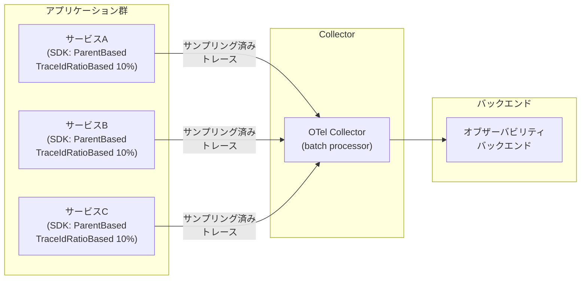
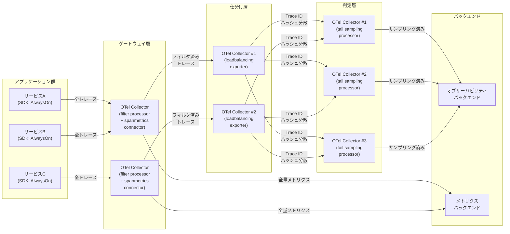

## 本章で使用するバージョン

本章のサンプルコードおよびCollector設定例は、以下のバージョンで動作を確認しています。

| コンポーネント | バージョン |
| --- | --- |
| OpenTelemetry Collector（contrib） | v0.146.0 |
| Python SDK（`opentelemetry-sdk`） | 1.39.1 |
| Go SDK（`go.opentelemetry.io/otel`） | v1.40.0 |
| Java SDK（`io.opentelemetry:opentelemetry-sdk`） | 1.57.0 |

OpenTelemetryの各SDKおよびCollectorはセマンティックバージョニングに従っており、同一メジャーバージョン内では後方互換性が維持されます。
そのため、上記より新しいバージョンでも同様に動作します。

## SDKとコレクターの役割

OpenTelemetry（OTel）におけるサンプリングは、アプリケーション内の **SDK** と、バックエンドにデータを送る前段に位置する **Collector** の両方で実施できます。

* **SDKの役割**: 主にヘッドサンプリングを担います。言語別のSDK（Java, Go, Python, etc.）は標準でさまざまなサンプラー（`AlwaysOn`, `AlwaysOff`, `TraceIdRatioBased`, `ParentBased`）を提供しています。SDK側でサンプリングを行うことで、そもそもスパンを生成・シリアライズ・送信するコストを削減できます。
* **Collectorの役割**: `processor` を活用して高度なサンプリングを実施します。特にテイルサンプリングは、複数のサービスからのスパンを集約して全体像を見る必要があるため、Collector側での実装が適しています。

## SDKによるサンプリング実装例

前節で述べたとおり、SDKはヘッドサンプリングの主な実装ポイントです。
ここでは、Python、Go、Javaの3言語について、OpenTelemetry SDKを使用したヘッドサンプリングの具体的な設定例を示します。

### Python

```python
from opentelemetry import trace
from opentelemetry.sdk.trace import TracerProvider
from opentelemetry.sdk.trace.sampling import (
    ParentBased,
    TraceIdRatioBased,
)
from opentelemetry.sdk.trace.export import BatchSpanProcessor
from opentelemetry.exporter.otlp.proto.grpc.trace_exporter import (
    OTLPSpanExporter,
)

# TraceIdRatioBasedサンプラーを作成する。
# 引数の0.1は「トレースの10%をサンプリングする」ことを意味する。
# Trace IDのハッシュ値に基づいて確率的に判定するため、
# 同じTrace IDは常に同じ判定結果になる。
ratio_sampler = TraceIdRatioBased(0.1)

# ParentBasedサンプラーでラップする。
# 親スパンが存在する場合は親のサンプリング決定を継承し、
# ルートスパン（親なし）の場合のみratio_samplerで判定する。
# これにより、トレース内のすべてのスパンが一貫した
# サンプリング決定を持つことが保証される。
sampler = ParentBased(root=ratio_sampler)

# TracerProviderにサンプラーを設定する。
provider = TracerProvider(sampler=sampler)

# OTLPエクスポーターとBatchSpanProcessorを設定する。
exporter = OTLPSpanExporter(endpoint="http://localhost:4317")
provider.add_span_processor(BatchSpanProcessor(exporter))

# グローバルなTracerProviderとして登録する。
trace.set_tracer_provider(provider)
```

### Go

```go
package main

import (
 "context"
 "log"

 "go.opentelemetry.io/otel"
 "go.opentelemetry.io/otel/exporters/otlp/otlptrace/otlptracegrpc"
 "go.opentelemetry.io/otel/sdk/trace"
)

func initTracer() func() {
 ctx := context.Background()

 // OTLPエクスポーターを作成する。
 exporter, err := otlptracegrpc.New(ctx,
  otlptracegrpc.WithEndpoint("localhost:4317"),
  otlptracegrpc.WithInsecure(),
 )
 if err != nil {
  log.Fatalf("OTLPエクスポーターの作成に失敗: %v", err)
 }

 // TraceIdRatioBasedサンプラーを作成する。
 // 0.1を指定することで、トレースの10%をサンプリングする。
 ratioSampler := trace.TraceIDRatioBased(0.1)

 // ParentBasedサンプラーでラップする。
 // 親スパンのサンプリング決定を継承しつつ、
 // ルートスパンにはratioSamplerを適用する。
 sampler := trace.ParentBased(ratioSampler)

 // TracerProviderを作成し、サンプラーを設定する。
 tp := trace.NewTracerProvider(
  trace.WithBatcher(exporter),
  trace.WithSampler(sampler),
 )

 // グローバルなTracerProviderとして登録する。
 otel.SetTracerProvider(tp)

 // アプリケーション終了時にTracerProviderをシャットダウンする
 // クリーンアップ関数を返す。
 return func() {
  if err := tp.Shutdown(ctx); err != nil {
   log.Printf("TracerProviderのシャットダウンに失敗: %v", err)
  }
 }
}
```

### Java

```java
import io.opentelemetry.api.OpenTelemetry;
import io.opentelemetry.api.trace.Tracer;
import io.opentelemetry.exporter.otlp.trace.OtlpGrpcSpanExporter;
import io.opentelemetry.sdk.OpenTelemetrySdk;
import io.opentelemetry.sdk.trace.SdkTracerProvider;
import io.opentelemetry.sdk.trace.export.BatchSpanProcessor;
import io.opentelemetry.sdk.trace.samplers.Sampler;

public class TracerConfig {
    public static OpenTelemetry initOpenTelemetry() {
        // OTLPエクスポーターを作成する。
        OtlpGrpcSpanExporter exporter = OtlpGrpcSpanExporter.builder()
                .setEndpoint("http://localhost:4317")
                .build();

        // TraceIdRatioBasedサンプラーを作成する。
        // 0.1を指定することで、トレースの10%をサンプリングする。
        Sampler ratioSampler = Sampler.traceIdRatioBased(0.1);

        // ParentBasedサンプラーでラップする。
        // 親スパンのサンプリング決定を継承しつつ、
        // ルートスパンにはratioSamplerを適用する。
        Sampler sampler = Sampler.parentBased(ratioSampler);

        // SdkTracerProviderを作成し、サンプラーを設定する。
        SdkTracerProvider tracerProvider = SdkTracerProvider.builder()
                .addSpanProcessor(BatchSpanProcessor.builder(exporter).build())
                .setSampler(sampler)
                .build();

        // OpenTelemetry SDKを構築して返す。
        return OpenTelemetrySdk.builder()
                .setTracerProvider(tracerProvider)
                .buildAndRegisterGlobal();
    }
}
```

### 環境変数による設定

コードを変更せずにサンプリングを設定する方法として、環境変数による設定も利用できます。
OpenTelemetry SDKは共通の環境変数仕様[^otel-env-config]に対応しており、以下の環境変数でサンプラーを指定できます。

```bash
# ParentBased(TraceIdRatioBased)サンプラーを設定する例
# parentbased_traceidratioは、ParentBasedサンプラーの内部に
# TraceIdRatioBasedサンプラーを使用することを意味する。
export OTEL_TRACES_SAMPLER="parentbased_traceidratio"

# サンプリング率を10%に設定する。
export OTEL_TRACES_SAMPLER_ARG="0.1"
```

この方法は、デプロイ環境ごとにサンプリング率を変更したい場合に便利です。
たとえば、開発環境では100%、ステージング環境では50%、本番環境では10%といった使い分けが、コード変更なしに実現できます。

[^otel-env-config]: OpenTelemetry, "General SDK Configuration", <https://opentelemetry.io/docs/concepts/sdk-configuration/general-sdk-configuration/>

## テイルサンプリングの3層構造（実践的設計）

大規模な分散システムでテイルサンプリングを確実に行うためには、単一のCollectorではリソースや可用性の面で限界があります。
そのため、通常は以下の3層構造のアーキテクチャを採用します。

### 1. ゲートウェイ層（トラフィックの集約）

アプリケーション（またはサイドカーのCollector）から送られてくる全テレメトリーを最初に受け取る層です。
ここではまだサンプリングの判定は行わず、単にトラフィックを次の層へ効率的に渡す役割を担います。

### 2. 仕分け層（Load Balancing Exporter）

テイルサンプリングを成功させるための鍵となる層です。OpenTelemetry Collectorの `loadbalancingexporter` を使用します。
テイルサンプリングを行うためには、**同じTrace IDを持つすべてのスパンが、同じ判定用のCollectorノードに到達する** 必要があります。
`loadbalancingexporter` はTrace IDに基づいたコンシステントハッシュを使用して、特定のトレースを特定のノードへ確実にルーティングします。

### 3. 判定層（Tail Sampling Processor）

実際にサンプリングの意思決定を行う層です。

* **メモリ保持**: 受信したスパンを一定期間（数秒〜数分）メモリに保持（バッファ）します。
* **ポリシーに基づく判定**: `tailsamplingprocessor` で定義されたポリシー（例: 「エラーが含まれていれば100%残す」「指定されたURLへのリクエストは0.1%にする」など）に従って、トレース全体をサンプリングするかどうかを決定します。
* **出力**: サンプリングが決定されたトレースのみを、最終的な保存先（SaaSやDB）へ送信します。

この3層構造により、高トラフィックな環境下でも、システム全体のコンテキストを考慮した「賢い」サンプリングを実現できます。

## サンプリング関連Collectorコンポーネント

OpenTelemetry Collectorには、サンプリングに関連するコンポーネントが複数存在します。
それぞれが異なる役割を持ち、組み合わせることでサンプリングパイプライン全体を構成します。
ここでは、主要なコンポーネントの設定例と使い分けを解説します。

### tail sampling プロセッサー

`tail_sampling` プロセッサーは、トレース全体の情報を見てからサンプリング判定を行うテイルサンプリングの中核コンポーネントです[^tail-sampling-processor]。
複数のポリシーを定義でき、いずれかのポリシーに合致したトレースが保持されます。

以下は、実運用で一般的なポリシーの組み合わせ例です。

```yaml
processors:
  tail_sampling:
    # トレースの完了を待つ時間。この時間内に届いたスパンを
    # まとめてサンプリング判定する。
    decision_wait: 30s
    # メモリに保持するトレースの最大数。
    num_traces: 100000
    policies:
      # ポリシー1: エラーを含むトレースは100%保持する。
      # 障害調査に必要なトレースを確実に残すための設定。
      - name: errors-policy
        type: status_code
        status_code:
          status_codes:
            - ERROR

      # ポリシー2: レイテンシが1000ms（1秒）を超えるトレースを保持する。
      # パフォーマンス問題の調査に必要なトレースを残す。
      - name: latency-policy
        type: latency
        latency:
          threshold_ms: 1000

      # ポリシー3: 上記に該当しないトレースは10%をランダムに保持する。
      # 正常系のトレースも一定割合残すことで、
      # ベースラインの把握を可能にする。
      - name: probabilistic-policy
        type: probabilistic
        probabilistic:
          sampling_percentage: 10

      # ポリシー4: 複合ポリシーの例。
      # 特定のサービスかつ特定のHTTPメソッドに該当する
      # トレースを保持する。and_sub_policyに定義した
      # すべての条件を満たすトレースが対象となる。
      - name: composite-policy
        type: and
        and:
          and_sub_policy:
            - name: service-name-filter
              type: string_attribute
              string_attribute:
                key: service.name
                values:
                  - payment-service
                  - order-service
            - name: http-method-filter
              type: string_attribute
              string_attribute:
                key: http.request.method
                values:
                  - POST
                  - PUT
                  - DELETE
```

[^tail-sampling-processor]: opentelemetry-collector-contrib, "Tail Sampling Processor", <https://github.com/open-telemetry/opentelemetry-collector-contrib/tree/main/processor/tailsamplingprocessor>

### probabilistic sampler プロセッサー

`probabilistic_sampler` プロセッサーは、確率的サンプリングを行うコンポーネントです[^probabilistic-sampler-processor]。
`tail_sampling` プロセッサーとは異なり、トレース全体の完了を待たずに個々のスパン（またはログ）単位で判定を行います。
そのため、メモリ消費が少なく、処理のレイテンシも低いという特徴があります。

`probabilistic_sampler` プロセッサーには3つの動作モードがあります。

#### hash_seedモード（デフォルト）

Trace IDのハッシュ値に基づいてサンプリング判定を行います。
同じTrace IDは常に同じ判定結果になるため、トレースの一貫性が保たれます。

```yaml
processors:
  probabilistic_sampler:
    # サンプリング率を10%に設定する。
    sampling_percentage: 10
    # ハッシュシードを指定する。
    # 複数のCollectorで同じシードを使うことで、
    # 同じTrace IDに対して同じ判定結果を得られる。
    hash_seed: 22
```

#### proportionalモード

上流のサンプラーが設定したサンプリング確率（tracestate内のth値）を尊重しつつ、追加のサンプリングを行います。
上流で既に50%にサンプリングされたデータに対してproportionalモードで20%を指定すると、最終的に全体の10%（50% × 20%）が残ります。

```yaml
processors:
  probabilistic_sampler:
    sampling_percentage: 20
    mode: proportional
```

#### equalizingモード

上流のサンプリング率に関係なく、指定した確率に「引き上げる」動作をします。
上流で10%にサンプリングされたデータに対してequalizingモードで50%を指定すると、追加のデータを復元することはできないため、既にサンプリング済みの10%がそのまま通過します。
一方、上流で80%にサンプリングされたデータに対して50%を指定すると、50%まで削減されます。

```yaml
processors:
  probabilistic_sampler:
    sampling_percentage: 50
    mode: equalizing
```

#### tail sampling プロセッサーとの使い分け

`tail_sampling` プロセッサーと`probabilistic_sampler` プロセッサーは、それぞれ異なるユースケースに適しています。

| 観点 | tail sampling プロセッサー | probabilistic sampler プロセッサー |
| --- | --- | --- |
| 判定タイミング | トレース完了後 | スパン受信時（即時） |
| 判定基準 | エラー、レイテンシ、属性など多様 | 確率のみ |
| メモリ消費 | 高い（トレースをバッファ） | 低い |
| 処理レイテンシ | 高い（decision_wait分の遅延） | 低い |
| 適用場面 | 重要なトレースを確実に残したい場合 | 均一な確率でデータ量を削減したい場合 |

一般的には、`probabilistic_sampler` プロセッサーをゲートウェイ層で使用してデータ量をおおまかに削減し、その後段の判定層で`tail_sampling` プロセッサーを使用して重要なトレースを選別する、という組み合わせが効果的です。

[^probabilistic-sampler-processor]: opentelemetry-collector-contrib, "Probabilistic Sampler Processor", <https://github.com/open-telemetry/opentelemetry-collector-contrib/tree/main/processor/probabilisticsamplerprocessor>

### load balancing エクスポーター

`loadbalancing` エクスポーターは、Trace IDに基づいてトレースデータを特定のバックエンドノードにルーティングするコンポーネントです[^loadbalancing-exporter]。
テイルサンプリングの3層構造における仕分け層で使用します。

```yaml
exporters:
  loadbalancing:
    # ルーティングキーとしてTrace IDを使用する。
    # 同じTrace IDを持つすべてのスパンが
    # 同じバックエンドノードに送信される。
    routing_key: "traceID"
    protocol:
      otlp:
        timeout: 1s
        tls:
          insecure: true
    resolver:
      # DNS解決を使用してバックエンドノードを検出する。
      # Kubernetes環境ではHeadless Serviceを指定することで、
      # 各Podのアドレスが自動的に解決される。
      dns:
        hostname: otel-collector-headless.observability.svc.cluster.local
        port: 4317
```

Kubernetes環境では、Headless Serviceを使用することで、判定層のCollector Podが増減した際にも自動的にルーティング先が更新されます。

[^loadbalancing-exporter]: opentelemetry-collector-contrib, "Load Balancing Exporter", <https://github.com/open-telemetry/opentelemetry-collector-contrib/tree/main/exporter/loadbalancingexporter>

### span metrics コネクター

`spanmetrics` コネクターは、スパンデータからメトリクスを自動生成するコンポーネントです[^spanmetrics-connector]。
サンプリングの前段に配置することで、サンプリングによってトレースが間引かれても、全量のトラフィックに基づいたメトリクス（リクエスト数、レイテンシ分布など）を確保できます[^spanmetrics-histogram]。

```yaml
connectors:
  spanmetrics:
    # ヒストグラムの設定。
    # レイテンシ分布を記録するためのバケット境界を定義する。
    # ここではexplicit（手動定義）モードを使用している。
    histogram:
      explicit:
        buckets:
          - 2ms
          - 5ms
          - 10ms
          - 25ms
          - 50ms
          - 100ms
          - 250ms
          - 500ms
          - 1s
          - 2.5s
          - 5s
          - 10s
    # メトリクスに付与するディメンション（ラベル）。
    # スパン属性からメトリクスのラベルとして抽出する属性を指定する。
    dimensions:
      - name: http.request.method
      - name: http.response.status_code
      - name: rpc.grpc.status_code

service:
  pipelines:
    # トレースパイプライン: spanmetricsを経由してからサンプリングする。
    traces:
      receivers: [otlp]
      processors: [batch]
      exporters: [spanmetrics, otlp/sampling]
    # メトリクスパイプライン: spanmetricsが生成したメトリクスを
    # バックエンドに送信する。サンプリングの影響を受けない全量メトリクス。
    metrics:
      receivers: [spanmetrics]
      processors: [batch]
      exporters: [otlp/metrics]
```

この構成のポイントは、トレースパイプラインの`exporters`に`spanmetrics`を含めることで、サンプリング処理の前にすべてのスパンからメトリクスを生成する点です。
これにより、サンプリング後のトレースデータからは失われる情報（全リクエストの正確なカウントやレイテンシ分布）を、メトリクスとして保持できます。

[^spanmetrics-connector]: opentelemetry-collector-contrib, "Span Metrics Connector", <https://github.com/open-telemetry/opentelemetry-collector-contrib/tree/main/connector/spanmetricsconnector>

[^spanmetrics-histogram]: `spanmetrics` コネクターは手動バケット定義（explicit buckets）に加えて、指数ヒストグラム（exponential histogram）もサポートしています。指数ヒストグラムはバケット境界を自動的に決定するため、手動でバケットを定義する必要がありません。レイテンシー分布が既知でバケット境界を最適化したい場合はexplicitモード、分布が不明な場合や広範囲のレイテンシーをカバーしたい場合はexponentialモードが適しています。設定例: `histogram: { exponential: { max_size: 160 } }`。詳細は公式ドキュメント（<https://github.com/open-telemetry/opentelemetry-collector-contrib/tree/main/connector/spanmetricsconnector>）の「Exponential Histogram」セクションを参照してください。

### filter プロセッサー

`filter` プロセッサーは、条件に合致するテレメトリーデータをドロップ（除外）するコンポーネントです[^filter-processor]。
サンプリングの前段でノイズとなるデータを除去することで、サンプリング対象のデータ品質を向上させ、バックエンドのストレージコストも削減できます。

```yaml
processors:
  filter/health-check:
    error_mode: ignore
    traces:
      span:
        # ヘルスチェックやReadinessプローブなど、
        # モニタリング目的のエンドポイントへのトレースを除外する。
        # これらは大量に発生するが分析価値が低いため、
        # サンプリング前に除去するのが効率的。
        - 'attributes["url.path"] == "/healthz"'
        - 'attributes["url.path"] == "/readyz"'
        - 'attributes["url.path"] == "/livez"'
        - 'attributes["url.path"] == "/metrics"'
        - 'attributes["http.target"] == "/favicon.ico"'
```

ヘルスチェックのような定期的かつ大量に発生するリクエストは、サンプリング対象に含めると正常系トレースの割合を不必要に増やしてしまいます。
`filter` プロセッサーで事前に除去することで、サンプリングの判定対象を実際のユーザーリクエストに絞り込めます。

[^filter-processor]: opentelemetry-collector-contrib, "Filter Processor", <https://github.com/open-telemetry/opentelemetry-collector-contrib/tree/main/processor/filterprocessor>

#### OTTL（OpenTelemetry Transformation Language）

上記の`filter` プロセッサーの設定例で使用している条件式は、OTTL（OpenTelemetry Transformation Language）と呼ばれるDSLで記述されています[^ottl-spec]。
OTTLはOpenTelemetry Collectorの複数のプロセッサー（`filter`、`transform`、`routing`など）で共通して使用される式言語であり、テレメトリーデータの属性やフィールドに対する条件判定や変換を柔軟に記述できます。

ここでは、`filter` プロセッサーで使用頻度の高いOTTLの基本構文と具体例を紹介します。

##### パス式

テレメトリーデータのフィールドにアクセスするためのパス式です。

* `name`: スパン名
* `status.code`: スパンのステータスコード（`STATUS_CODE_OK`、`STATUS_CODE_ERROR`など）
* `kind`: スパンの種別（`SPAN_KIND_SERVER`、`SPAN_KIND_CLIENT`など）
* `attributes["key"]`: スパン属性へのアクセス
* `resource.attributes["key"]`: リソース属性へのアクセス

##### 比較演算子と論理演算子

* 比較演算子: `==`、`!=`、`>`、`<`、`>=`、`<=`
* 論理演算子: `and`、`or`、`not`

##### 文字列関数

* `IsMatch(value, pattern)`: 正規表現によるマッチング

##### 具体例

以下に、`filter` プロセッサーで使用可能なOTTL式の具体例を示します。

```yaml
processors:
  # 例1: 特定のサービスのスパンを除外する
  filter/service:
    error_mode: ignore
    traces:
      span:
        - 'resource.attributes["service.name"] == "internal-proxy"'

  # 例2: 正規表現によるURLパスのマッチング
  filter/url-pattern:
    error_mode: ignore
    traces:
      span:
        - 'IsMatch(attributes["url.path"], "^/api/v[0-9]+/health")'

  # 例3: 複合条件（正常系かつ特定パスのスパンを除外）
  filter/normal-health:
    error_mode: ignore
    traces:
      span:
        - 'attributes["http.response.status_code"] >= 200 and attributes["http.response.status_code"] < 300 and attributes["url.path"] == "/healthz"'

  # 例4: スパン名によるフィルタリング
  filter/span-name:
    error_mode: ignore
    traces:
      span:
        - 'name == "health-check"'
        - 'IsMatch(name, "^internal\\..*")'
```

OTTLは`filter` プロセッサー以外にも、`transform` プロセッサーでの属性の書き換えや、`routing` プロセッサーでの条件分岐にも使用されます。
より高度な構文や利用可能な関数の一覧については、公式ドキュメントを参照してください。

[^ottl-spec]: opentelemetry-collector-contrib, "OpenTelemetry Transformation Language (OTTL)", <https://github.com/open-telemetry/opentelemetry-collector-contrib/tree/main/pkg/ottl>

### count コネクター

`count` コネクターは、パイプラインを通過するテレメトリーデータの件数をメトリクスとして記録するコンポーネントです[^count-connector]。
サンプリングの前後に配置することで、サンプリングによるデータ削減率をリアルタイムに把握できます。

```yaml
connectors:
  # サンプリング前のトレース数をカウントする。
  count/before_sampling:
    spans:
      otel.sampling.spans.before:
        description: "サンプリング前のスパン数"
    spanevent:
      otel.sampling.spanevents.before:
        description: "サンプリング前のスパンイベント数"

  # サンプリング後のトレース数をカウントする。
  count/after_sampling:
    spans:
      otel.sampling.spans.after:
        description: "サンプリング後のスパン数"
    spanevent:
      otel.sampling.spanevents.after:
        description: "サンプリング後のスパンイベント数"

service:
  pipelines:
    # サンプリング前のカウントを取得するパイプライン。
    traces/pre:
      receivers: [otlp]
      processors: [batch]
      exporters: [count/before_sampling]

    # サンプリング処理を行うパイプライン。
    traces/sampling:
      receivers: [count/before_sampling]
      processors: [tail_sampling]
      exporters: [count/after_sampling]

    # サンプリング後のデータをバックエンドに送信するパイプライン。
    traces/post:
      receivers: [count/after_sampling]
      processors: [batch]
      exporters: [otlp/backend]

    # カウントメトリクスをPrometheusで公開するパイプライン。
    # before/afterの両方のメトリクスを1つのパイプラインで収集する。
    metrics/sampling_stats:
      receivers: [count/before_sampling, count/after_sampling]
      processors: [batch]
      exporters: [prometheus]
```

`count/before_sampling`と`count/after_sampling`の2つのメトリクスを比較することで、実際のサンプリング削減率を算出できます。
この情報は、サンプリングポリシーの調整やキャパシティプランニングに役立ちます。

[^count-connector]: opentelemetry-collector-contrib, "Count Connector", <https://github.com/open-telemetry/opentelemetry-collector-contrib/tree/main/connector/countconnector>

## サンプリング導入のアーキテクチャパターン

サンプリングの導入方法は、システムの規模やトラフィック特性によって異なります。
ここでは、代表的な2つのアーキテクチャパターンを紹介します。

### パターン1: SDKのみのヘッドサンプリング

最もシンプルな構成です。
各アプリケーションのSDKでサンプリング判定を行い、サンプリングされたトレースのみをCollectorに送信します。



#### 適用条件

* システム規模: 小〜中規模（サービス数が10程度まで）
* トラフィック量: 1,000 req/s以下
* サンプリング要件: 均一な確率サンプリングで十分な場合

#### 利点と制約

この構成の利点は、Collector側に特別な設定が不要で、運用が簡素な点です。
SDKの`ParentBased(TraceIdRatioBased)`サンプラーを設定するだけで導入できます。
`ParentBased`サンプラーにより、親スパンのサンプリング決定が子スパンに伝播するため、トレース内の一貫性も保たれます。

一方で、SDKの時点でサンプリング判定を行うため、「エラーが発生したトレースだけを残す」といったトレース全体の情報に基づく判定はできません。
また、サンプリング率の変更にはアプリケーションの再デプロイ（または環境変数の変更と再起動）が必要です。

### パターン2: 3層構造によるテイルサンプリング

前節で解説した3層構造を用いた、テイルサンプリングの構成です。
エラーやレイテンシなどトレース全体の特徴に基づいたサンプリング判定が可能になります。

各層は単一障害点（SPoF）を避けるために複数台で構成します。
特に仕分け層は、1台に障害が発生してもトレースデータの流入が途絶えないよう、冗長化が必要です。



#### 適用条件

* システム規模: 中〜大規模（サービス数が10以上）
* トラフィック量: 1,000 req/s以上
* サンプリング要件: エラーやレイテンシに基づく選択的サンプリングが必要な場合

#### 各層の役割

ゲートウェイ層では、`filter` プロセッサーによるノイズ除去と`spanmetrics` コネクターによる全量メトリクスの生成を行います。
SDKは`AlwaysOn`（全量送信）に設定し、サンプリング判定はCollector側に委ねます。ゲートウェイ層もロードバランサーの背後に複数台配置し、可用性を確保します。

判定層では、`tail_sampling` プロセッサーが定義されたポリシーに従ってサンプリング判定を行います。
判定層は水平スケールが可能で、トラフィック量に応じてノード数を増減できます。

仕分け層については、テイルサンプリングの成否を左右する重要な層であるため、次節で詳しく解説します。

#### 仕分け層とコンシステントハッシュ

テイルサンプリングが正しく機能するためには、同じTrace IDを持つすべてのスパンが、同じ判定層ノードに集約される必要があります。
1つのトレースを構成するスパンが複数の判定層ノードに分散してしまうと、各ノードはトレースの一部しか見えず、正確なサンプリング判定ができません。

##### なぜ汎用ロードバランサーでは不十分なのか

「判定層の前にEnvoyやNginxなどの汎用ロードバランサーを置けばよいのでは」と考えるかもしれません。
しかし、汎用ロードバランサーではテイルサンプリングに必要なルーティングを実現できません。
その理由を理解するには、OTLPのデータ構造を知る必要があります。

OTLPでは、1回のgRPC/HTTPリクエストの中に複数のスパンがバッチとしてまとめて送信されます。
たとえば、あるサービスのSDKが`BatchSpanProcessor`を使用している場合、一定時間内に生成された複数のスパンが1つのリクエストにまとめられます。
このバッチの中には、異なるTrace IDを持つスパンが混在しています。

```text
1つのOTLPリクエスト（バッチ）:
├── スパンA (Trace ID: abc123)
├── スパンB (Trace ID: def456)  ← 別のトレース
├── スパンC (Trace ID: abc123)  ← スパンAと同じトレース
└── スパンD (Trace ID: ghi789)  ← さらに別のトレース
```

汎用ロードバランサーはリクエスト単位でルーティングを行います。
ラウンドロビンやランダム、あるいはリクエストヘッダに基づくルーティングは可能ですが、リクエストのペイロード（ボディ）の中身を解析して、スパンごとに異なる宛先に振り分けることはできません。
つまり、上記のバッチ全体が1つの判定層ノードに送られるか、あるいはリクエスト単位で別のノードに送られるかのどちらかです。

後者の場合、Trace ID `abc123` のスパンAを含むバッチがノード1に、別のリクエストに含まれるTrace ID `abc123` の別のスパンがノード2に送られる可能性があります。
これではトレースが分断されてしまいます。

`loadbalancing` エクスポーターは、OTLPのペイロードを解析し、バッチ内のスパンをTrace IDごとに分解してから、各Trace IDに対応する判定層ノードにルーティングします。
つまり、1つの受信バッチを複数の送信バッチに再構成するという、テレメトリーデータの構造を理解したルーティングを行います。
これは汎用ロードバランサーには実現できない、OpenTelemetry Collector固有の機能です。

##### コンシステントハッシュの仕組み

`loadbalancing` エクスポーターは、Trace IDごとのルーティング先をコンシステントハッシュ（Consistent Hashing）[^consistent-hashing]によって決定しています。

コンシステントハッシュは、分散システムにおいてデータを複数のノードに均等に振り分けるためのアルゴリズムです。
通常のハッシュ（`hash(key) mod N`）では、ノード数 $N$ が変わるとほぼすべてのキーの割り当て先が変わってしまいます。
コンシステントハッシュでは、ノードの追加・削除時に再配置されるキーの数を最小限に抑えられます。

動作の概要は以下のとおりです。

1. ハッシュ空間を論理的なリング（0〜$2^{32}-1$の円環）として扱う
2. 各判定層ノードのアドレスをハッシュ関数に通し、リング上の位置を決定する
3. ルーティング対象のTrace IDをハッシュ関数に通し、リング上の位置を決定する
4. Trace IDの位置からリングを時計回りに探索し、最初に見つかったノードにルーティングする

この仕組みにより、判定層のノードが追加・削除された場合でも、影響を受けるのはリング上で隣接するノードが担当していたTrace IDの一部だけです。
たとえば判定層が3ノードから4ノードに増えた場合、再配置されるTrace IDは全体の約25%に留まります。

##### 仕分け層が複数台でも正しく動作する理由

図のとおり、仕分け層のCollectorは複数台で構成されています。
ここで疑問になるのは、「仕分け層のCollector #1に届いたスパンと、Collector #2に届いたスパンが、同じTrace IDであれば同じ判定層ノードに送られるのか」という点です。

答えは「送られる」です。
コンシステントハッシュは純粋な関数であり、同じ入力（Trace ID）と同じノードリスト（判定層のアドレス一覧）が与えられれば、どの仕分け層Collectorで計算しても同じ出力（ルーティング先）を返します。

`loadbalancing` エクスポーターは、判定層ノードの一覧をDNS解決（またはKubernetesのService Discovery）で取得します。
すべての仕分け層Collectorが同じDNSエントリを参照するため、同じノードリストを持ちます。
したがって、あるTrace IDのスパンがどの仕分け層Collectorに到着しても、コンシステントハッシュの計算結果は同一となり、同じ判定層ノードにルーティングされます。

```yaml
# 仕分け層のCollector設定例
# すべての仕分け層Collectorで同一の設定を使用する。
exporters:
  loadbalancing:
    routing_key: "traceID"
    protocol:
      otlp:
        timeout: 1s
        tls:
          insecure: true
    resolver:
      dns:
        # すべての仕分け層CollectorがこのDNSエントリを参照する。
        # Headless Serviceにより、判定層の全Podアドレスが返される。
        # どの仕分け層Collectorでも同じノードリストが得られるため、
        # 同じTrace IDは必ず同じ判定層ノードにルーティングされる。
        hostname: otel-tail-sampler-headless.observability.svc.cluster.local
        port: 4317
```

[^consistent-hashing]: David Karger et al., "Consistent Hashing and Random Trees: Distributed Caching Protocols for Relieving Hot Spots on the World Wide Web," Proceedings of the 29th Annual ACM Symposium on Theory of Computing (STOC '97), 1997, pp.654-663. コンシステントハッシュの原論文。`loadbalancing` exporterの実装については <https://github.com/open-telemetry/opentelemetry-collector-contrib/tree/main/exporter/loadbalancingexporter> を参照。

#### 利点と制約

この構成の利点は、トレース全体の情報に基づく高度なサンプリング判定が可能な点です。
エラートレースの100%保持、レイテンシ閾値に基づく保持、特定サービスのトレース優先保持など、柔軟なポリシーを設定できます。
また、`spanmetrics` コネクターにより、サンプリング前の全量データに基づくメトリクスも確保できます。

一方で、3層構造の運用は複雑になります。判定層のメモリ管理（`decision_wait`と`num_traces`の調整）、仕分け層のハッシュ分散の均一性、ゲートウェイ層のスループットなど、各層のチューニングが必要です。
また、`decision_wait`の分だけデータの到着に遅延が生じます。

判定層のノード追加・削除時には、コンシステントハッシュの再配置が発生します。
再配置中は一部のTrace IDのルーティング先が変わるため、一時的にトレースの分断が起こりえます。
この影響を最小化するには、ノード変更をトラフィックの少ない時間帯に行い、`decision_wait`の2倍程度の間隔を空けて段階的に実施するのが望ましいです。

### パターンの選択指針

| 判断基準 | パターン1（SDK ヘッドサンプリング） | パターン2（3層テイルサンプリング） |
| --- | --- | --- |
| トラフィック量 | 1,000 req/s以下 | 1,000 req/s以上 |
| サービス数 | 10以下 | 10以上 |
| サンプリング要件 | 均一な確率サンプリング | エラー・レイテンシベースの選択的サンプリング |
| 運用チームの規模 | 小規模 | 中〜大規模 |
| インフラコスト | 低い | 中〜高い（Collector群の運用コスト） |
| 導入の容易さ | 容易（SDK設定のみ） | 中程度（3層構造の構築が必要） |

実際の導入では、まずパターン1で始めて、トラフィック量の増加やサンプリング要件の高度化に応じてパターン2に移行するアプローチが現実的です。

## サンプリング処理のパフォーマンスチューニング

テイルサンプリングを運用する際、サンプリング処理自体がボトルネックにならないよう、適切なチューニングが必要です。
ここでは、主要なパラメータの推奨設定値と、メモリ見積もり、スケーリング戦略、データ鮮度への影響について解説します。

### decision_waitとnum_tracesの設定

`tail_sampling` プロセッサーの2つの主要パラメータは、サンプリング品質とリソース消費のトレードオフを決定します。

#### decision_wait

`decision_wait`は、トレースの最初のスパンを受信してからサンプリング判定を行うまでの待機時間です。この時間内に届いたスパンがトレースの構成要素として判定に使用されます。

| 設定値 | 利点 | 欠点 |
| --- | --- | --- |
| 5〜10秒 | メモリ消費が少ない、判定が速い | 遅延スパンを取りこぼす可能性がある |
| 30秒（推奨） | 多くのトレースが完了する | メモリ消費が中程度 |
| 60秒以上 | 遅延スパンも含めた判定が可能 | メモリ消費が大きい、データ鮮度が低下 |

推奨値は30秒です。
多くのWebアプリケーションでは、リクエストの処理が30秒以内に完了するため、この値でトレースの大部分を捕捉できます。
バッチ処理や非同期処理を含むシステムでは、処理時間に応じて値を大きくする必要があります。

#### num_traces

`num_traces`は、メモリに同時に保持するトレースの最大数です。
この値を超えると、古いトレースから強制的に判定が行われます。

推奨値はトラフィック量に基づいて算出します。

$$
\text{num\_traces} = \text{トレース生成レート（traces/s）} \times \text{decision\_wait（s）} \times 1.5
$$

末尾の1.5はバースト時のマージンです。
たとえば、1,000 traces/sのシステムで`decision_wait`が30秒の場合は以下のようになります。

$$
\text{num\_traces} = 1{,}000 \times 30 \times 1.5 = 45{,}000
$$

### メモリ見積もり方法

判定層のCollectorに必要なメモリ量は、以下の式で概算できます。

$$
\text{必要メモリ} = \text{トレース生成レート} \times \text{decision\_wait} \times \text{平均スパン数/トレース} \times \text{平均スパンサイズ}
$$

具体的な計算例を示します。

| パラメータ | 値 |
| --- | --- |
| トレース生成レート | 1,000 traces/s |
| decision_wait | 30秒 |
| 平均スパン数/トレース | 10スパン |
| 平均スパンサイズ | 1 KB |

$$
\text{必要メモリ} = 1{,}000 \times 30 \times 10 \times 1\text{ KB} = 300\text{ MB}
$$

この値にCollector自体のベースメモリ（約200〜300 MB）とGCオーバーヘッド（約1.5倍）を加味すると、このシナリオでは約750 MB〜1 GBのメモリを割り当てるのが妥当です。

判定層を複数ノードで構成する場合は、`loadbalancing` エクスポーターによってトレースが分散されるため、各ノードの必要メモリは全体量をノード数で割った値になります。
3ノード構成であれば、各ノードに約250〜350 MBを割り当てます。

### スケーリング戦略

判定層のCollectorを水平スケールする際は、Trace IDの分散を考慮する必要があります。

#### ノード追加時の注意点

`loadbalancing` エクスポーターはコンシステントハッシュを使用しているため、ノードの追加・削除時にTrace IDの再分散が発生します。
再分散中は、同じTrace IDのスパンが異なるノードに送信される可能性があり、一時的にサンプリング判定の精度が低下します。

この影響を最小化するために、以下の点に注意します。

* ノードの追加・削除はトラフィックが少ない時間帯に行う
* 一度に大量のノードを追加・削除せず、段階的に行う
* `decision_wait`の2倍程度の時間を空けてから次のノード変更を行う

#### スケーリングの目安

| トラフィック量 | 推奨ノード数 | ノードあたりメモリ |
| --- | --- | --- |
| 1,000 traces/s以下 | 2（冗長性確保） | 1 GB |
| 1,000〜5,000 traces/s | 3〜5 | 1〜2 GB |
| 5,000〜10,000 traces/s | 5〜10 | 2〜4 GB |
| 10,000 traces/s以上 | 10以上 | 4 GB以上 |

### レイテンシとデータ鮮度

テイルサンプリングは、`decision_wait`の分だけデータの到着に遅延が生じます。
この遅延がオブザーバビリティの運用に与える影響を理解しておく必要があります。

#### 遅延の内訳

テイルサンプリングパイプライン全体の遅延は、以下の要素の合計です。

$$
\text{総遅延} = \text{SDK → ゲートウェイ層} + \text{ゲートウェイ層 → 仕分け層} + \text{仕分け層 → 判定層} + \text{decision\_wait} + \text{判定層 → バックエンド}
$$

ネットワーク遅延が各ホップで数ミリ秒〜数十ミリ秒、`decision_wait`が30秒の場合、総遅延は約30〜35秒程度になります。

#### 許容範囲の指針

| ユースケース | 許容遅延 | 推奨decision_wait |
| --- | --- | --- |
| リアルタイムアラート | 数秒以内 | テイルサンプリング不向き（メトリクスベースのアラートを推奨） |
| 障害調査 | 1〜2分 | 30〜60秒 |
| パフォーマンス分析 | 数分 | 30〜120秒 |
| 長期トレンド分析 | 数十分 | 制約なし |

リアルタイム性が求められるアラートには、テイルサンプリングの遅延は許容できない場合が多いです。
この場合、前述の`spanmetrics` コネクターを使用して、サンプリング前の全量データからメトリクスを生成し、メトリクスベースのアラートを設定するのが適切です。
テイルサンプリングは、アラート発火後の障害調査やパフォーマンス分析に活用する、という役割分担が現実的です。

## まとめ

本章では、OpenTelemetryを使ったサンプリングの実装方法とアーキテクチャについて解説しました。

まず、SDKによるヘッドサンプリングの実装例として、Python、Go、Javaの3言語で`ParentBased(TraceIdRatioBased)`サンプラーの設定方法を示しました。
環境変数による設定も紹介し、コード変更なしにサンプリング率を切り替える方法を確認しました。

次に、テイルサンプリングの3層構造（ゲートウェイ層、仕分け層、判定層）の設計と、仕分け層におけるコンシステントハッシュの仕組みを解説しました。
サンプリング関連のCollectorコンポーネントとして、`tail_sampling` プロセッサー、`probabilistic_sampler` プロセッサー、`loadbalancing` エクスポーター、`spanmetrics` コネクター、`filter` プロセッサー（OTTLによる条件記述を含む）、`count` コネクターの設定例と使い分けを示しました。

さらに、SDKのみのヘッドサンプリングと3層テイルサンプリングの2つのアーキテクチャパターンを比較し、システム規模やトラフィック特性に応じた選択指針を提示しました。
パフォーマンスチューニングでは、`decision_wait`と`num_traces`の推奨設定値、メモリ見積もり方法、スケーリング戦略、データ鮮度への影響について解説しました。

次章では、ここまでに学んだサンプリングの基礎と実装をさらに発展させ、高度な戦略について解説します。
トラフィック量の変動に応じてサンプリング率を自動調整する動的サンプリングアルゴリズム（EMAなど）、サンプリングされたデータから元の統計量を復元する方法、サンプリング環境下で4つの黄金シグナル（レイテンシー、トラフィック、エラー、サチュレーション）を維持する方法を取り上げます。
また、主要なオブザーバビリティSaaSベンダーが提供するサンプリング機能についても紹介し、自前実装との比較を行います。
