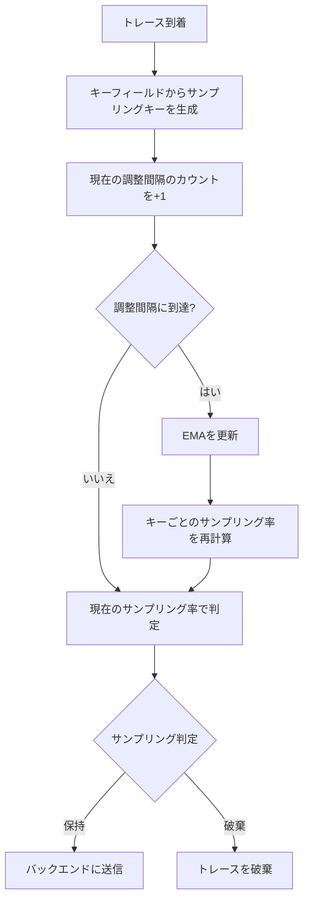
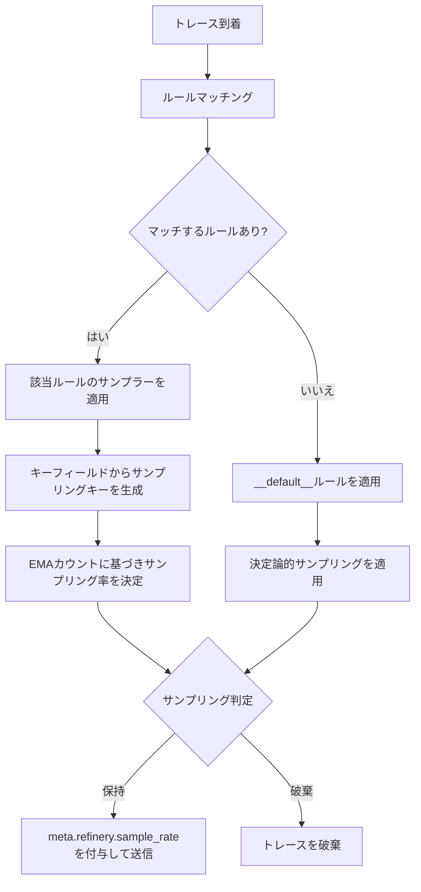
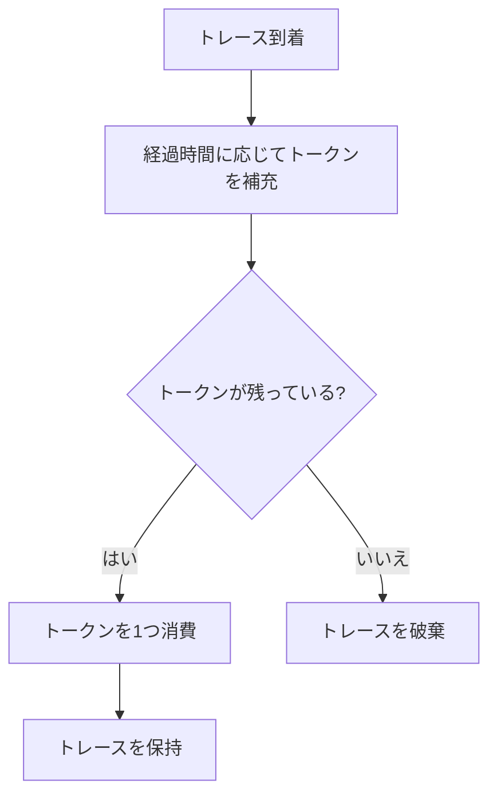
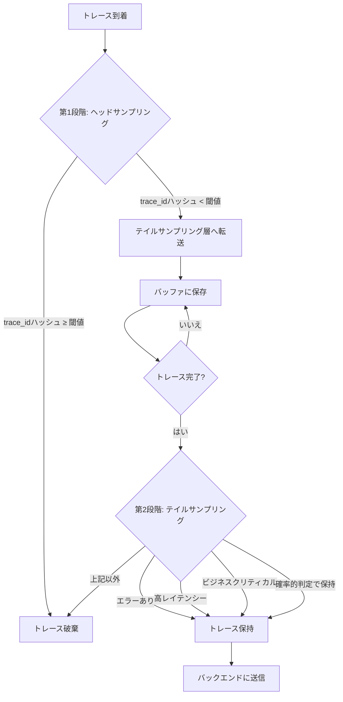

## 動的サンプリング（Adaptive Sampling）

トラフィックの変動が激しいサービスでは、固定のサンプリング率（例: 1%）を設定していると、スパイク時にデータ量が爆発したり、逆に深夜帯にデータが少なすぎて分析が困難になったりします。これを解決するのが **動的サンプリング（Adaptive Sampling）** です。

### 特徴

* **流量に応じた自動調整**: 現在のトラフィック量をリアルタイム（または数分単位）で監視し、目標とするデータ量（例: 500スパン/秒）に収まるよう、サンプリング率を自動的に増減させます。
* **アルゴリズムの例**:
  * **EMA (Exponential Moving Average)**: 指数移動平均を用いて将来のトラフィックを予測し、サンプリング率を滑らかに調整します。
  * **Refinery (Honeycomb)**: 特定のキー（HTTPステータスコード、URL、顧客IDなど）ごとにサンプリング率を動的に計算します。
  * **トークンバケット（Token Bucket）**: 一定レートでトークンを補充し、トークンがある場合のみトレースを保持します。バースト的なトラフィックにも対応しつつ、平均的なスループットを制御できます。

### 動的サンプリングアルゴリズムの詳細

動的サンプリングの中核をなすのは、トラフィック量の変動を追跡し、サンプリング率を自動調整するアルゴリズムです。ここでは、代表的なアルゴリズムであるEMA（指数移動平均）と、Honeycomb Refineryが採用するキーベースの動的サンプリングについて詳しく解説します。

#### EMA（指数移動平均）アルゴリズム

EMA（Exponential Moving Average）は、時系列データの平滑化に広く使われる手法です。動的サンプリングの文脈では、トラフィック量の移動平均を計算し、その値に基づいてサンプリング率を調整します。

EMAの基本的な更新式は以下のとおりです。

$$
\text{EMA}_t = \alpha \times x_t + (1 - \alpha) \times \text{EMA}_{t-1}
$$

ここで、各変数の意味は以下のとおりです。

* $\text{EMA}_t$: 時刻 $t$ におけるEMAの値（平滑化されたトラフィック量の推定値）
* $x_t$: 時刻 $t$ における実測値（直近の調整間隔で観測されたキーごとのトレース数）
* $\alpha$（Weight）: 平滑化係数（0 < $\alpha$ < 1）。直近の観測値に対する重み
* $\text{EMA}_{t-1}$: 前回のEMAの値

$\alpha$ の値が大きいほど直近のトラフィック変動に敏感に反応し、小さいほど過去の傾向を重視して安定した挙動を示します。

以下は、EMAを用いた動的サンプリング率の計算を示すPythonの擬似コードです。

```python
class EMADynamicSampler:
    def __init__(self, goal_sample_rate, weight=0.5, adjustment_interval=15):
        self.goal_sample_rate = goal_sample_rate
        self.weight = weight  # EMAの平滑化係数α
        self.adjustment_interval = adjustment_interval  # 秒
        self.ema_counts = {}  # キーごとのEMA値
        self.current_counts = {}  # 現在の調整間隔でのカウント

    def observe(self, key):
        """トレースを観測し、キーごとのカウントを更新する"""
        self.current_counts[key] = self.current_counts.get(key, 0) + 1

    def adjust(self):
        """調整間隔ごとに呼び出され、EMAを更新してサンプリング率を再計算する"""
        for key, count in self.current_counts.items():
            if key in self.ema_counts:
                # EMA更新: α × 今回の観測値 + (1 - α) × 前回のEMA
                self.ema_counts[key] = (
                    self.weight * count
                    + (1 - self.weight) * self.ema_counts[key]
                )
            else:
                # 新しいキーは観測値をそのまま初期値とする
                self.ema_counts[key] = count
        self.current_counts = {}

    def get_sample_rate(self, key):
        """キーに対するサンプリング率を返す"""
        if key not in self.ema_counts:
            return 1  # 未知のキーはすべて保持
        total_ema = sum(self.ema_counts.values())
        num_keys = len(self.ema_counts)
        if total_ema == 0 or num_keys == 0:
            return 1
        # 目標サンプリング率を達成するための各キーのレートを計算
        # 頻出キーほど高いサンプリング率（多く捨てる）、
        # 希少キーほど低いサンプリング率（多く保持する）
        avg_per_key = total_ema / num_keys
        key_rate = max(1, int(
            self.ema_counts[key] / avg_per_key * self.goal_sample_rate
        ))
        return key_rate
```

#### EMAアルゴリズムの動作フロー

EMAベースの動的サンプリングの全体的な動作フローを以下に示します。



#### Honeycomb Refineryのアルゴリズム

Honeycomb Refinery[^refinery]は、Honeycombが開発しApache License 2.0で公開しているOSSのテイルサンプリングプロキシです。
Honeycomb以外のバックエンドとも組み合わせて利用でき、複数の動的サンプリングアルゴリズムを提供しています。Refineryの動的サンプリングは、トレース内のフィールド値の組み合わせをキーとして使用し、キーの出現頻度に基づいてサンプリング率を調整します。

Refineryが提供する主要なサンプラーは以下のとおりです。

* **DynamicSampler**: 直近の調整間隔のカウントのみに基づいてサンプリング率を計算する基本的な動的サンプラー
* **EMADynamicSampler**: EMAを用いてカウントを平滑化し、トラフィック変動に対してより安定したサンプリング率を提供する。多くのユースケースで推奨される
* **EMAThroughputSampler**: 目標サンプリング率ではなく、目標スループット（秒あたりのスパン数）を指定する。EMADynamicSamplerと同様にEMAで平滑化する

Refineryの動的サンプリングの核心は、キーフィールドの選択にあります。たとえば `request.method`、`request.path`、`response.status_code` をキーフィールドに指定すると、Refineryはこれらのフィールド値の組み合わせごとにトラフィック量を追跡します。頻出する組み合わせ（例: `GET /api/health 200`）は高い率でサンプリングされ（多く破棄され）、希少な組み合わせ（例: `POST /api/checkout 500`）は低い率でサンプリングされます（多く保持されます）。

以下は、Refineryの `rules.yaml` の設定例です。

```yaml
# Honeycomb Refinery rules.yaml 設定例
RulesVersion: 2
Samplers:
  # デフォルトルール（必須）: 他のルールにマッチしないトレースに適用
  __default__:
    DeterministicSampler:
      SampleRate: 1  # すべて保持

  # 本番環境のサービス向けルール
  production:
    EMADynamicSampler:
      GoalSampleRate: 50          # 目標: 50トレースに1つを保持
      AdjustmentInterval: 30s     # 30秒ごとにEMAを再計算
      Weight: 0.5                 # 平滑化係数α（デフォルト値）
      MaxKeys: 500                # 追跡するキーの最大数
      FieldList:                  # サンプリングキーを構成するフィールド
        - request.method
        - request.path
        - response.status_code
```



#### トークンバケット（Token Bucket）アルゴリズム

トークンバケットは、レートリミッティングで広く使われるアルゴリズムを動的サンプリングに応用したものです。
一定のレートでトークンを補充し、トレースを保持するたびにトークンを1つ消費します。
トークンが残っていればトレースを保持し、トークンがなければ破棄します。

基本的な動作は以下のとおりです。

1. バケットに一定容量（バーストサイズ）のトークンを保持できる
2. 一定間隔（補充レート）でトークンが追加される
3. トレースが到着するたびにトークンを1つ消費する
4. トークンが0の場合、トレースは破棄される

以下は、トークンバケットを用いた動的サンプリングのPythonの擬似コードです。

```python
import time

class TokenBucketSampler:
    def __init__(self, rate, burst_size):
        self.rate = rate  # 秒あたりのトークン補充数
        self.burst_size = burst_size  # バケットの最大容量
        self.tokens = burst_size  # 初期トークン数
        self.last_refill = time.monotonic()

    def _refill(self):
        """経過時間に応じてトークンを補充する"""
        now = time.monotonic()
        elapsed = now - self.last_refill
        new_tokens = elapsed * self.rate
        self.tokens = min(self.burst_size, self.tokens + new_tokens)
        self.last_refill = now

    def should_sample(self):
        """トレースを保持するかどうかを判定する"""
        self._refill()
        if self.tokens >= 1:
            self.tokens -= 1
            return True
        return False
```



トークンバケットの利点は、実装がシンプルでありながら、バースト的なトラフィックにも対応できる点です。
バーストサイズを設定することで、短時間のトラフィックスパイク時にも一定数のトレースを保持できます。
一方で、EMAベースの動的サンプリングのようにキーごとの頻度に基づく優先度付けはできないため、均一なレートリミッティングが目的の場合に適しています。

OpenTelemetry Collectorの`tail_sampling` プロセッサーでは、`rate_limiting` ポリシーとしてトークンバケットに類似した機能が提供されています。

#### パラメータ調整の指針

動的サンプリングの効果を最大化するには、パラメータの適切な調整が重要です。

##### Weight（平滑化係数α）

$\alpha$ の値はトラフィックパターンに応じて調整します。

| トラフィック特性 | 推奨Weight | 理由 |
| --- | --- | --- |
| 安定したトラフィック | 0.3〜0.4 | 過去の傾向を重視し、一時的な変動に過剰反応しない |
| 変動が大きいトラフィック | 0.5〜0.7 | 直近の変動に追従しつつ、ある程度の安定性を維持 |
| スパイクが頻発するトラフィック | 0.7〜0.9 | 急激な変動に素早く対応する |

##### AdjustmentInterval（調整間隔）

調整間隔は、EMAの再計算頻度を決定します。

* 短い間隔（5〜15秒）: トラフィック変動への追従が速いが、計算コストが増加する
* 中程度の間隔（15〜30秒）: 多くのユースケースで適切なバランス。Refineryのデフォルトは15秒
* 長い間隔（30〜60秒）: 安定したトラフィックパターンに適する。Honeycomb社自身のIngestサービスでは60秒を使用している[^refinery-sampling-example]

##### FieldList（キーフィールド）の選択

キーフィールドの選択は動的サンプリングの効果を左右する最も重要な設定です。

適切なフィールドの条件は以下のとおりです。

* カーディナリティが適度であること（数十〜数百の一意な値）
* 高頻度のトラフィックと異常なトラフィックを区別できること
* トレース内で一貫した値を持つこと

良い例として、HTTPメソッド、エンドポイントパス、ステータスコードの組み合わせがあります。これにより、正常なトラフィック（`GET /api/users 200`）は高い率でサンプリングされ、エラー（`POST /api/checkout 500`）は保持されやすくなります。

避けるべきフィールドとして、UUIDやPod IDのような一意性の高いフィールドがあります。これらをキーに含めると、すべてのキーがユニークになり、サンプリング率が実質的に1（全量保持）になってしまいます。

[^refinery]: Honeycomb, "Honeycomb Refinery", <https://docs.honeycomb.io/manage-data-volume/refinery/>
[^refinery-sampling-example]: Honeycomb, "Specify Sampling Methods - Sampling Example", <https://docs.honeycomb.io/manage-data-volume/sample/honeycomb-refinery/sampling-methods/>

## コンテキストベースサンプリング

前節の動的サンプリングでは、トラフィック量の変動に応じてサンプリング率を自動調整する手法を解説しました。しかし、実際のプロダクション環境では「どのトレースを保持するか」の判断基準として、トラフィック量だけでなく、リクエストの内容やビジネス上の重要度も考慮する必要があります。

**コンテキストベースサンプリング** は、トレースに付与された属性（コンテキスト）に基づいてサンプリング判定を行う手法です。この手法により、ビジネス上重要なトレースを優先的に保持しつつ、ルーティンなトラフィックを効率的に削減できます。

コンテキストベースサンプリングは、使用する属性の種類に応じて以下の3つに分類されます。

* **リクエストコンテキスト**: HTTPメソッド、パス、ステータスコードなどのリクエスト属性に基づく判定
* **ユーザーコンテキスト**: ユーザーID、セッションID、顧客セグメントなどのユーザー属性に基づく判定
* **ビジネスコンテキスト**: 取引金額、重要度フラグ、SLAティアなどのビジネス属性に基づく判定

これらを組み合わせることで、「エラーは全量保持」「プレミアム顧客のトレースは高い率で保持」「ヘルスチェックは最小限に抑える」といった、ビジネス要件に即したサンプリング戦略を実現できます。

`tail_sampling` プロセッサーの基本的な設定方法とパラメータ（`decision_wait`、`num_traces`、基本ポリシー構成）の詳細については第20章「サンプリング関連Collectorコンポーネント」で解説しています。ここでは、コンテキストベースサンプリングに特化したポリシー設計に焦点を当てます。

### リクエストコンテキストベースサンプリング

リクエストコンテキストベースサンプリングは、HTTPリクエストの属性に基づいてサンプリング判定を行います。最も基本的なコンテキストベースサンプリングであり、多くのサービスで最初に導入される手法です。

判定に使用する主な属性は以下のとおりです。

| 属性名 | データ型 | 説明 | 例 |
| --- | --- | --- | --- |
| `http.request.method` | string | HTTPメソッド | "GET", "POST", "PUT", "DELETE" |
| `http.route` | string | 正規化されたURLパス | "/api/users/{id}", "/health" |
| `http.response.status_code` | int | HTTPレスポンスステータスコード | 200, 404, 500 |

リクエストコンテキストに基づくサンプリング判定の典型的なルールは以下のとおりです。

1. **エラーレスポンス（5xx）は全量保持**: サーバーエラーは障害調査に不可欠であり、発生頻度も低いため、全量保持してもデータ量への影響は小さい
2. **重要エンドポイントは高い率で保持**: 決済や認証など、ビジネス上重要なエンドポイントのトレースは50%程度保持する
3. **ヘルスチェックは最小限に抑える**: `/health` や `/readiness` などのヘルスチェックエンドポイントは大量のトラフィックを生成するが、分析価値は低いため1%程度に抑える
4. **その他のリクエストはデフォルト率で保持**: 上記に該当しないリクエストは10%程度で保持する

以下は、OpenTelemetry Collectorの `tail_sampling` プロセッサーを使用したリクエストコンテキストベースサンプリングの設定例です。

```yaml
# OpenTelemetry Collector設定例: リクエストコンテキストベースサンプリング
processors:
  tail_sampling:
    decision_wait: 10s   # 基本パラメータの詳細は第20章を参照
    num_traces: 100000   # 基本パラメータの詳細は第20章を参照
    policies:
      # ポリシー1: サーバーエラー（5xx）は全量保持
      - name: error-traces
        type: status_code
        status_code:
          status_codes:
            - ERROR

      # ポリシー2: 重要エンドポイントは50%保持
      - name: critical-endpoints
        type: and
        and:
          and_sub_policy:
            - name: is-critical-route
              type: string_attribute
              string_attribute:
                key: http.route
                values:
                  - /api/checkout
                  - /api/payment
                  - /api/auth/login
            - name: critical-rate
              type: probabilistic
              probabilistic:
                sampling_percentage: 50

      # ポリシー3: ヘルスチェックは1%保持
      - name: health-check
        type: and
        and:
          and_sub_policy:
            - name: is-health-check
              type: string_attribute
              string_attribute:
                key: http.route
                values:
                  - /health
                  - /readiness
                  - /liveness
            - name: health-rate
              type: probabilistic
              probabilistic:
                sampling_percentage: 1

      # ポリシー4: その他のリクエストは10%保持
      - name: default-rate
        type: probabilistic
        probabilistic:
          sampling_percentage: 10
```

この設定では、`tail_sampling` プロセッサーのポリシーが上から順に評価されます。いずれかのポリシーで「保持」と判定されたトレースは保持されます。`and` タイプのポリシーを使用することで、「特定のエンドポイントかつ確率的サンプリング」のような複合条件を表現できます。

### ユーザーコンテキストベースサンプリング

ユーザーコンテキストベースサンプリングは、リクエストを発行したユーザーの属性に基づいてサンプリング判定を行います。ユーザーの重要度や契約プランに応じて、トレースの保持率を変えることで、重要な顧客の体験を詳細に分析できます。

判定に使用する主な属性は以下のとおりです。

| 属性名 | データ型 | 説明 | 例 |
| --- | --- | --- | --- |
| `user.id` | string | ユーザーの一意識別子 | "user-12345" |
| `session.id` | string | セッションの一意識別子 | "sess-abcde-12345" |
| `customer.segment` | string | 顧客セグメント | "premium", "standard", "free" |

ユーザーコンテキストに基づくサンプリング判定の典型的なルールは以下のとおりです。

1. **プレミアム顧客は全量保持**: 有料プランの顧客のトレースは全量保持し、パフォーマンス問題を迅速に検出・対応する
2. **テストユーザーは全量保持**: QAチームやE2Eテストで使用するテストユーザーのトレースは、テスト結果の検証のために全量保持する
3. **セッションベースの一貫したサンプリング**: セッションIDのハッシュ値に基づいてサンプリング判定を行うことで、同一セッション内のトレースを一貫して保持または破棄する
4. **その他のユーザーはデフォルト率で保持**: 上記に該当しないユーザーのトレースは5%程度で保持する

以下は、OpenTelemetry Collectorの `tail_sampling` プロセッサーを使用したユーザーコンテキストベースサンプリングの設定例です。

```yaml
# OpenTelemetry Collector設定例: ユーザーコンテキストベースサンプリング
processors:
  tail_sampling:
    decision_wait: 10s   # 基本パラメータの詳細は第20章を参照
    num_traces: 100000   # 基本パラメータの詳細は第20章を参照
    policies:
      # ポリシー1: プレミアム顧客は全量保持
      - name: premium-customers
        type: string_attribute
        string_attribute:
          key: customer.segment
          values:
            - premium
            - enterprise

      # ポリシー2: テストユーザーは全量保持
      - name: test-users
        type: string_attribute
        string_attribute:
          key: user.id
          values:
            - test-user-1
            - test-user-2
            - qa-automation

      # ポリシー3: その他のユーザーは5%保持
      - name: default-user-rate
        type: probabilistic
        probabilistic:
          sampling_percentage: 5
```

セッションベースの一貫したサンプリングを実現するには、`trace_id_ratio` ポリシーの代わりに `string_attribute` と `probabilistic` を組み合わせるか、ヘッドサンプリング側でセッションIDに基づく判定を行います。テイルサンプリングでは、同一トレース内のスパンは常に同じ判定結果になるため、トレース単位での一貫性は自動的に保証されます。

### ビジネスコンテキストベースサンプリング

ビジネスコンテキストベースサンプリングは、トランザクションのビジネス上の重要度に基づいてサンプリング判定を行います。取引金額やSLAティアなど、ビジネスに直結する属性を判定基準とすることで、ビジネスインパクトの大きいトレースを優先的に保持できます。

判定に使用する主な属性は以下のとおりです。

| 属性名 | データ型 | 説明 | 例 |
| --- | --- | --- | --- |
| `transaction.amount` | float | 取引金額 | 15000.50, 250.00 |
| `priority.flag` | string | 重要度フラグ | "high", "normal", "low" |
| `sla.tier` | string | SLAティア | "gold", "silver", "bronze" |

ビジネスコンテキストに基づくサンプリング判定の典型的なルールは以下のとおりです。

1. **高額取引は全量保持**: 一定金額（例: 10,000円）を超える取引のトレースは、不正検知や障害時の影響調査のために全量保持する
2. **高優先度トランザクションは全量保持**: `priority.flag` が "high" に設定されたトランザクションは、ビジネスクリティカルな処理として全量保持する
3. **ゴールドSLAは高い率で保持**: SLAティアが "gold" の顧客に関連するトランザクションは50%保持し、SLA違反の早期検出に備える
4. **その他のトランザクションはデフォルト率で保持**: 上記に該当しないトランザクションは10%程度で保持する

以下は、OpenTelemetry Collectorの `tail_sampling` プロセッサーを使用したビジネスコンテキストベースサンプリングの設定例です。

```yaml
# OpenTelemetry Collector設定例: ビジネスコンテキストベースサンプリング
processors:
  tail_sampling:
    decision_wait: 10s   # 基本パラメータの詳細は第20章を参照
    num_traces: 100000   # 基本パラメータの詳細は第20章を参照
    policies:
      # ポリシー1: 高優先度トランザクションは全量保持
      - name: high-priority
        type: string_attribute
        string_attribute:
          key: priority.flag
          values:
            - high

      # ポリシー2: ゴールドSLAは50%保持
      - name: gold-sla
        type: and
        and:
          and_sub_policy:
            - name: is-gold-sla
              type: string_attribute
              string_attribute:
                key: sla.tier
                values:
                  - gold
            - name: gold-rate
              type: probabilistic
              probabilistic:
                sampling_percentage: 50

      # ポリシー3: その他のトランザクションは10%保持
      - name: default-business-rate
        type: probabilistic
        probabilistic:
          sampling_percentage: 10
```

なお、`transaction.amount` のような数値属性に基づくフィルタリングは、`tail_sampling` プロセッサーの標準ポリシーでは直接サポートされていません。数値条件に基づくサンプリングを実現するには、`filter` プロセッサーと `tail_sampling` プロセッサーを組み合わせるか、OpenTelemetry Collector の `transform` プロセッサーで数値属性を文字列属性に変換してから `tail_sampling` で判定する方法があります。

### ユースケースと実装ガイド

コンテキストベースサンプリングの3つの分類は、それぞれ異なるシナリオで効果を発揮します。ここでは、各コンテキストタイプが適用される実際のシナリオと、3つを統合した完全な設定例を示します。

#### リクエストコンテキストが有効なシナリオ

* **マイクロサービスアーキテクチャのAPIゲートウェイ**: 大量のヘルスチェックやメトリクスエンドポイントへのリクエストを低い率でサンプリングし、決済や認証などの重要エンドポイントを高い率で保持する
* **障害調査の迅速化**: 5xxエラーを全量保持することで、障害発生時にエラートレースを即座に分析できる
* **コスト最適化**: トラフィックの大部分を占めるGETリクエストのサンプリング率を下げ、データ量とストレージコストを削減する

#### ユーザーコンテキストが有効なシナリオ

* **SaaS プラットフォーム**: 有料プランの顧客のトレースを優先的に保持し、パフォーマンス問題を迅速に検出・対応する
* **A/Bテストの分析**: テスト対象のユーザーセグメントのトレースを全量保持し、機能変更がパフォーマンスに与える影響を正確に測定する
* **カスタマーサポート**: 特定の顧客から問い合わせがあった場合に、そのユーザーのトレースを一時的に全量保持に切り替えて問題を調査する

#### ビジネスコンテキストが有効なシナリオ

* **ECサイトの決済処理**: 高額取引のトレースを全量保持し、決済失敗や不正取引の調査に備える
* **金融サービスのコンプライアンス**: 規制対象のトランザクション（一定金額以上の送金など）のトレースを全量保持し、監査証跡として活用する
* **SLA管理**: ゴールドティアの顧客に関連するトランザクションを高い率で保持し、SLA違反の早期検出と根本原因分析を可能にする

#### 統合設定例

以下は、リクエストコンテキスト、ユーザーコンテキスト、ビジネスコンテキストの3つを組み合わせた完全なOpenTelemetry Collector設定例です。

```yaml
# OpenTelemetry Collector設定例: コンテキストベースサンプリング統合設定
receivers:
  otlp:
    protocols:
      grpc:
        endpoint: 0.0.0.0:4317
      http:
        endpoint: 0.0.0.0:4318

processors:
  batch:
    timeout: 1s
    send_batch_size: 1024

  tail_sampling:
    decision_wait: 10s   # 基本パラメータの詳細は第20章を参照
    num_traces: 100000   # 基本パラメータの詳細は第20章を参照
    policies:
      # --- ビジネスコンテキスト（最優先） ---
      - name: high-priority-transactions
        type: string_attribute
        string_attribute:
          key: priority.flag
          values:
            - high

      - name: gold-sla-transactions
        type: and
        and:
          and_sub_policy:
            - name: is-gold-sla
              type: string_attribute
              string_attribute:
                key: sla.tier
                values:
                  - gold
            - name: gold-rate
              type: probabilistic
              probabilistic:
                sampling_percentage: 50

      # --- リクエストコンテキスト ---
      - name: error-traces
        type: status_code
        status_code:
          status_codes:
            - ERROR

      - name: critical-endpoints
        type: and
        and:
          and_sub_policy:
            - name: is-critical-route
              type: string_attribute
              string_attribute:
                key: http.route
                values:
                  - /api/checkout
                  - /api/payment
                  - /api/auth/login
            - name: critical-rate
              type: probabilistic
              probabilistic:
                sampling_percentage: 50

      - name: health-check
        type: and
        and:
          and_sub_policy:
            - name: is-health-check
              type: string_attribute
              string_attribute:
                key: http.route
                values:
                  - /health
                  - /readiness
                  - /liveness
            - name: health-rate
              type: probabilistic
              probabilistic:
                sampling_percentage: 1

      # --- ユーザーコンテキスト ---
      - name: premium-customers
        type: string_attribute
        string_attribute:
          key: customer.segment
          values:
            - premium
            - enterprise

      - name: test-users
        type: string_attribute
        string_attribute:
          key: user.id
          values:
            - test-user-1
            - test-user-2
            - qa-automation

      # --- デフォルト ---
      - name: default-rate
        type: probabilistic
        probabilistic:
          sampling_percentage: 10

exporters:
  otlp/backend:
    endpoint: tempo:4317
    tls:
      insecure: true

service:
  pipelines:
    traces:
      receivers: [otlp]
      processors: [tail_sampling, batch]
      exporters: [otlp/backend]
```

この統合設定では、ポリシーの評価順序が重要です。ビジネスコンテキストのポリシーを最初に配置し、次にリクエストコンテキスト、最後にユーザーコンテキストとデフォルトポリシーを配置しています。`tail_sampling` プロセッサーでは、いずれかのポリシーで「保持」と判定されたトレースは保持されるため、優先度の高いポリシーを先に配置することで、重要なトレースが確実に保持されます。

## 複数段階サンプリング

前節のコンテキストベースサンプリングでは、トレースの属性に基づいてサンプリング判定を行う手法を解説しました。しかし、テイルサンプリングはトレース完了まで全スパンをメモリに保持する必要があり、大規模なトラフィックではCollectorのリソース消費が課題となります。

**複数段階サンプリング** は、ヘッドサンプリングとテイルサンプリングを組み合わせることで、この課題を解決する手法です。第1段階（ヘッドサンプリング）でトラフィックを粗くフィルタリングし、第2段階（テイルサンプリング）で残ったトレースに対して詳細な判定を行います。これにより、テイルサンプリング層が処理するデータ量を大幅に削減しつつ、重要なトレースを高い精度で保持できます。

テイルサンプリングの3層構造（ゲートウェイ層・仕分け層・判定層）の設計・構築方法と、`tail_sampling` プロセッサーの基本設定（`decision_wait`、`num_traces`、基本ポリシー構成）の詳細については第20章「サンプリング関連Collectorコンポーネント」で解説しています。ここでは、ヘッドサンプリングとテイルサンプリングを組み合わせた複数段階構成に焦点を当てます。

### アーキテクチャと利点

複数段階サンプリングのアーキテクチャは、以下の2つの層で構成されます。

* **第1段階（ヘッドサンプリング層）**: トレース開始時点で、trace_idのハッシュ値に基づいて確率的にサンプリングを行う。この段階では個々のスパンの属性は考慮せず、トラフィック全体を一定の割合に削減することが目的
* **第2段階（テイルサンプリング層）**: 第1段階を通過したトレースに対して、トレース完了後に詳細な判定を行う。エラーの有無、レイテンシー、ビジネス上の重要度など、トレース全体の情報を考慮した高精度なサンプリングが可能

この2段階構成の主な利点は以下のとおりです。

1. **リソース効率の向上**: 第1段階でトラフィックを削減するため、テイルサンプリング層が保持するトレース数が減少し、メモリ使用量を抑制できる
2. **スケーラビリティの改善**: テイルサンプリング層の負荷が軽減されるため、より大規模なトラフィックに対応できる
3. **コスト最適化**: テイルサンプリング層のインフラコストを削減しつつ、重要なトレースの保持精度を維持できる

### 段階的フィルタリング戦略

第1段階と第2段階では、サンプリング判定の基準が異なります。

第1段階（ヘッドサンプリング）は、トレース開始時点で利用可能な情報のみに基づいて判定を行います。trace_idのハッシュ値を使用した確率的サンプリングが一般的です。この段階の目的は、テイルサンプリング層に流入するデータ量を制御することであり、サンプリングの精度よりもスループットの制御を重視します。

第2段階（テイルサンプリング）は、トレース完了後に全スパンの情報を考慮して判定を行います。エラーを含むトレース、高レイテンシーのトレース、ビジネスクリティカルなトレースなど、重要なトレースを選択的に保持します。第1段階で削減されたデータ量に対して処理を行うため、より複雑な判定ロジックを適用できます。

以下のMermaid図は、複数段階サンプリングの判定フローを示しています。



この判定フローでは、第1段階で全トラフィックの一定割合（例: 20%）のみを通過させます。第2段階では、通過したトレースの中からエラー、高レイテンシー、ビジネスクリティカルなトレースを優先的に保持し、残りのトレースに対して確率的サンプリングを適用します。

### 実装例

以下は、OpenTelemetry Collectorで複数段階サンプリングを実現する設定例です。第1段階のヘッドサンプリングにはSDK側の `TraceIdRatioBased` サンプラーを使用し、第2段階のテイルサンプリングにはCollectorの `tail_sampling` プロセッサーを使用します。

#### SDK側の設定（第1段階: ヘッドサンプリング）

アプリケーションのOpenTelemetry SDKで、trace_idに基づく確率的サンプリングを設定します。以下は環境変数による設定例です。

```yaml
# 環境変数によるSDK側ヘッドサンプリング設定
# trace_idのハッシュ値に基づき、20%のトレースのみを生成する
env:
  - name: OTEL_TRACES_SAMPLER
    value: traceidratio
  - name: OTEL_TRACES_SAMPLER_ARG
    value: "0.2"
```

#### Collector側の設定（第2段階: テイルサンプリング）

第1段階を通過したトレースに対して、Collectorでテイルサンプリングを適用します。

```yaml
# OpenTelemetry Collector設定例: 複数段階サンプリング（第2段階）
receivers:
  otlp:
    protocols:
      grpc:
        endpoint: 0.0.0.0:4317
      http:
        endpoint: 0.0.0.0:4318

processors:
  batch:
    timeout: 1s
    send_batch_size: 1024

  tail_sampling:
    # 第1段階で20%に削減されたトレースに対して判定を行う
    decision_wait: 10s   # 基本パラメータの詳細は第20章を参照
    num_traces: 50000    # 基本パラメータの詳細は第20章を参照
    policies:
      # ポリシー1: エラーを含むトレースは全量保持
      - name: error-traces
        type: status_code
        status_code:
          status_codes:
            - ERROR

      # ポリシー2: 高レイテンシーのトレースは全量保持
      - name: high-latency
        type: latency
        latency:
          threshold_ms: 1000

      # ポリシー3: ビジネスクリティカルなトレースは全量保持
      - name: business-critical
        type: string_attribute
        string_attribute:
          key: business.critical
          values:
            - "true"

      # ポリシー4: 残りのトレースは50%保持
      - name: probabilistic-sampling
        type: probabilistic
        probabilistic:
          sampling_percentage: 50

exporters:
  otlp/backend:
    endpoint: tempo:4317
    tls:
      insecure: true

service:
  pipelines:
    traces:
      receivers: [otlp]
      processors: [tail_sampling, batch]
      exporters: [otlp/backend]
```

この設定では、第1段階（SDK側）で全トラフィックの20%に削減し、第2段階（Collector側）でさらにエラー・高レイテンシー・ビジネスクリティカルなトレースを優先保持しつつ、残りを50%に削減します。最終的なサンプリング率は、通常のトレースで約10%（20% × 50%）、エラーや高レイテンシーのトレースで約20%（第1段階の通過率）となります。

### パフォーマンス特性とトレードオフ

複数段階サンプリングのパフォーマンス特性は、各段階のサンプリング率の設定に大きく依存します。基本的なメモリ見積もりの計算方法やスケーリング戦略の詳細については、第20章「サンプリング処理のパフォーマンスチューニング」を参照してください。ここでは、複数段階構成に固有のパフォーマンス特性に焦点を当てます。

#### データ削減率とリソース使用量の関係

以下の表は、第1段階のサンプリング率を変えた場合の、テイルサンプリング層のリソース使用量の変化を示しています。元のトラフィックが10,000スパン/秒の場合を想定しています。

| 第1段階サンプリング率 | テイルサンプリング層の入力 | 必要メモリ（概算） | 最終保持率（通常トレース） |
| --- | --- | --- | --- |
| 100%（テイルのみ） | 10,000スパン/秒 | 約2 GB | 第2段階の設定に依存 |
| 50% | 5,000スパン/秒 | 約1 GB | 第2段階の設定 × 50% |
| 20% | 2,000スパン/秒 | 約400 MB | 第2段階の設定 × 20% |
| 10% | 1,000スパン/秒 | 約200 MB | 第2段階の設定 × 10% |

テイルサンプリング層のメモリ使用量は、`decision_wait`（判定待機時間）の間に蓄積されるトレース数に比例します。第1段階でトラフィックを削減することで、テイルサンプリング層のメモリ使用量を線形に削減できます。

#### 複雑性とサンプリング精度のトレードオフ

複数段階サンプリングには、以下のトレードオフがあります。

**精度の低下**: 第1段階のヘッドサンプリングはtrace_idのハッシュ値に基づく確率的判定であるため、重要なトレースが第1段階で破棄される可能性があります。たとえば、第1段階で20%のサンプリング率を設定した場合、エラーを含むトレースの80%は第1段階で破棄されます。テイルサンプリングのみの構成と比較すると、エラートレースの保持率は低下します。

**運用の複雑性**: SDK側とCollector側の両方でサンプリング設定を管理する必要があり、設定の整合性を維持するための運用コストが増加します。第1段階のサンプリング率を変更する場合、アプリケーションの再デプロイが必要になる場合があります。

**統計量への影響**: 第1段階で破棄されたトレースは `spanmetrics` コネクターでもメトリクス化されないため、メトリクスの精度にも影響します。この問題を軽減するには、`spanmetrics` コネクターをサンプリング前（第1段階の前）に配置するか、SDK側でメトリクスを別途生成する必要があります。

これらのトレードオフを考慮すると、複数段階サンプリングは以下のケースで特に有効です。

* テイルサンプリング層のリソース制約が厳しい場合
* トラフィック量が非常に大きく、テイルサンプリングのみでは処理しきれない場合
* エラートレースの完全な保持よりも、全体的なコスト最適化を優先する場合

一方、エラートレースの完全な保持が必須要件である場合や、トラフィック量がテイルサンプリング層で十分に処理可能な場合は、テイルサンプリングのみの構成が適しています。

## 統合サンプリング戦略

ここまで、動的サンプリング、コンテキストベースサンプリング、複数段階サンプリングの3つの手法を個別に解説してきました。実際のプロダクション環境では、これらの手法を組み合わせることで、単一の手法では実現できない高度なサンプリング戦略を構築できます。

なお、統合戦略で使用する `spanmetrics` コネクターの基本設定（ヒストグラムバケット、ディメンション設定、パイプライン構成）については第20章「サンプリング関連Collectorコンポーネント」で解説しています。ここでは、複数の手法を組み合わせた統合パイプライン構成に焦点を当てます。

### 手法の組み合わせ方

3つの手法はそれぞれ異なる課題を解決します。

* **動的サンプリング**: トラフィック量の変動に応じてサンプリング率を自動調整する。「どのくらいの量を保持するか」を最適化する
* **コンテキストベースサンプリング**: トレースの属性に基づいて保持・破棄を判定する。「どのトレースを保持するか」を最適化する
* **複数段階サンプリング**: ヘッドサンプリングとテイルサンプリングを組み合わせてリソース効率を向上させる。「どこでサンプリングするか」を最適化する

これらを統合する際の基本的な考え方は、以下のとおりです。

1. **第1段階（ヘッドサンプリング）** でトラフィック全体を粗くフィルタリングし、テイルサンプリング層の負荷を制御する
2. **第2段階（テイルサンプリング）** でコンテキストベースのポリシーを適用し、ビジネス上重要なトレースを優先的に保持する
3. **動的サンプリング** でデフォルトのサンプリング率をトラフィック量に応じて自動調整し、目標データ量を維持する

この3層構造により、リソース効率を維持しつつ、ビジネス要件に即したサンプリングを実現できます。

### 戦略選択のガイドライン

どの手法をどのように組み合わせるかは、サービスの特性と要件に応じて判断します。以下の表は、主要な判断基準と推奨される戦略の対応を示しています。

| 判断基準 | 条件 | 推奨戦略 |
| --- | --- | --- |
| トラフィック量 | 1,000スパン/秒未満 | テイルサンプリング + コンテキストベース |
| トラフィック量 | 1,000〜10,000スパン/秒 | 複数段階 + コンテキストベース |
| トラフィック量 | 10,000スパン/秒以上 | 複数段階 + コンテキストベース + 動的 |
| ビジネス要件 | エラートレースの完全保持が必須 | テイルサンプリング + コンテキストベース |
| ビジネス要件 | コスト最適化が最優先 | 複数段階 + 動的 |
| ビジネス要件 | 顧客セグメント別の保持率制御 | コンテキストベース（ユーザー/ビジネス） |
| コスト制約 | Collectorのリソースが限られている | 複数段階（ヘッドサンプリングで削減） |
| コスト制約 | ストレージコストを削減したい | 動的 + コンテキストベース |

#### トラフィックパターンに基づく選択

トラフィック量が少ない場合（1,000スパン/秒未満）は、テイルサンプリングのみで十分に処理できるため、複数段階サンプリングの複雑性を導入する必要はありません。コンテキストベースのポリシーをテイルサンプリングに設定するだけで、効果的なサンプリングが実現できます。

トラフィック量が中程度（1,000〜10,000スパン/秒）の場合は、テイルサンプリング層のリソース消費が課題になり始めます。第1段階のヘッドサンプリングでトラフィックを20〜50%に削減し、第2段階でコンテキストベースの判定を行う構成が効果的です。

トラフィック量が大きい場合（10,000スパン/秒以上）は、3つの手法すべてを組み合わせた統合戦略が推奨されます。ヘッドサンプリングでトラフィックを大幅に削減し、テイルサンプリングでコンテキストベースの判定を行い、デフォルトのサンプリング率を動的に調整します。

#### ビジネス要件に基づく選択

エラートレースの完全保持が必須要件の場合、ヘッドサンプリングでエラートレースが破棄されるリスクを避けるため、テイルサンプリングのみの構成が適しています。ただし、リソース制約がある場合は、ヘッドサンプリング率を高め（50%以上）に設定し、テイルサンプリングでエラーを全量保持するポリシーを組み合わせることで、エラートレースの保持率を高く維持できます。

コスト最適化が最優先の場合は、ヘッドサンプリングでトラフィックを大幅に削減し、動的サンプリングでデフォルト率を自動調整する構成が効果的です。

### 統合実装例

以下は、動的サンプリング、コンテキストベースサンプリング、複数段階サンプリングの3つの手法を組み合わせた完全なOpenTelemetry Collector設定例です。

#### SDK側の設定（第1段階: ヘッドサンプリング）

```yaml
# 環境変数によるSDK側ヘッドサンプリング設定
# trace_idのハッシュ値に基づき、20%のトレースのみを生成する
env:
  - name: OTEL_TRACES_SAMPLER
    value: traceidratio
  - name: OTEL_TRACES_SAMPLER_ARG
    value: "0.2"
```

#### Collector側の設定（第2段階: テイルサンプリング + コンテキストベース + 動的）

```yaml
# OpenTelemetry Collector設定例: 統合サンプリング戦略
receivers:
  otlp:
    protocols:
      grpc:
        endpoint: 0.0.0.0:4317
      http:
        endpoint: 0.0.0.0:4318

connectors:
  # サンプリング前の全量データからメトリクスを生成（基本設定の詳細は第20章を参照）
  spanmetrics:
    namespace: traces
    histogram:
      explicit:
        buckets: [2, 4, 6, 8, 10, 50, 100, 200, 400, 800, 1000, 5000, 10000]
    dimensions:
      - name: http.request.method
      - name: http.response.status_code
      - name: http.route
    metrics_expiration: 5m
    resource_metrics_key_attributes:
      - service.name
      - deployment.environment

processors:
  batch:
    timeout: 1s
    send_batch_size: 1024

  tail_sampling:
    # 第1段階で20%に削減されたトレースに対して判定を行う
    decision_wait: 10s   # 基本パラメータの詳細は第20章を参照
    num_traces: 50000    # 基本パラメータの詳細は第20章を参照
    policies:
      # --- ビジネスコンテキスト（最優先） ---
      - name: high-priority-transactions
        type: string_attribute
        string_attribute:
          key: priority.flag
          values:
            - high

      - name: gold-sla-transactions
        type: and
        and:
          and_sub_policy:
            - name: is-gold-sla
              type: string_attribute
              string_attribute:
                key: sla.tier
                values:
                  - gold
            - name: gold-rate
              type: probabilistic
              probabilistic:
                sampling_percentage: 50

      # --- リクエストコンテキスト ---
      - name: error-traces
        type: status_code
        status_code:
          status_codes:
            - ERROR

      - name: high-latency
        type: latency
        latency:
          threshold_ms: 1000

      - name: critical-endpoints
        type: and
        and:
          and_sub_policy:
            - name: is-critical-route
              type: string_attribute
              string_attribute:
                key: http.route
                values:
                  - /api/checkout
                  - /api/payment
                  - /api/auth/login
            - name: critical-rate
              type: probabilistic
              probabilistic:
                sampling_percentage: 50

      - name: health-check
        type: and
        and:
          and_sub_policy:
            - name: is-health-check
              type: string_attribute
              string_attribute:
                key: http.route
                values:
                  - /health
                  - /readiness
                  - /liveness
            - name: health-rate
              type: probabilistic
              probabilistic:
                sampling_percentage: 1

      # --- ユーザーコンテキスト ---
      - name: premium-customers
        type: string_attribute
        string_attribute:
          key: customer.segment
          values:
            - premium
            - enterprise

      # --- デフォルト（動的サンプリング率を適用） ---
      # 注: tail_samplingプロセッサーは動的サンプリング率の
      # 自動調整機能を持たないため、デフォルトの確率的サンプリングを
      # 使用する。動的な調整が必要な場合は、Honeycomb Refineryなどの
      # 外部サンプリングプロキシとの併用を検討する
      - name: default-rate
        type: probabilistic
        probabilistic:
          sampling_percentage: 10

exporters:
  otlp/backend:
    endpoint: tempo:4317
    tls:
      insecure: true

  prometheus:
    endpoint: 0.0.0.0:8889

service:
  pipelines:
    # トレースパイプライン: spanmetricsを経由してメトリクスを生成後、
    # テイルサンプリングを適用
    traces/metrics:
      receivers: [otlp]
      processors: [batch]
      exporters: [spanmetrics]

    traces/sampling:
      receivers: [otlp]
      processors: [tail_sampling, batch]
      exporters: [otlp/backend]

    # メトリクスパイプライン: spanmetricsからメトリクスを受信
    metrics:
      receivers: [spanmetrics]
      processors: [batch]
      exporters: [prometheus]
```

この統合設定のポイントは以下のとおりです。

* **第1段階（SDK側）**: trace_idに基づくヘッドサンプリングで全トラフィックの20%に削減する
* **spanmetricsコネクター**: サンプリング前の全量データからメトリクスを生成し、Four Golden Signalsの正確な計測を維持する（基本設定の詳細は第20章を参照）
* **第2段階（Collector側）**: ビジネスコンテキスト → リクエストコンテキスト → ユーザーコンテキスト → デフォルトの優先順位でポリシーを評価する
* **デフォルト率**: 上記のポリシーに該当しないトレースは10%で保持する。第1段階と合わせた最終保持率は約2%（20% × 10%）となる

### 段階的導入ガイド

統合サンプリング戦略を一度に導入するのではなく、段階的に導入することで、リスクを最小化しつつ効果を検証できます。

#### ステップ1: テイルサンプリングの導入

最初のステップとして、Collectorにテイルサンプリングを導入します。この段階ではヘッドサンプリングは使用せず、全量データに対してテイルサンプリングを適用します。

* エラートレースの全量保持ポリシーを設定する
* デフォルトの確率的サンプリング率を設定する（例: 10%）
* `spanmetrics` コネクターを併用し、メトリクスの精度を維持する

#### ステップ2: コンテキストベースポリシーの追加

テイルサンプリングが安定稼働した後、コンテキストベースのポリシーを段階的に追加します。

* リクエストコンテキスト（重要エンドポイント、ヘルスチェック）のポリシーを追加する
* ユーザーコンテキスト（プレミアム顧客）のポリシーを追加する
* ビジネスコンテキスト（高額取引、高優先度）のポリシーを追加する

各ポリシーの追加後、サンプリング結果を検証し、期待どおりのトレースが保持されていることを確認します。

#### ステップ3: ヘッドサンプリングの導入

テイルサンプリング層のリソース消費が課題になった場合に、ヘッドサンプリングを導入します。

* SDK側でtrace_idに基づくヘッドサンプリングを設定する（例: 50%から開始）
* テイルサンプリング層のリソース使用量を監視し、ヘッドサンプリング率を調整する
* エラートレースの保持率が許容範囲内であることを確認する

#### ステップ4: 動的サンプリングの検討

固定のサンプリング率では対応しきれないトラフィック変動がある場合に、動的サンプリングを検討します。

* Honeycomb Refineryなどの動的サンプリングプロキシの導入を検討する
* EMAベースの動的サンプリングでデフォルト率を自動調整する
* 目標スループットまたは目標サンプリング率を設定し、トラフィック変動に追従させる

### トラブルシューティング

統合サンプリング戦略の運用で発生しやすい問題と、その解決策を以下に示します。

#### 重要なトレースが保持されない

**症状**: エラートレースやビジネスクリティカルなトレースが期待どおりに保持されない。

**原因と解決策**:

* **第1段階で破棄されている**: ヘッドサンプリング率が低すぎる場合、重要なトレースが第1段階で破棄される。ヘッドサンプリング率を上げるか、重要なトレースにはヘッドサンプリングをバイパスする仕組みを検討する
* **ポリシーの条件が不正確**: テイルサンプリングのポリシーで使用している属性名や値が、実際のスパン属性と一致していない。Collectorのデバッグログを有効にして、スパン属性の実際の値を確認する
* **`decision_wait` が短すぎる**: トレースの全スパンが到着する前にサンプリング判定が行われている。`decision_wait` を延長する

#### テイルサンプリング層のメモリ不足

**症状**: Collectorのメモリ使用量が増加し、OOM（Out of Memory）が発生する。

**原因と解決策**:

* **`num_traces` が大きすぎる**: バッファに保持するトレース数の上限を下げる
* **`decision_wait` が長すぎる**: 判定待機時間を短縮し、バッファに蓄積されるトレース数を減らす
* **ヘッドサンプリング率が高すぎる**: 第1段階のサンプリング率を下げ、テイルサンプリング層への流入量を削減する

#### サンプリング率の不整合

**症状**: 復元した統計量と実際の値に大きな乖離がある。

**原因と解決策**:

* **`spanmetrics` コネクターがサンプリング後のデータを処理している**: `spanmetrics` コネクターはサンプリング前の全量データを処理する必要がある。パイプラインの構成を確認し、`spanmetrics` がテイルサンプリングの前に配置されていることを確認する
* **サンプリング率のメタデータが付与されていない**: 動的サンプリングを使用している場合、各トレースにサンプリング率のメタデータ（例: `sampling.rate`）が付与されていることを確認する。このメタデータがないと、バックエンド側で正確な統計量復元ができない

