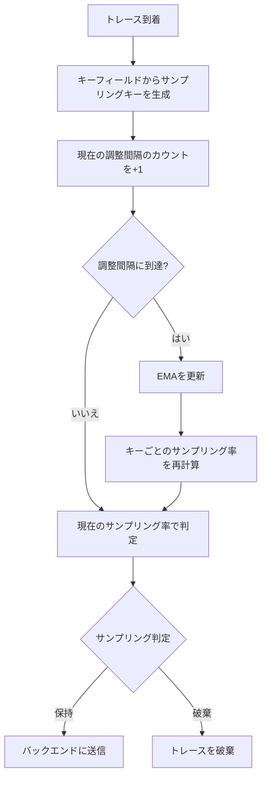
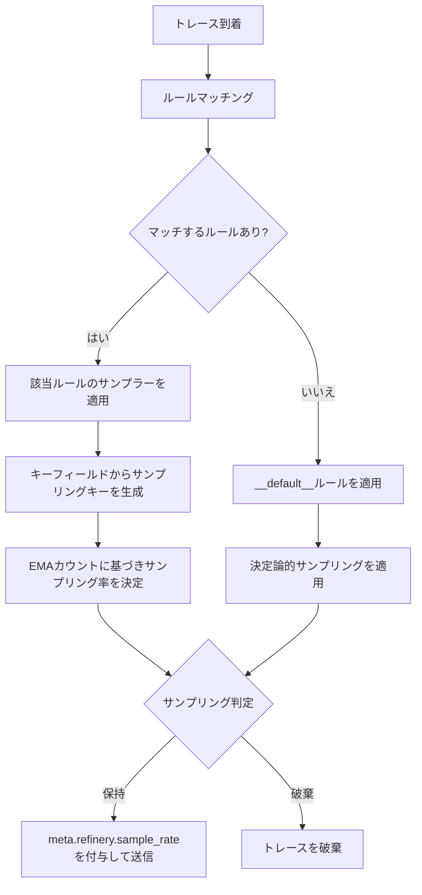
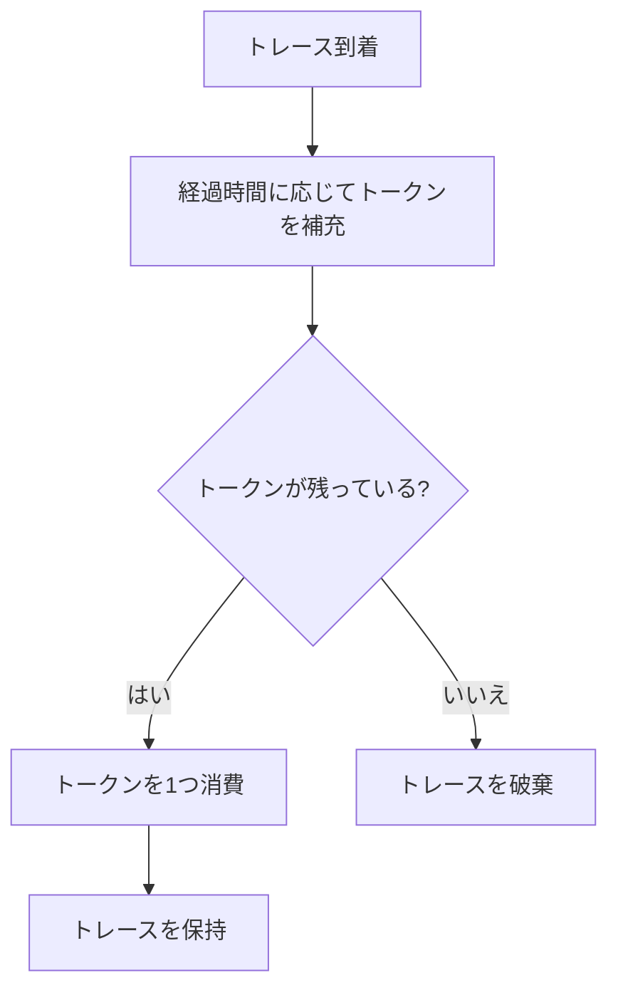

## 動的サンプリング（Adaptive Sampling）

トラフィックの変動が激しいサービスでは、固定のサンプリング率（例: 1%）を設定していると、スパイク時にデータ量が爆発したり、逆に深夜帯にデータが少なすぎて分析が困難になったりします。これを解決するのが **動的サンプリング（Adaptive Sampling）** です。

### 特徴

* **流量に応じた自動調整**: 現在のトラフィック量をリアルタイム（または数分単位）で監視し、目標とするデータ量（例: 500スパン/秒）に収まるよう、サンプリング率を自動的に増減させます。
* **アルゴリズムの例**:
  * **EMA (Exponential Moving Average)**: 指数移動平均を用いて将来のトラフィックを予測し、サンプリング率を滑らかに調整します。
  * **Refinery (Honeycomb)**: 特定のキー（HTTPステータスコード、URL、顧客IDなど）ごとにサンプリング率を動的に計算します。
  * **トークンバケット（Token Bucket）**: 一定レートでトークンを補充し、トークンがある場合のみトレースを保持します。バースト的なトラフィックにも対応しつつ、平均的なスループットを制御できます。

### 動的サンプリングアルゴリズムの詳細

動的サンプリングの中核をなすのは、トラフィック量の変動を追跡し、サンプリング率を自動調整するアルゴリズムです。ここでは、代表的なアルゴリズムであるEMA（指数移動平均）と、Honeycomb Refineryが採用するキーベースの動的サンプリングについて詳しく解説します。

#### EMA（指数移動平均）アルゴリズム

EMA（Exponential Moving Average）は、時系列データの平滑化に広く使われる手法です。動的サンプリングの文脈では、トラフィック量の移動平均を計算し、その値に基づいてサンプリング率を調整します。

EMAの基本的な更新式は以下のとおりです。

$$
\text{EMA}_t = \alpha \times x_t + (1 - \alpha) \times \text{EMA}_{t-1}
$$

ここで、各変数の意味は以下のとおりです。

* $\text{EMA}_t$: 時刻 $t$ におけるEMAの値（平滑化されたトラフィック量の推定値）
* $x_t$: 時刻 $t$ における実測値（直近の調整間隔で観測されたキーごとのトレース数）
* $\alpha$（Weight）: 平滑化係数（0 < $\alpha$ < 1）。直近の観測値に対する重み
* $\text{EMA}_{t-1}$: 前回のEMAの値

$\alpha$ の値が大きいほど直近のトラフィック変動に敏感に反応し、小さいほど過去の傾向を重視して安定した挙動を示します。

以下は、EMAを用いた動的サンプリング率の計算を示すPythonの擬似コードです。

```python
class EMADynamicSampler:
    def __init__(self, goal_sample_rate, weight=0.5, adjustment_interval=15):
        self.goal_sample_rate = goal_sample_rate
        self.weight = weight  # EMAの平滑化係数α
        self.adjustment_interval = adjustment_interval  # 秒
        self.ema_counts = {}  # キーごとのEMA値
        self.current_counts = {}  # 現在の調整間隔でのカウント

    def observe(self, key):
        """トレースを観測し、キーごとのカウントを更新する"""
        self.current_counts[key] = self.current_counts.get(key, 0) + 1

    def adjust(self):
        """調整間隔ごとに呼び出され、EMAを更新してサンプリング率を再計算する"""
        for key, count in self.current_counts.items():
            if key in self.ema_counts:
                # EMA更新: α × 今回の観測値 + (1 - α) × 前回のEMA
                self.ema_counts[key] = (
                    self.weight * count
                    + (1 - self.weight) * self.ema_counts[key]
                )
            else:
                # 新しいキーは観測値をそのまま初期値とする
                self.ema_counts[key] = count
        self.current_counts = {}

    def get_sample_rate(self, key):
        """キーに対するサンプリング率を返す"""
        if key not in self.ema_counts:
            return 1  # 未知のキーはすべて保持
        total_ema = sum(self.ema_counts.values())
        num_keys = len(self.ema_counts)
        if total_ema == 0 or num_keys == 0:
            return 1
        # 目標サンプリング率を達成するための各キーのレートを計算
        # 頻出キーほど高いサンプリング率（多く捨てる）、
        # 希少キーほど低いサンプリング率（多く保持する）
        avg_per_key = total_ema / num_keys
        key_rate = max(1, int(
            self.ema_counts[key] / avg_per_key * self.goal_sample_rate
        ))
        return key_rate
```

#### EMAアルゴリズムの動作フロー

EMAベースの動的サンプリングの全体的な動作フローを以下に示します。



#### Honeycomb Refineryのアルゴリズム

Honeycomb Refinery[^refinery]は、Honeycombが開発しApache License 2.0で公開しているOSSのテイルサンプリングプロキシです。
Honeycomb以外のバックエンドとも組み合わせて利用でき、複数の動的サンプリングアルゴリズムを提供しています。Refineryの動的サンプリングは、トレース内のフィールド値の組み合わせをキーとして使用し、キーの出現頻度に基づいてサンプリング率を調整します。

Refineryが提供する主要なサンプラーは以下のとおりです。

* **DynamicSampler**: 直近の調整間隔のカウントのみに基づいてサンプリング率を計算する基本的な動的サンプラー
* **EMADynamicSampler**: EMAを用いてカウントを平滑化し、トラフィック変動に対してより安定したサンプリング率を提供する。多くのユースケースで推奨される
* **EMAThroughputSampler**: 目標サンプリング率ではなく、目標スループット（秒あたりのスパン数）を指定する。EMADynamicSamplerと同様にEMAで平滑化する

Refineryの動的サンプリングの核心は、キーフィールドの選択にあります。たとえば `request.method`、`request.path`、`response.status_code` をキーフィールドに指定すると、Refineryはこれらのフィールド値の組み合わせごとにトラフィック量を追跡します。頻出する組み合わせ（例: `GET /api/health 200`）は高い率でサンプリングされ（多く破棄され）、希少な組み合わせ（例: `POST /api/checkout 500`）は低い率でサンプリングされます（多く保持されます）。

以下は、Refineryの `rules.yaml` の設定例です。

```yaml
# Honeycomb Refinery rules.yaml 設定例
RulesVersion: 2
Samplers:
  # デフォルトルール（必須）: 他のルールにマッチしないトレースに適用
  __default__:
    DeterministicSampler:
      SampleRate: 1  # すべて保持

  # 本番環境のサービス向けルール
  production:
    EMADynamicSampler:
      GoalSampleRate: 50          # 目標: 50トレースに1つを保持
      AdjustmentInterval: 30s     # 30秒ごとにEMAを再計算
      Weight: 0.5                 # 平滑化係数α（デフォルト値）
      MaxKeys: 500                # 追跡するキーの最大数
      FieldList:                  # サンプリングキーを構成するフィールド
        - request.method
        - request.path
        - response.status_code
```



#### トークンバケット（Token Bucket）アルゴリズム

トークンバケットは、レートリミッティングで広く使われるアルゴリズムを動的サンプリングに応用したものです。
一定のレートでトークンを補充し、トレースを保持するたびにトークンを1つ消費します。
トークンが残っていればトレースを保持し、トークンがなければ破棄します。

基本的な動作は以下のとおりです。

1. バケットに一定容量（バーストサイズ）のトークンを保持できる
2. 一定間隔（補充レート）でトークンが追加される
3. トレースが到着するたびにトークンを1つ消費する
4. トークンが0の場合、トレースは破棄される

以下は、トークンバケットを用いた動的サンプリングのPythonの擬似コードです。

```python
import time


class TokenBucketSampler:
    def __init__(self, rate, burst_size):
        self.rate = rate  # 秒あたりのトークン補充数
        self.burst_size = burst_size  # バケットの最大容量
        self.tokens = burst_size  # 初期トークン数
        self.last_refill = time.monotonic()

    def _refill(self):
        """経過時間に応じてトークンを補充する"""
        now = time.monotonic()
        elapsed = now - self.last_refill
        new_tokens = elapsed * self.rate
        self.tokens = min(self.burst_size, self.tokens + new_tokens)
        self.last_refill = now

    def should_sample(self):
        """トレースを保持するかどうかを判定する"""
        self._refill()
        if self.tokens >= 1:
            self.tokens -= 1
            return True
        return False
```



トークンバケットの利点は、実装がシンプルでありながら、バースト的なトラフィックにも対応できる点です。
バーストサイズを設定することで、短時間のトラフィックスパイク時にも一定数のトレースを保持できます。
一方で、EMAベースの動的サンプリングのようにキーごとの頻度に基づく優先度付けはできないため、均一なレートリミッティングが目的の場合に適しています。

OpenTelemetry Collectorの`tail_sampling` プロセッサーでは、`rate_limiting` ポリシーとしてトークンバケットに類似した機能が提供されています。

#### パラメータ調整の指針

動的サンプリングの効果を最大化するには、パラメータの適切な調整が重要です。

##### Weight（平滑化係数α）

$\alpha$ の値はトラフィックパターンに応じて調整します。

| トラフィック特性 | 推奨Weight | 理由 |
| --- | --- | --- |
| 安定したトラフィック | 0.3〜0.4 | 過去の傾向を重視し、一時的な変動に過剰反応しない |
| 変動が大きいトラフィック | 0.5〜0.7 | 直近の変動に追従しつつ、ある程度の安定性を維持 |
| スパイクが頻発するトラフィック | 0.7〜0.9 | 急激な変動に素早く対応する |

##### AdjustmentInterval（調整間隔）

調整間隔は、EMAの再計算頻度を決定します。

* 短い間隔（5〜15秒）: トラフィック変動への追従が速いが、計算コストが増加する
* 中程度の間隔（15〜30秒）: 多くのユースケースで適切なバランス。Refineryのデフォルトは15秒
* 長い間隔（30〜60秒）: 安定したトラフィックパターンに適する。Honeycomb社自身のIngestサービスでは60秒を使用している[^refinery-sampling-example]

##### FieldList（キーフィールド）の選択

キーフィールドの選択は動的サンプリングの効果を左右する最も重要な設定です。

適切なフィールドの条件は以下のとおりです。

* カーディナリティが適度であること（数十〜数百の一意な値）
* 高頻度のトラフィックと異常なトラフィックを区別できること
* トレース内で一貫した値を持つこと

良い例として、HTTPメソッド、エンドポイントパス、ステータスコードの組み合わせがあります。これにより、正常なトラフィック（`GET /api/users 200`）は高い率でサンプリングされ、エラー（`POST /api/checkout 500`）は保持されやすくなります。

避けるべきフィールドとして、UUIDやPod IDのような一意性の高いフィールドがあります。これらをキーに含めると、すべてのキーがユニークになり、サンプリング率が実質的に1（全量保持）になってしまいます。

[^refinery]: Honeycomb, "Honeycomb Refinery", <https://docs.honeycomb.io/manage-data-volume/refinery/>
[^refinery-sampling-example]: Honeycomb, "Specify Sampling Methods - Sampling Example", <https://docs.honeycomb.io/manage-data-volume/sample/honeycomb-refinery/sampling-methods/>

## アグリゲーション（集約）

サンプリングは「データを捨てる」行為ですが、**アグリゲーション（集約）** は「詳細を捨てる代わりに、傾向（統計量）を残す」行為です。

### 生トレースを捨てる代わりにメトリクス化する

すべてのトレースを保存するのはコスト的に不可能でも、すべてのリクエストのレイテンシーやエラーの有無をカウントすることは可能です。OpenTelemetry Collectorの `spanmetrics` コネクターや各種プロセッサを使用して、スパンからメトリクス（リクエスト数、レイテンシーのヒストグラムなど）を事前生成します。
これにより、サンプリングでトレースを0.1%まで絞り込んだとしても、サービス全体の正確な成功率やP99レイテンシーをメトリクスとして維持し続けることができます。

### spanmetrics コネクターの設定例

`spanmetric`コネクター [^spanmetricsconnector]は、OpenTelemetry Collectorのconnectorコンポーネントで、トレースパイプラインからスパンデータを受け取り、メトリクスパイプラインにメトリクスを出力します。
サンプリング前の全量トレースからメトリクスを生成することで、サンプリングによる情報損失を補完する役割を果たします。

#### 生成されるメトリクス

`spanmetrics` コネクターは以下のメトリクスを自動生成します。

| メトリクス名 | 種類 | 説明 |
| --- | --- | --- |
| `duration` | ヒストグラム | スパンの処理時間の分布。デフォルトのメトリクス名は `duration`（`namespace` 設定で接頭辞を付与可能） |
| `calls` | カウンター | スパンの呼び出し回数。成功・失敗を `status.code` ラベルで区別 |
| `events` | カウンター | スパンイベントの発生回数（オプション、`events` 設定で有効化） |

これらのメトリクスには、サービス名（`service.name`）、スパン名（`span.name`）、スパン種別（`span.kind`）、ステータスコード（`status.code`）がデフォルトのディメンション（ラベル）として付与されます。

#### 基本設定例

以下は、`spanmetrics` コネクターの基本的な設定例です。

```yaml
# OpenTelemetry Collector設定例: spanmetricsconnector
connectors:
  spanmetrics:
    # メトリクス名の接頭辞（例: traces.duration, traces.calls）
    namespace: traces
    # ヒストグラムの設定
    histogram:
      # 明示的バケット境界（ミリ秒単位）
      explicit:
        buckets: [2, 4, 6, 8, 10, 50, 100, 200, 400, 800, 1000, 5000, 10000]
    # 追加ディメンション（ラベル）の設定
    dimensions:
      - name: http.request.method
      - name: http.response.status_code
      - name: http.route
      - name: rpc.method
      - name: rpc.service
    # メトリクスの有効期限（この期間スパンが到着しないディメンションの
    # 時系列はメトリクス出力から除外される）
    metrics_expiration: 5m
    # リソース属性をメトリクスのラベルに含めるかどうか
    resource_metrics_key_attributes:
      - service.name
      - deployment.environment

service:
  pipelines:
    # トレースパイプライン: spanmetricsconnectorを経由してメトリクスを生成
    traces:
      receivers: [otlp]
      processors: [batch]
      exporters: [spanmetrics, otlp/backend]
    # メトリクスパイプライン: spanmetricsconnectorからメトリクスを受信
    metrics:
      receivers: [spanmetrics]
      processors: [batch]
      exporters: [prometheus]
```

この設定では、トレースパイプラインの `exporters` に `spanmetrics` を含めることで、すべてのスパンデータが `spanmetricsconnector` に渡されます。`spanmetricsconnector` はスパンからメトリクスを生成し、メトリクスパイプラインの `receivers` として機能します。

#### ヒストグラムバケットの設定

ヒストグラムバケットの設定は、レイテンシー分布の精度に直接影響します。

`spanmetrics` コネクターは、明示的バケット（explicit）と指数ヒストグラム（exponential）の2つのモードをサポートしています。
明示的バケットはバケット境界を手動で定義するモードで、レイテンシー分布が既知の場合に精度を最適化できます。
一方、指数ヒストグラムはバケット境界を自動的に決定するため、分布が不明な場合や広範囲のレイテンシーをカバーしたい場合に適しています。

以下は明示的バケットの設定例です。
サービスのレイテンシー分布が既知で、特定のパーセンタイル（P50、P95、P99）の精度を重視する場合に、バケット境界を手動で最適化できる利点があります。

```yaml
connectors:
  spanmetrics:
    histogram:
      # 明示的バケット: 任意の境界値を指定
      explicit:
        buckets: [2, 4, 6, 8, 10, 50, 100, 200, 400, 800, 1000, 5000, 10000]
```

指数ヒストグラムを使用する場合は、以下のように設定します。

```yaml
connectors:
  spanmetrics:
    histogram:
      # 指数ヒストグラム: バケット境界を自動決定
      exponential:
        max_size: 160
```

バケット境界の設計指針は以下のとおりです。

* 低レイテンシー帯（2〜10 ms）を細かく区切ることで、P50付近の精度を確保する
* 中レイテンシー帯（50〜1,000 ms）はP95/P99の計算に重要
* 高レイテンシー帯（5,000〜10,000 ms）はタイムアウトに近い異常値の検出に使用する
* バケット数が多すぎるとカーディナリティが増加し、メトリクスストレージのコストが上がる。通常10〜15個程度が適切
* レイテンシー分布が不明な場合や、多様なサービスを一括で計測する場合は指数ヒストグラムの利用を検討する

#### ディメンション（ラベル）の設定

追加ディメンションを設定することで、メトリクスの分析粒度を制御できます。

```yaml
connectors:
  spanmetrics:
    dimensions:
      # スパン属性からディメンションを追加
      - name: http.request.method
      - name: http.response.status_code
      - name: http.route
      # デフォルト値を指定（属性が存在しない場合に使用）
      - name: deployment.environment
        default: unknown
    # リソース属性からディメンションを追加
    resource_metrics_key_attributes:
      - service.name
      - service.version
```

ディメンション設定の注意点は以下のとおりです。

* ディメンションを追加するほどメトリクスのカーディナリティが増加する。カーディナリティの高い属性（ユーザーIDやリクエストIDなど）は避ける
* `http.route`（正規化されたURLパス）は `http.url`（完全なURL）よりもカーディナリティが低く、ディメンションとして適している
* `default` を指定すると、属性が存在しないスパンでもメトリクスが生成される

[^spanmetricsconnector]: OpenTelemetry, "Span Metrics Connector", <https://github.com/open-telemetry/opentelemetry-collector-contrib/tree/main/connector/spanmetricsconnector>

## 統計量復元の数式と計算例

サンプリングされたデータから元の統計量を復元することは、サンプリング導入後の分析精度を維持するために不可欠です。ここでは、サンプリング率に基づく重み付け計算の数式と、具体的な計算例を示します。

### 基本原理: 重み付けによる復元

サンプリングされたデータから母集団の統計量を推定するには、各サンプルにサンプリング率の逆数を重みとして掛けます。サンプリング率 $r$ でサンプリングされたデータの場合、各サンプルは元の $1/r$ 個のデータを代表しています。

#### 合計値の復元

サンプリングされたデータから元の合計値を推定する式は以下のとおりです。

$$
\hat{T} = \sum_{i=1}^{n} \frac{x_i}{r_i}
$$

ここで、$\hat{T}$ は推定合計値、$x_i$ はサンプリングされた $i$ 番目の観測値、$r_i$ はその観測値に適用されたサンプリング率、$n$ はサンプル数です。

均一なサンプリング率 $r$ の場合、これは以下のように簡略化されます。

$$
\hat{T} = \frac{1}{r} \sum_{i=1}^{n} x_i
$$

#### 平均値の復元

重み付き平均の推定式は以下のとおりです。

$$
\hat{\mu} = \frac{\sum_{i=1}^{n} \frac{x_i}{r_i}}{\sum_{i=1}^{n} \frac{1}{r_i}}
$$

均一なサンプリング率の場合、重みが相殺されるため、サンプルの単純平均がそのまま母集団の平均の推定値になります。

$$
\hat{\mu} = \frac{1}{n} \sum_{i=1}^{n} x_i
$$

#### パーセンタイルの復元

パーセンタイルの復元は、合計値や平均値と比べて複雑です。サンプリングされたデータから正確なパーセンタイルを復元するには、各サンプルの重みを考慮した重み付きパーセンタイルを計算します。

手順は以下のとおりです。

1. サンプルを値の昇順にソートする
2. 各サンプルの重み $w_i = 1/r_i$ を計算する
3. 重みの累積和を計算する
4. 累積重みが全体の重みの $p$% に達する点の値が、$p$ パーセンタイルの推定値となる

ただし、サンプル数が少ない場合、パーセンタイルの推定精度は低下します。特にP99のような極端なパーセンタイルでは、サンプリング率が低いと信頼性のある推定が困難になります。このため、パーセンタイルの正確な計算が必要な場合は、サンプリング前の全量データから `spanmetrics` コネクターでヒストグラムメトリクスを生成しておくことが推奨されます。

### 具体的な計算例

あるAPIエンドポイントのレイテンシーデータを10%（$r = 0.1$）でサンプリングした場合の復元計算を示します。

サンプリングで保持された5件のリクエストのレイテンシーが以下のとおりだったとします。

| サンプル | レイテンシー (ms) | サンプリング率 | 重み (1/r) |
| --- | --- | --- | --- |
| 1 | 45 | 0.1 | 10 |
| 2 | 120 | 0.1 | 10 |
| 3 | 80 | 0.1 | 10 |
| 4 | 200 | 0.1 | 10 |
| 5 | 95 | 0.1 | 10 |

#### 合計リクエスト数の復元

サンプルとして5件が保持されたので、元のリクエスト数の推定値は以下のとおりです。

$$
\hat{N} = \frac{5}{0.1} = 50 \text{ 件}
$$

#### レイテンシー合計の復元

$$
\hat{T} = \frac{1}{0.1} \times (45 + 120 + 80 + 200 + 95) = 10 \times 540 = 5{,}400 \text{ ms}
$$

#### 平均レイテンシーの復元

均一なサンプリング率の場合、サンプルの単純平均がそのまま推定値になります。

$$
\hat{\mu} = \frac{45 + 120 + 80 + 200 + 95}{5} = \frac{540}{5} = 108 \text{ ms}
$$

### 動的サンプリング環境での復元

動的サンプリングでは、キーごとにサンプリング率が異なるため、各サンプルの重みも異なります。以下の例では、正常リクエストとエラーリクエストで異なるサンプリング率が適用されています。

| サンプル | レイテンシー (ms) | ステータス | サンプリング率 | 重み (1/r) |
| --- | --- | --- | --- | --- |
| 1 | 45 | 200 | 0.02 | 50 |
| 2 | 120 | 200 | 0.02 | 50 |
| 3 | 80 | 200 | 0.02 | 50 |
| 4 | 500 | 500 | 1.0 | 1 |
| 5 | 95 | 200 | 0.02 | 50 |

この場合の推定リクエスト数は以下のとおりです。

$$
\hat{N} = 50 + 50 + 50 + 1 + 50 = 201 \text{ 件}
$$

重み付き平均レイテンシーは以下のとおりです。

$$
\hat{\mu} = \frac{45 \times 50 + 120 \times 50 + 80 \times 50 + 500 \times 1 + 95 \times 50}{50 + 50 + 50 + 1 + 50} = \frac{17{,}500}{201} \approx 87.1 \text{ ms}
$$

エラーリクエスト（ステータス500）はサンプリング率1.0（全量保持）のため重みが1であり、正常リクエストは2%サンプリングのため重みが50です。この重み付けにより、正常リクエストの寄与が適切に復元されます。

### サンプリング前後の統計量比較

以下の表は、あるサービスの1時間分のデータについて、サンプリング前の実測値とサンプリング後の復元値を比較したものです。

| 統計量 | サンプリング前（実測値） | 10%サンプリング後（復元値） | 誤差 |
| --- | --- | --- | --- |
| 総リクエスト数 | 100,000 | 99,800 | -0.2% |
| 平均レイテンシー | 85 ms | 87 ms | +2.4% |
| P50レイテンシー | 62 ms | 60 ms | -3.2% |
| P95レイテンシー | 245 ms | 252 ms | +2.9% |
| P99レイテンシー | 890 ms | 920 ms | +3.4% |
| エラー率 | 0.5% | 0.48% | -4.0% |

合計値や平均値は比較的正確に復元できますが、P99のような極端なパーセンタイルやエラー率のような低頻度イベントの統計量は、サンプル数の減少により誤差が大きくなる傾向があります。これが、テイルサンプリングでエラートレースを優先的に保持する理由の一つです。

## Four Golden Signals（4つの黄金シグナル）の維持

サンプリング導入下でも、GoogleのSRE Bookで提唱されている **Four Golden Signals（4つの黄金シグナル）**[^sre-book] を正しく監視し続けるにはコツが必要です。ここでは、各シグナルについてサンプリング環境下での対応方法を詳しく解説します。

### レイテンシー (Latency)

レイテンシーは、リクエストの処理にかかった時間を示すシグナルです。サンプリング環境下では、サンプリングされたトレースだけからレイテンシーを計算すると、サンプリングバイアスの影響を受ける可能性があります。

#### 対応方法

レイテンシーの正確な計測には、サンプリング前の全量データから生成したメトリクスを使用します。`spanmetrics` コネクターでヒストグラムメトリクスを生成しておけば、サンプリング率に関係なく正確なレイテンシー分布を把握できます。

サンプリングされたトレースは、レイテンシーの統計量を計算するためではなく、個別のリクエストの詳細な分析（どのスパンがボトルネックか、どのサービス間の呼び出しが遅いか）に使用します。

#### モニタリングクエリ例

```promql
# P50レイテンシー（spanmetricsconnectorで生成したヒストグラムから算出）
histogram_quantile(0.50,
  sum(rate(traces_duration_bucket{service_name="api-gateway"}[5m])) by (le)
)

# P99レイテンシー
histogram_quantile(0.99,
  sum(rate(traces_duration_bucket{service_name="api-gateway"}[5m])) by (le)
)

# エンドポイント別の平均レイテンシー
sum(rate(traces_duration_sum{service_name="api-gateway"}[5m])) by (http_route)
/
sum(rate(traces_duration_count{service_name="api-gateway"}[5m])) by (http_route)
```

### トラフィック (Traffic)

トラフィックは、システムに対するリクエスト量を示すシグナルです。サンプリングされたトレースのみからトラフィック量を把握するには、サンプリング率を考慮した復元が必要です。

#### 対応方法

トラフィック量の把握には2つのアプローチがあります。

1つ目は、`spanmetrics` コネクターで生成したカウンターメトリクスを使用する方法です。サンプリング前の全量データからリクエスト数のカウンターが生成されるため、正確なトラフィック量を把握できます。

2つ目は、サンプリングされたトレースからサンプリング率の逆数を用いて復元する方法です。前節の統計量復元の手法を適用します。

#### モニタリングクエリ例

```promql
# 秒あたりのリクエスト数（spanmetricsconnectorのカウンターから算出）
sum(rate(traces_calls_total{service_name="api-gateway"}[5m]))

# エンドポイント別のリクエスト数
sum(rate(traces_calls_total{service_name="api-gateway"}[5m])) by (http_route)

# ステータスコード別のリクエスト数
sum(rate(traces_calls_total{service_name="api-gateway"}[5m])) by (http_response_status_code)
```

### エラー (Errors)

エラーは、リクエストの失敗率を示すシグナルです。エラーは通常、全トラフィックに対して低い割合で発生するため、サンプリングによる影響を最も受けやすいシグナルです。

#### 対応方法

エラートレースの保持には、テイルサンプリングを活用します。エラーを含むトレースは100%保持するポリシーを設定することで、エラーの詳細な分析に必要なトレースデータを確保します。

エラー率の計算には、`spanmetricsconnector` で生成したメトリクスを使用します。`status.code` ラベルでエラーと成功を区別できるため、正確なエラー率を算出できます。

#### モニタリングクエリ例

```promql
# エラー率（spanmetricsconnectorのカウンターから算出）
sum(rate(traces_calls_total{service_name="api-gateway", status_code="STATUS_CODE_ERROR"}[5m]))
/
sum(rate(traces_calls_total{service_name="api-gateway"}[5m]))

# エンドポイント別のエラー率
sum(rate(traces_calls_total{status_code="STATUS_CODE_ERROR"}[5m])) by (http_route)
/
sum(rate(traces_calls_total[5m])) by (http_route)

# HTTPステータスコード別のエラー数
sum(rate(traces_calls_total{http_response_status_code=~"5.."}[5m])) by (http_response_status_code)
```

### サチュレーション (Saturation)

サチュレーションは、システムのキャパシティに対する使用率を示すシグナルです。CPU使用率、メモリ使用量、コネクション数などのシステムメトリクスで計測します。

#### 対応方法

サチュレーションは、トレースデータではなくシステムメトリクスから計測するため、サンプリングの影響を直接受けません。ただし、サンプリング処理自体がシステムリソースを消費するため、Collector自体のサチュレーションも監視対象に含める必要があります。

特にテイルサンプリングの判定層では、`decision_wait` の間トレースデータをメモリに保持するため、メモリ使用量の監視が重要です。

#### モニタリングクエリ例

```promql
# Collectorのメモリ使用率
process_resident_memory_bytes{job="otel-collector"}
/
node_memory_MemTotal_bytes

# Collectorのスパン受信レート
sum(rate(otelcol_receiver_accepted_spans_total[5m])) by (receiver)

# Collectorのスパンドロップレート（キャパシティ超過の指標）
sum(rate(otelcol_processor_dropped_spans_total[5m])) by (processor)
```

### サンプリング導入前後のダッシュボード設定の違い

サンプリング導入前後で、ダッシュボードのデータソースと計算方法を変更する必要があります。

| シグナル | サンプリング導入前 | サンプリング導入後 |
| --- | --- | --- |
| レイテンシー | トレースバックエンドから直接クエリ | `spanmetrics` コネクターのヒストグラムメトリクスから算出 |
| トラフィック | トレースバックエンドのスパン数をカウント | `spanmetrics` コネクターのカウンターメトリクスから算出 |
| エラー | トレースバックエンドでエラースパンをフィルタ | `spanmetrics` コネクターのカウンターメトリクス（`status_code` ラベル）から算出。詳細分析はテイルサンプリングで保持したトレースを使用 |
| サチュレーション | システムメトリクスから算出 | システムメトリクスから算出（変更なし）。Collectorのリソース使用量を追加で監視 |

サンプリング導入の核心は、統計的な集計（レイテンシーの分布、リクエスト数、エラー率）はサンプリング前の全量メトリクスから算出し、個別のリクエストの詳細分析（ボトルネックの特定、エラーの根本原因調査）にはサンプリングされたトレースを使用するという、メトリクスとトレースの役割分担にあります。

[^sre-book]: Betsy Beyer et al., "Site Reliability Engineering: How Google Runs Production Systems", O'Reilly Media, 2016, Chapter 6 "Monitoring Distributed Systems"

## オブザーバビリティSaaSベンダーのサンプリング機能

ここまで、OpenTelemetry CollectorやHoneycomb Refineryを用いた自前のサンプリング実装について解説してきました。一方で、主要なオブザーバビリティSaaSベンダーは、それぞれ独自のサンプリング機能を提供しています。ここでは、各ベンダーのアプローチと特徴を紹介し、自前実装との使い分けの判断基準を示します。

### AWS X-Ray Sampling Rules

AWS X-Ray[^xray-sampling]は、Reservoir（リザーバー）と固定レートの2段階サンプリングを採用しています。

* **アプローチ**: ヘッドサンプリング（2段階: Reservoir + 固定レート）
* **OpenTelemetry連携**: AWS Distro for OpenTelemetry（ADOT）SDKおよびCollectorがX-Rayのリモートサンプリングルールに対応。SDKがX-Rayサービスからサンプリングルールを定期的に取得し、ローカルでサンプリング判定を行う
* **差別化ポイント**: Reservoirは秒あたりの固定数のトレースを確実に保持し、それを超えるトラフィックには固定レート（例: 5%）を適用する。これにより、低トラフィック時でも一定数のトレースが確保される。サンプリングルールはAWSコンソールやAPIから動的に変更可能で、アプリケーションの再デプロイなしにサンプリング戦略を調整できる
* **簡素化される運用**: サンプリングルールの一元管理（AWSコンソール/API）。アプリケーション側のコード変更なしにサンプリング戦略を変更可能

### Grafana Cloud Adaptive Traces / Adaptive Metrics

Grafana CloudのAdaptive Telemetryスイート[^grafana-adaptive]は、バックエンド側でテレメトリーデータを最適化する機能群です。

* **アプローチ**: バックエンド側テイルサンプリング（Adaptive Traces）、カーディナリティ最適化（Adaptive Metrics）
* **OpenTelemetry連携**: OpenTelemetry CollectorからOTLPでGrafana Cloudに送信し、バックエンド側でサンプリング判定を行う。Collector側でのサンプリング設定は不要
* **差別化ポイント**: エラーや高レイテンシーなどの重要なトレースを自動的に識別して保持する。ユーザーがサンプリングポリシーを細かく設定する必要がなく、バックエンド側で最適化が行われる。Adaptive Metricsはメトリクスのカーディナリティを自動的に最適化し、未使用の時系列を削減する
* **簡素化される運用**: Collector側のサンプリング設定が不要。バッファ管理やスケーリングをバックエンド側で処理

### Honeycomb Refinery

Honeycomb Refinery[^refinery]は、Honeycombが開発・公開しているOSSのテイルサンプリングプロキシです。前節で解説したEMAアルゴリズムを含む複数の動的サンプリング手法を提供します。

* **アプローチ**: テイルサンプリング + 動的サンプリング
* **OpenTelemetry連携**: OTLPを受信し、サンプリング後にHoneycombへ転送する。OpenTelemetry SDKやCollectorからOTLPで送信可能
* **差別化ポイント**: キーフィールドベースの動的サンプリングにより、頻出トラフィックを効率的に削減しつつ、希少なイベント（エラー、異常レイテンシー）を高い確率で保持する。OSSとして公開されているため、Honeycomb以外のバックエンドとも組み合わせ可能
* **簡素化される運用**: テイルサンプリングのバッファ管理、ピア間のトレース分散、動的サンプリング率の自動調整

### Datadog Ingestion Controls

Datadog[^datadog-ingestion]は、SDK側のヘッドサンプリングとバックエンド側のインテリジェントな保持を組み合わせたアプローチを採用しています。

* **アプローチ**: ヘッドサンプリング（SDK/Agent側）+ バックエンド側のインテリジェント保持
* **OpenTelemetry連携**: Datadog AgentがOTLPを受信可能。OpenTelemetry SDKからDatadog Agentに送信し、Agent側でサンプリング判定を行う
* **差別化ポイント**: Datadog Agentがデフォルトで秒あたり一定数のトレースを保持し、エラーやレアなエンドポイントのトレースを自動的に優先保持する。バックエンド側でも追加の保持ロジック（エラートレースの自動保持など）が動作する
* **簡素化される運用**: デフォルト設定で合理的なサンプリングが行われるため、初期設定の負荷が低い。エラートレースの保持ポリシーが組み込み済み

### Dynatrace Adaptive Traffic Management

Dynatrace[^dynatrace-atm]は、OneAgentによる動的サンプリング機能を提供しています。

* **アプローチ**: 動的サンプリング（Agent側）
* **OpenTelemetry連携**: OpenTelemetry SDKからのデータをDynatrace OneAgentまたはActiveGate経由で受信可能。OTLPエンドポイントも提供
* **差別化ポイント**: Adaptive Traffic Managementは、ライセンスに含まれるトレースボリュームに収まるよう、サンプリング率を自動的に調整する。トラフィック量の増減に応じてリアルタイムにサンプリング率が変動し、統計的に有効なデータセットを維持する
* **簡素化される運用**: サンプリング率の手動設定が不要。ライセンスボリュームに基づく自動調整により、コスト超過を防止

### New Relic Infinite Tracing

New Relic[^newrelic-infinite]は、Infinite Tracingとしてバックエンド側のテイルサンプリング機能を提供しています。

* **アプローチ**: バックエンド側テイルサンプリング
* **OpenTelemetry連携**: OpenTelemetry SDKからNew RelicのOTLPエンドポイントに直接送信可能。Infinite Tracingを有効にすると、トレースオブザーバー（Trace Observer）がバックエンド側でテイルサンプリングを実行する
* **差別化ポイント**: トレースオブザーバーがすべてのスパンを受信し、トレース完了後にサンプリング判定を行う。エラーや異常なレイテンシーを含むトレースを優先的に保持する
* **簡素化される運用**: Collector側でのテイルサンプリング設定が不要。バッファ管理とスケーリングをNew Relic側で処理

### Elastic APM Server Tail-based Sampling

Elastic[^elastic-tail]は、APM Server内蔵のテイルサンプリング機能を提供しています。

* **アプローチ**: テイルサンプリング（APM Server内蔵）
* **OpenTelemetry連携**: Elastic Distribution of OpenTelemetry（EDOT）CollectorまたはElastic APM Agentからデータを受信。OTLPプロトコルをサポート
* **差別化ポイント**: APM Server自体にテイルサンプリング機能が内蔵されており、別途サンプリングプロキシを構築する必要がない。サンプリングポリシーはAPM Serverの設定で定義する。複数のAPM Serverインスタンス間でのトレース分散にも対応
* **簡素化される運用**: 既存のElastic APM構成にサンプリング機能を追加するだけで利用可能。別途Collectorやプロキシの構築が不要

### 自前実装 vs ベンダーソリューションの判断基準

OpenTelemetry Collectorによる自前実装と、ベンダーが提供するサンプリングソリューションのどちらを選択するかは、以下の観点で判断します。

#### 自前実装が適するケース

* **マルチベンダー構成**: 複数のバックエンド（例: トレースはJaeger、メトリクスはPrometheus）にデータを送信する場合、ベンダー固有のサンプリング機能は使えない
* **細かいポリシー制御**: サンプリングポリシーを細かくカスタマイズしたい場合（特定の属性値の組み合わせに基づく複雑な条件など）
* **ベンダーロックイン回避**: 特定のベンダーに依存せず、バックエンドを将来的に変更する可能性がある場合
* **コスト最適化**: ベンダーのサンプリング機能が有料オプションの場合、OSSのCollectorで同等の機能を実現できる

#### ベンダーソリューションが適するケース

* **運用工数の削減**: テイルサンプリングの3層構造の構築・運用は複雑であり、バックエンド側で処理してもらえるなら運用負荷が大幅に軽減される
* **マネージドなスケーリング**: トラフィック量の増減に応じたCollectorのスケーリングをベンダー側で処理してもらえる
* **バックエンドとの統合的な最適化**: ベンダーのバックエンドと密に連携したサンプリング（例: クエリパターンに基づく最適化）は、自前実装では実現が難しい
* **迅速な導入**: サンプリングの設計・構築に時間をかけられない場合、ベンダーのデフォルト設定で合理的なサンプリングが得られる

以下の表に、各ベンダーのアプローチを比較します。

| ベンダー | アプローチ | サンプリング実行場所 | OTel連携 | 主な特徴 |
| --- | --- | --- | --- | --- |
| Honeycomb Refinery | テイル + 動的 | プロキシ（OSS） | OTLP受信 | キーベース動的サンプリング、OSS |
| Grafana Cloud | テイル | バックエンド | OTLP送信 | 自動的な重要トレース保持 |
| Datadog | ヘッド + 保持 | Agent + バックエンド | OTLP受信（Agent） | デフォルトで合理的なサンプリング |
| Dynatrace | 動的 | Agent | OTLP受信 | ライセンスボリュームに基づく自動調整 |
| New Relic | テイル | バックエンド | OTLP送信 | トレースオブザーバーによる判定 |
| Elastic | テイル | APM Server | OTLP受信 | APM Server内蔵、追加構築不要 |
| AWS X-Ray | ヘッド（2段階） | SDK/Agent | ADOT SDK/Collector | Reservoir + 固定レート、リモートルール |

[^grafana-adaptive]: Grafana Labs, "Maximize data value and cut costs: Adaptive Telemetry for metrics, logs, traces, and profiles in Grafana Cloud", 2025, <https://grafana.com/blog/2025/10/08/adaptive-telemetry-suite-in-grafana-cloud/>
[^datadog-ingestion]: Datadog, "Ingestion Controls", <https://docs.datadoghq.com/tracing/trace_pipeline/ingestion_controls/>
[^dynatrace-atm]: Dynatrace, "Adaptive Traffic Management concepts", <https://docs.dynatrace.com/docs/ingest-from/dynatrace-oneagent/adaptive-traffic-management/adaptive-traffic-management-concepts>
[^newrelic-infinite]: New Relic, "Infinite Tracing", <https://docs.newrelic.com/docs/distributed-tracing/infinite-tracing/introduction-infinite-tracing/>
[^elastic-tail]: Elastic, "Tail-based sampling", <https://www.elastic.co/guide/en/observability/current/tail-based-samling-config.html>
[^xray-sampling]: AWS, "Configuring sampling rules", <https://docs.aws.amazon.com/xray/latest/devguide/xray-console-sampling.html>

サンプリングは単なるデータ削減手段ではなく、モニタリングのニーズに合わせて「情報の密度」を最適化する戦略なのです。

## まとめ

本章では、固定サンプリング率を超えた高度なサンプリング戦略について解説しました。

動的サンプリングでは、EMA（指数移動平均）アルゴリズムとHoneycomb Refineryのキーベースサンプリングを取り上げ、トラフィック量の変動に応じてサンプリング率を自動調整する仕組みを示しました。
アグリゲーションでは、`spanmetrics` コネクターを用いてサンプリング前の全量データからメトリクスを生成し、サンプリングによる情報損失を補完する方法を解説しました。

統計量の復元では、サンプリング率の逆数を重みとして使用する基本原理と、合計値・平均値・パーセンタイルの具体的な復元計算を示しました。
Four Golden Signals（4つの黄金シグナル）の維持では、各シグナルについてサンプリング環境下での対応方法とPromQLクエリ例を提示し、メトリクスとトレースの役割分担を明確にしました。
また、主要なオブザーバビリティSaaSベンダーのサンプリング機能を比較し、自前実装との使い分けの判断基準を示しました。

次章では、これらの戦略を実際の組織でどのように適用するかを事例として紹介します。
テレメトリーパイプラインの構成、PII除去の実装方法、運用メトリクスの監視項目など、実運用で必要となる具体的なプラクティスを取り上げます。
