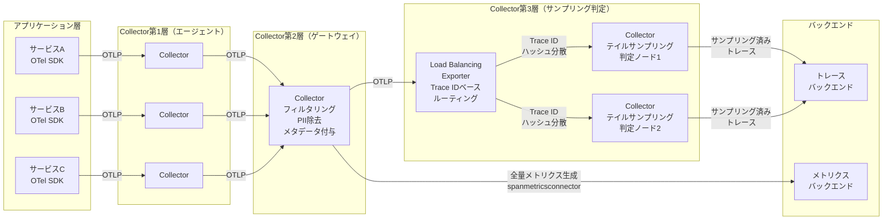

## テレメトリーパイプラインの活用

大規模な組織（SlackやHoneycombの事例など）では、テレメトリーデータを単に「送る」だけでなく、**テレメトリーパイプライン** として高度に管理しています。Collectorは単なる中継点ではなく、データ加工の拠点となります。

* **データのフィルタリング**: 不要なノイズ（ヘルスチェックのログなど）を早期に除去し、コストを最適化します。
* **秘匿情報（PII）の除去**: ログやスパン属性に含まれる可能性のあるユーザーのメールアドレスやクレジットカード情報などを、バックエンドに届く前にマスクまたは削除します。
* **メタデータの付与**: 実行環境（ステージング、本番）、デプロイID、チーム名などを自動的に付与し、分析時の軸を増やします。

以下の図は、サンプリングを含むテレメトリーパイプラインの全体構成を示しています。アプリケーションから生成されたテレメトリーデータが、各Collector層を経由してバックエンドに到達するまでのデータフローを表しています。



各層の役割は以下の通りです。

| 層 | コンポーネント | 役割 |
| --- | --- | --- |
| アプリケーション層 | OTel SDK | テレメトリーデータの生成、ヘッドサンプリング（設定時） |
| 第1層（エージェント） | Collector | 各ホスト/Podに配置、データの収集とバッチ送信 |
| 第2層（ゲートウェイ） | Collector | フィルタリング、PII除去、メタデータ付与、全量メトリクス生成 |
| 第3層（サンプリング判定） | Load Balancing Exporter + 判定ノード | Trace IDベースのルーティングとテイルサンプリング判定 |
| バックエンド | トレース/メトリクスストレージ | サンプリング済みトレースと全量メトリクスの保存・クエリ |

ゲートウェイ層でspanmetricsコネクターを使用して全量メトリクスを生成した後にサンプリング判定層へデータを送ることで、サンプリングによるメトリクスの欠損を防いでいる点が重要です。

## PII除去の実装方法

テレメトリーデータには、意図せずユーザーの個人識別情報（PII）が含まれることがあります。たとえば、HTTPリクエストのURLパスにメールアドレスが含まれていたり、スパン属性にクレジットカード番号が記録されていたりするケースです。コンプライアンス要件を満たすためには、これらのデータがバックエンドに到達する前にマスクまたは削除する必要があります。

OpenTelemetry Collectorでは、`transform`プロセッサーと`filter`プロセッサーを組み合わせることで、PII除去を実現できます。

### 属性の削除

特定の属性を完全に削除する場合は、`transform`プロセッサーの`delete_key`関数を使用します。

```yaml
processors:
  transform/remove-pii-attributes:
    trace_statements:
      - context: span
        statements:
          # ユーザーのメールアドレス属性を削除
          - delete_key(attributes, "user.email")
          # クレジットカード番号属性を削除
          - delete_key(attributes, "payment.card_number")
          # 電話番号属性を削除
          - delete_key(attributes, "user.phone")
    log_statements:
      - context: log
        statements:
          - delete_key(attributes, "user.email")
          - delete_key(attributes, "payment.card_number")
```

### 正規表現を使用したマスキング

属性値を完全に削除するのではなく、マスキング（一部を伏せ字にする）したい場合は、`transform`プロセッサーの`replace_pattern`関数を使用します。

```yaml
processors:
  transform/mask-pii:
    trace_statements:
      - context: span
        statements:
          # メールアドレスのマスキング
          # user@example.com → u***@example.com
          - replace_pattern(attributes["http.url"],
              "[a-zA-Z0-9._%+-]+@[a-zA-Z0-9.-]+\\.[a-zA-Z]{2,}",
              "***@***.***")

          # クレジットカード番号のマスキング（16桁の数字列）
          # 1234-5678-9012-3456 → ****-****-****-3456
          - replace_pattern(attributes["http.url"],
              "\\b\\d{4}[- ]?\\d{4}[- ]?\\d{4}[- ]?(\\d{4})\\b",
              "****-****-****-$$1")

          # 日本の電話番号のマスキング
          # 090-1234-5678 → 090-****-****
          - replace_pattern(attributes["http.url"],
              "(0\\d{1,4})[- ]?\\d{1,4}[- ]?\\d{4}",
              "$$1-****-****")
    log_statements:
      - context: log
        statements:
          # ログ本文中のメールアドレスをマスキング
          - replace_pattern(body,
              "[a-zA-Z0-9._%+-]+@[a-zA-Z0-9.-]+\\.[a-zA-Z]{2,}",
              "***@***.***")
```

### PII検出パターン

以下は、テレメトリーデータに含まれる可能性のある主なPIIパターンと、対応する正規表現の例です。

| PIIの種類 | 正規表現パターン | 例 |
| --- | --- | --- |
| メールアドレス | `[a-zA-Z0-9._%+-]+@[a-zA-Z0-9.-]+\.[a-zA-Z]{2,}` | <user@example.com> |
| クレジットカード番号 | `\b\d{4}[- ]?\d{4}[- ]?\d{4}[- ]?\d{4}\b` | 1234-5678-9012-3456 |
| 日本の電話番号 | `0\d{1,4}[- ]?\d{1,4}[- ]?\d{4}` | 090-1234-5678 |
| マイナンバー | `\b\d{4}\s?\d{4}\s?\d{4}\b` | 1234 5678 9012 |
| IPv4アドレス | `\b\d{1,3}\.\d{1,3}\.\d{1,3}\.\d{1,3}\b` | 192.168.1.1 |
| JWTトークン | `eyJ[a-zA-Z0-9_-]+\.eyJ[a-zA-Z0-9_-]+\.[a-zA-Z0-9_-]+` | eyJhbGci... |

### パイプラインへの組み込み

PII除去プロセッサーは、サンプリング処理やバックエンドへのエクスポートよりも前の段階（ゲートウェイ層）に配置します。これにより、PII情報がパイプラインの下流に流れることを防ぎます。

```yaml
service:
  pipelines:
    traces:
      receivers: [otlp]
      processors:
        - transform/remove-pii-attributes  # まずPII属性を削除
        - transform/mask-pii               # 次にURLなどに含まれるPIIをマスキング
        - batch                            # バッチ処理
      exporters: [otlp/backend]
```

PII除去の設定は、組織のコンプライアンス要件に応じてカスタマイズしてください。特に、GDPRやPCI DSSなどの規制に準拠する必要がある場合は、法務部門と連携して除去対象のデータ種別を定義することを推奨します。

## 運用の落とし穴

サンプリングを導入したシステムを運用する際には、特有の課題に直面します。

* **パフォーマンス**: Collectorでのテイルサンプリングはメモリを大量に消費します。バッファサイズの設定ミスにより、Collector自体がOOM（Out of Memory）でダウンするリスクがあります。
* **可用性**: 判定層のCollectorが単一障害点にならないよう、冗長化と適切なスケーリングが必要です。
* **データの鮮度（ラグ）**: 判定のためにデータを数秒〜数十秒バッファするため、リアルタイムのモニタリングにわずかな遅延が生じます。

## 運用メトリクスモニタリング項目

Collectorを安定的に運用するためには、Collector自体の健全性を継続的にモニタリングする必要があります。OpenTelemetry Collectorは内部メトリクスをPrometheusエンドポイント（デフォルトではポート8888）で公開しており、これらを監視することで問題の早期検出が可能です。

### モニタリング項目一覧

以下の表は、サンプリングパイプラインの運用において特に重要なモニタリング項目をまとめたものです。

| カテゴリ | メトリクス名 | 説明 | 推奨閾値 | 重要度 |
| --- | --- | --- | --- | --- |
| メモリ | `process_runtime_total_alloc_bytes` | Collectorプロセスの累積メモリ割り当て量 | - | 高 |
| メモリ | `otelcol_processor_tail_sampling_sampling_traces_on_memory` | テイルサンプリングでメモリ上に保持中のトレース数 | `num_traces`設定値の80%以下 | 緊急 |
| CPU | `process_cpu_seconds_total` | Collectorプロセスの累積CPU使用時間 | - | 高 |
| スループット | `otelcol_receiver_accepted_spans` | レシーバーが受信したスパン数（累積） | - | 中 |
| スループット | `otelcol_receiver_refused_spans` | レシーバーが拒否したスパン数（累積） | 0が理想、増加傾向は要調査 | 緊急 |
| スループット | `otelcol_exporter_sent_spans` | エクスポーターが送信したスパン数（累積） | - | 中 |
| スループット | `otelcol_exporter_send_failed_spans` | エクスポーターが送信に失敗したスパン数（累積） | 0が理想、増加傾向は要調査 | 高 |
| キュー | `otelcol_exporter_queue_size` | エクスポーターの送信キューに滞留中のバッチ数 | キュー容量の70%以下 | 高 |
| キュー | `otelcol_exporter_queue_capacity` | エクスポーターの送信キュー容量 | - | 低 |
| サンプリング | `otelcol_processor_tail_sampling_count_traces_sampled` | サンプリング判定されたトレース数（sampled=trueとfalseのラベルで区別） | 想定サンプリング率と一致 | 高 |
| ドロップ | `otelcol_processor_dropped_spans` | プロセッサーがドロップしたスパン数 | 0が理想 | 緊急 |

### メトリクスの取得方法

OpenTelemetry Collectorの内部メトリクスは、`service`セクションの`telemetry`設定で有効化します。

```yaml
service:
  telemetry:
    metrics:
      level: detailed  # basic, normal, detailed から選択
      address: 0.0.0.0:8888  # Prometheusエンドポイント
```

Prometheusからスクレイプする場合の設定例は以下の通りです。

```yaml
scrape_configs:
  - job_name: 'otel-collector'
    scrape_interval: 15s
    static_configs:
      - targets: ['otel-collector:8888']
```

### アラート設定の推奨ルール

以下は、Collectorの安定運用のために設定すべきアラートルールのPromQL例です。

#### メモリ使用量の急増（緊急）

Collectorのメモリ使用量がリミットの80%を超えた場合にアラートを発報します。OOM（Out of Memory）によるCollectorダウンを防ぐための早期警告です。

```promql
container_memory_working_set_bytes{container="otel-collector"}
  / container_spec_memory_limit_bytes{container="otel-collector"}
  > 0.8
```

#### スパン受信拒否の発生（緊急）

レシーバーがスパンを拒否し始めた場合、バックプレッシャーが発生しています。直ちにスケールアウトまたはサンプリング率の調整が必要です。

```promql
rate(otelcol_receiver_refused_spans_total[5m]) > 0
```

#### エクスポート失敗率の上昇（高）

エクスポーターの送信失敗率が1%を超えた場合、バックエンドとの接続に問題がある可能性があります。

```promql
rate(otelcol_exporter_send_failed_spans_total[5m])
  / rate(otelcol_exporter_sent_spans_total[5m])
  > 0.01
```

#### 送信キューの滞留（高）

エクスポーターのキューが容量の70%を超えた場合、バックエンドへの送信が追いついていません。

```promql
otelcol_exporter_queue_size
  / otelcol_exporter_queue_capacity
  > 0.7
```

#### テイルサンプリングのメモリ上トレース数（高）

テイルサンプリングプロセッサーがメモリ上に保持しているトレース数が`num_traces`設定値の80%を超えた場合、バッファが逼迫しています。

```promql
otelcol_processor_tail_sampling_sampling_traces_on_memory
  > <num_traces設定値> * 0.8
```

#### サンプリング率の異常（中）

実際のサンプリング率が想定値から大きく乖離している場合、サンプリングポリシーの設定に問題がある可能性があります。

```promql
rate(otelcol_processor_tail_sampling_count_traces_sampled{sampled="true"}[5m])
  / rate(otelcol_processor_tail_sampling_count_traces_sampled[5m])
```

この値が想定サンプリング率と大きく異なる場合は、ポリシー設定を見直してください。

## ケーススタディ

ここでは、SlackやHoneycomb以外の企業がサンプリングをどのように導入し、どのような効果を得たかを紹介します。いずれも公開されたブログ記事やカンファレンス発表に基づく情報です。

### Uber: アダプティブサンプリングによる大規模トレース管理(2019年)

#### 背景と課題

Uberは4,000以上のマイクロサービスで構成される大規模分散システムを運用しており、1日あたり数十億件のリクエストを処理していました[^f4-uber-observability]。分散トレーシングシステムとしてJaeger（Uber社内で開発されたOSSプロジェクト）を採用していましたが、全トレースを保存するとストレージコストとクエリ性能の両面で問題が生じていました。

サービスごとにトラフィック量が大きく異なるため、単一の固定サンプリング率ではうまく機能しませんでした。高トラフィックのサービスでは過剰なデータが生成され、低トラフィックのサービスでは十分なサンプルが得られないという問題がありました。

#### 採用したサンプリング戦略

Uberはアダプティブサンプリング（動的サンプリング）を採用しました[^f4-jaeger-adaptive]。この仕組みでは、オペレーターが「1秒あたりに収集するトレース数の目標値」を宣言的に設定するだけで、サンプリングエンジンがサービスごと・エンドポイントごとにサンプリング率を自動調整します。

主な設定パラメータは以下の通りです。

| パラメータ | 設定値 | 説明 |
| --- | --- | --- |
| サンプリング方式 | リモートサンプリング（アダプティブ） | Jaeger Collectorが各SDKにサンプリング率を配信 |
| 目標収集レート | サービス・エンドポイント単位で設定 | トラフィック量に応じて自動調整 |
| 調整間隔 | トラフィック変動に追従 | ピーク時間帯と閑散時間帯で自動的に変化 |

#### 導入効果

* トレースデータ量を目標値以内に安定的に維持し、ストレージコストを予測可能にしました
* ピーク時間帯（配車リクエストが集中する時間帯）でもサンプリング率が自動的に下がり、データ量の急増を防止しました
* 閑散時間帯にはサンプリング率が自動的に上がり、低トラフィックのサービスでも十分なトレースサンプルを確保しました
* 手動でのサンプリング率調整が不要になり、運用負荷が大幅に軽減されました

#### 導入時の課題と解決方法

最大の課題は、4,000以上のサービスに対してサンプリング設定を個別に管理することの複雑さでした。Uberはリモートサンプリング機能を活用し、Jaeger Collectorを中央管理ポイントとすることでこの問題を解決しました。各SDKはCollectorからサンプリング設定を取得するため、設定変更を迅速に全サービスに反映できます。

このアダプティブサンプリング機能は、Uber社内で数年間運用された後、Jaeger v1.27.0でOSS版にも実装されました。

### Canva: OpenTelemetryによるエンドツーエンドトレーシングの構築（2021年）

#### 背景と課題

Canvaは月間1億人以上のアクティブユーザーを持つオンラインデザインプラットフォームで、150億以上のデザインが作成されています[^f4-canva-tracing]。バックエンドは多数のマイクロサービスで構成されており、1日あたり50億以上のスパンを生成しています。

当初はOpenTracing APIとZipkinを使用していましたが、その後AWS X-Rayに移行しました。しかしX-Rayでは属性のカスタマイズ性やデータ保持期間の制御に制約があり、社内での採用率が低い状態が続いていました。たとえば、何らかの理由でデータを削除する必要が生じた場合、保持期間（30日間）が経過するまでX-Rayへのアクセスをブロックする必要がありました。

#### 採用したサンプリング戦略

Canvaは2021年にOpenTelemetryへの全面移行を決定しました。OpenTelemetry Collectorをゲートウェイとして導入し、複数のバックエンド（Jaeger、Datadog、Honeycombなど）にトレースデータをルーティングする構成を採用しています。

サンプリング戦略としては、OpenTelemetry Collectorのゲートウェイ層でサンプリングを実施し、バックエンドごとに異なるサンプリングポリシーを適用できる柔軟な構成としました。

| パラメータ | 設定値 | 説明 |
| --- | --- | --- |
| 計装方式 | OpenTelemetry SDK（自動計装） | サービスフレームワークに組み込み、標準で計装を提供 |
| Collector構成 | ゲートウェイパターン | 複数バックエンドへのルーティングとサンプリングを集中管理 |
| 可視化ツール | Jaeger（主要）、Kibana、Datadog（補助） | 用途に応じて使い分け |

#### 導入効果

* 1日50億スパンという大量のトレースデータを効率的に管理し、必要なバックエンドに必要なデータのみを送信しました
* OpenTelemetryの標準化により、一度の計装で複数のバックエンドに対応可能となり、ベンダー評価のコストを大幅に削減しました
* サービスフレームワークへの組み込みにより、開発者が意識せずともトレーシングが有効になる「ゼロコンフィグ」体験を実現しました
* ベンダーロックインを回避し、バックエンドの切り替えや併用が容易になりました

#### 導入時の課題と解決方法

最大の課題は、既存のOpenTracing/X-Ray計装からOpenTelemetryへの移行でした。CanvaはまずハッカソンプロジェクトとしてOpenTelemetryゲートウェイを構築し、複数ベンダーのツールを並行評価することで、移行リスクを最小化しました。OpenTelemetryの標準化されたAPIにより、計装コードを一度書けば複数のバックエンドに対応できるため、移行の負担が大幅に軽減されました。

### DoorDash: OpenTelemetryのスパンプロセッサー最適化(2021年)

#### 背景と課題

DoorDashはフードデリバリーサービスを提供する企業で、モノリスアーキテクチャからマイクロサービスアーキテクチャへの移行に伴い、分散トレーシングの導入が必要になりました[^f4-doordash-otel]。OpenTelemetryを採用しましたが、標準のスパンプロセッサーではCPU使用率が高く、プラットフォーム全体のパフォーマンスに悪影響を及ぼす懸念がありました。

特に高スループット環境では、スパンの生成・処理・エクスポートのオーバーヘッドが無視できないレベルに達し、アプリケーション本来の処理に影響を与えるリスクがありました。

#### 採用したサンプリング戦略

DoorDashはOpenTelemetryのスパンプロセッサーを独自に最適化するアプローチを採用しました。標準実装のベースラインを計測した上で、6つの最適化手法を比較検証し、最も効果的な方法を選択しました。

| パラメータ | 設定値 | 説明 |
| --- | --- | --- |
| トレーシング基盤 | OpenTelemetry SDK | 標準化されたAPIによるベンダー非依存の計装 |
| 最適化対象 | スパンプロセッサー | バッチ処理、キューイング、エクスポートの効率化 |
| 評価方法 | 6手法の比較ベンチマーク | CPU使用率、メモリ使用量、スループットを計測 |

#### 導入効果

* スパンプロセッサーの最適化により、CPU使用率のオーバーヘッドを大幅に削減しました
* 高スループット環境でもアプリケーションのパフォーマンスに影響を与えずにトレーシングを実現しました
* OpenTelemetryの標準化により、ベンダー非依存のトレーシング基盤を構築しました
* ベンチマーク結果に基づく定量的な意思決定により、最適な構成を選択しました

#### 導入時の課題と解決方法

DoorDashが直面した課題は、OpenTelemetryの標準実装がそのままでは高スループット環境のパフォーマンス要件を満たさないことでした。この問題に対して、DoorDashは体系的なベンチマーク手法を採用しました。まず標準実装のベースラインを計測し、次に6つの異なる最適化手法を同一条件で比較評価することで、パフォーマンスとデータ品質のバランスが最も良い手法を選択しました。この「計測に基づく最適化」のアプローチは、サンプリング戦略の選定においても参考になります。

[^f4-uber-observability]: Uber Engineering, "Optimizing Observability with Jaeger, M3, and XYS at Uber", 2019年11月, <https://www.uber.com/en-PT/blog/optimizing-observability/>
[^f4-jaeger-adaptive]: Yuri Shkuro, "Adaptive Sampling in Jaeger", Jaeger Blog, 2022年1月, <https://medium.com/jaegertracing/adaptive-sampling-in-jaeger-50f336f4334>
[^f4-canva-tracing]: Canva Engineering Blog, "End-to-end Tracing", 2023年6月, <https://www.canva.dev/blog/engineering/end-to-end-tracing/>
[^f4-doordash-otel]: Santosh Banda, "Optimizing OpenTelemetry's Span Processor for High Throughput and Low CPU Costs", DoorDash Engineering Blog, 2021年4月, <https://careersatdoordash.com/blog/optimizing-opentelemetrys-span-processor/>

## サンプリングデータからの統計量復元

サンプリングされたデータから、「本来の全体トラフィック量」を知ることは可能でしょうか？答えは **「可能」** です。

サンプリングが行われる際、各スパンにはその時のサンプリング率（またはその逆数である **SampleRate**）がメタデータとして記録されます。
たとえば、1/100の確率でサンプリングされたトレースがある場合、そのトレース1件を「100件分」として重み付けして計算することで、統計的に正しい全体量を推定できます。これは統計学における「標本からの母集団の推定」そのものであり、最新の分析ツールはこの計算を自動的に行い、サンプリングを意識させないユーザー体験を提供しています。

## まとめ

本章では、大規模組織におけるテレメトリーパイプラインの実践的な活用方法と、実際の企業事例を通じてサンプリング戦略の導入効果を見てきました。

テレメトリーパイプラインは単なるデータ転送の仕組みではなく、データのフィルタリング、PII除去、メタデータ付与といった高度な加工を行う重要な基盤です。
特にPII除去は、コンプライアンス要件を満たすために不可欠な処理であり、適切な正規表現パターンとプロセッサー配置により実現できます。

運用面では、Collectorのメモリ使用量、スパン受信拒否率、エクスポート失敗率などの内部メトリクスを継続的にモニタリングすることで、問題の早期検出と安定運用が可能になります。

Uber、Canva、DoorDashの事例から学べることは、サンプリング戦略に万能の解は存在せず、組織の規模、トラフィック特性、運用体制に応じた最適化が必要だということです。
アダプティブサンプリング、複数バックエンド対応、スパンプロセッサー最適化など、それぞれの組織が直面した課題に対して独自の解決策を見出しています。

また、サンプリングされたデータからでも、適切な重み付け計算により統計的に正しい全体量を推定できることを確認しました。
これにより、サンプリングを導入してもデータの信頼性を損なうことなく、コスト効率と可観測性を両立できます。

次章では、本書で学んだ内容を実際のプロジェクトに適用する際に役立つチェックリストを提供します。サンプリング戦略の選定からテレメトリーパイプラインの構築、運用監視の設定まで、導入の各フェーズで確認すべき項目を網羅的にまとめています。
